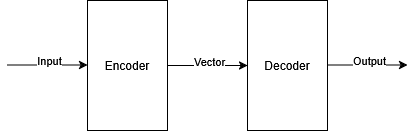
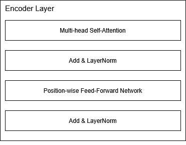
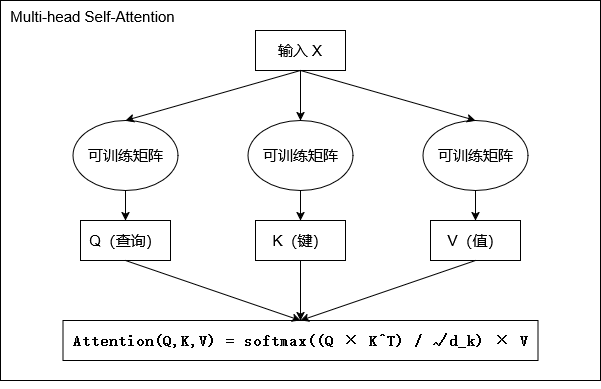
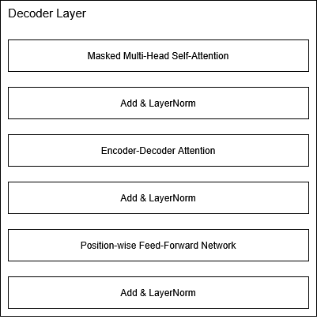

<style>
html {
  font-family: Consolas;
}
.box-centered {
  width: fit-content;
  margin: auto;
  display: flex;
  flex-direction: column;
  justify-content: center;
}
.box-left {
  flex: 1;
  height: 100%;
  display: flex;
  flex-direction: column;
}
.text {
  font-size: 1.5rem;
  text-align: left;
  margin-top: 0.8rem !important;
  margin-bottom: 0.8rem !important;
}
.list {
  margin-left: 3rem !important;
  margin-top: 0.4rem !important;
  margin-bottom: 0.4rem !important;
}
.title {
  font-size: 2.8rem;
  text-align: left;
  font-weight: bold;
}
.font-larger {
  font-size: 2rem;
}
.img-tip {
  font-size: 1.32rem;
  text-align: center;
  color: rgba(255, 255, 255, 0.45);
  margin-top: 1rem !important;
}
.img-fit {
  margin-bottom: 0 !important;
  max-height: 45vh !important;
}
.img-right {
  max-height: 55vh !important;
  max-width: 32vw !important
}
.box-four-combo {
  margin-top: 4rem;
  display: flex;
  flex-direction: row;
  justify-content: center;
  width: 100%;
}
.four-combo {
  width: 18%;
  margin-left: 2rem !important;
  margin-right: 2rem !important;
}
.reveal pre code {
  font-family: Consolas;
  font-size: 1.2rem;
  line-height: 2rem;
  overflow: visible;
  padding-right: 1.5rem;
}
</style>

<!-- slide -->

**Attention is All You Need**
NeuroIPS 2017

<!-- slide vertical -->

<div class="box-centered">
  <p class="title">旧的思路：</p>
  <li class="text list">核心依赖于 RNN 或 CNN</li>
  <li class="text list">RNN：序列依赖，计算复杂度大</li>
  <li class="text list">CNN：一次只能看几个词，需要堆叠很多很多层</li>
  <li class="text list">使用 Encoder-Decoder 结构</li>
  
</div>

<!-- slide vertical -->

<div class="box-centered">
  <p class="title">新的解决方案</p>
  <li class="text list">Transformer：丢弃复杂的神经网络模型，只保留注意力机制</li>
  <li class="text list">并行化，计算复杂度小</li>
  <li class="text list">效果反而更好，通用性更强</li>
</div>

<!-- slide -->

**输入预处理**

<!-- slide vertical -->

<div class="box-centered">
  <p class="title">输入预处理</p>
  <li class="text list">自注意力机制是无序的，无法感知输入序列的位置信息</li>
  <li class="text list">需要手动引入位置信息</li>

  $$PE(pos, 2i) = \sin(\frac{pos}{10000^{\frac{2i}{d_{model}}}})$$

  $$PE(pos, 2i+1) = \cos(\frac{pos}{10000^{\frac{2i}{d_{model}}}})$$
</div>

<!-- slide -->

**Encoder 结构**

<!-- slide vertical -->

**Encoder 由若干个（$N \geq 6$）个层构成**

<div class="box-centered">
  
</div>

<!-- slide vertical data-auto-animate -->

<div class="box-centered">
  <p class="title">多头自注意力机制</p>
  <li class="text list">根据输入并行计算 QKV 矩阵</li>
  <li class="text list">根据预定义的n_heads（往往是 8）拆分矩阵，并行计算</li>
  <li class="text list">将结果拼接，通过线性变换得到最终结果</li>

  $$Attention(Q, K, V) = softmax(\frac{Q\times K^T}{\sqrt{d_k}})\times V$$
</div>

<!-- slide vertical data-auto-animate -->

<div class="box-centered">
  <p class="title">多头自注意力机制</p>
  <li class="text list">根据输入并行计算 QKV 矩阵</li>
  <li class="text list">根据预定义的n_heads（往往是 8）拆分矩阵，并行计算</li>
  <li class="text list">将结果拼接，通过线性变换得到最终结果</li>

  
</div>

<!-- slide vertical -->

<div class="box-centered">
  <p class="title">位置前馈网络</p>
  <li class="text list">所有 token 共用一个 FNN，可独立并行计算</li>
  <li class="text list">为每个 token 的表示注入非线性和跨特征交互能力，进一步提炼文本信息。</li>
  <li class="text list">解决多头注意力机制只能对问题进行线性变换的问题</li>

  $$FFN(x) = max(0, xW_1 + b_1)W_2 + b_2$$

  ```python
  [batch, seq_len, d_model]
      ↓ W₁: [d_model, d_ff]
  [batch, seq_len, d_ff]  (扩展4倍)
      ↓ 激活函数
  [batch, seq_len, d_ff]
      ↓ W₂: [d_ff, d_model]
  [batch, seq_len, d_model]  (压缩回原维度)
  ```
</div>

<!-- slide -->

**Decoder 结构**

<!-- slide vertical -->

**Decoder 和 Encoder 类似**

<div class="box-centered">
  
</div>

<!-- slide vertical -->

<div class="box-centered">
  <p class="title">Masked Multi-Head Self-Attention</p>
  <li class="text list">Masked Multi-Head Self-Attention 是一种特殊的自注意力机制</li>
  <li class="text list">在计算自注意力时，需要屏蔽掉当前位置之后的信息</li>
  <li class="text list">防止当前位置的信息泄露到后面的位置</li>
</div>

<!-- slide vertical -->

<div class="box-centered">
  <p class="title">Encoder-Decoder Attention</p>
  <li class="text list">Encoder-Decoder Attention 使用的 K、V 矩阵来自编码器</li>
  <li class="text list">Q 矩阵来自解码器</li>
  <li class="text list">计算解码器中每个 token 对编码器所有 token 的注意力</li>

  ```python
  解码器输入（英文）
    │
    ├─→ [线性变换] ──→ Q1, K1, V1 ──→ 掩码自注意力 ──→ "理解已写内容"
    │
    └─→ [残差连接] ─────────────────────────────────────────┘
    │
    ↓ 更新后的表示
    │
    ├─→ [线性变换] ──→ Q2 ──→ 编码器-解码器注意力 ──→ "查看原文"
    │               K2, V2 │
    │                      └─→ 来自编码器（中文）
    │
    └─→ [残差连接] ──────────────────────────────────────┘
  ```
</div>

<!-- slide -->

**KV Cache**

<!-- slide vertical -->

<div class="box-centered">
  <p class="title">自回归生成的效率问题</p>
  <li class="text list">Transformer解码时采用自回归方式，逐个生成token</li>
  <li class="text list">生成第n个token时，需要重新计算前n-1个token的K/V矩阵</li>
  <li class="text list">重复计算导致时间复杂度为O(n²)，生成速度随序列长度急剧下降</li>
</div>

<!-- slide vertical -->

<div class="box-centered">
  <p class="title">什么是KV Cache</p>
  <li class="text list">缓存每一层、每个注意力头中已计算过的Key和Value矩阵</li>
  <li class="text list">空间换时间：用显存占用换取计算效率</li>
  <li class="text list">推理阶段专属优化，不改变模型结构和训练过程</li>
</div>

<!-- slide vertical -->

<div class="box-centered">
  <p class="title">KV Cache的增量计算过程</p>
  <li class="text list">首次计算：对输入序列所有token计算Q/K/V，保存K/V到缓存</li>
  <li class="text list">后续每步：仅计算当前token的Q/K/V，读取缓存获取历史K/V</li>
  <li class="text list">拼接后计算注意力：将缓存的K/V与当前K_t/V_t拼接，参与注意力运算</li>
  <li class="text list">每步时间复杂度从O(n)降为O(1)，总复杂度从O(n²)降为O(n)</li>

  ```python
  K_hist, V_hist = read_cache(layer, head)  # 形状：(batch, t-1, dim)
  Q_t = compute_query(cur_token)            # 形状：(batch, 1, dim)
  K_t = compute_key(cur_token)              # 形状：(batch, 1, dim)
  V_t = compute_value(cur_token)            # 形状：(batch, 1, dim)

  K_full = concat([K_hist, K_t], dim=1)     # 形状：(batch, t, dim)
  V_full = concat([V_hist, V_t], dim=1)     # 形状：(batch, t, dim)

  output = attention(Q_t, K_full, V_full)   # 注意力计算
  update_cache(layer, head, K_t, V_t)       # 追加到缓存
  ```
</div>
