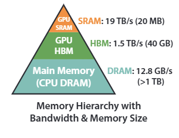

<!-- slide -->

**FlashAttention: Fast and Memory-Efficient Exact Attention with IO-Awareness**
NeuroIPS 2022

<!-- slide vertical -->

  
问题发现

  <li class="text list">传统自注意力机制的时间和内存复杂度都是 O(N²)</li>
  <li class="text list">很多方法设法降低了计算复杂度，但并没有带来明显的"wall-clock"速度提升</li>
  
论文思考

  <li class="text list">之前的方法都忽略了内存读写速度的限制</li>
  <li class="text list">因此，本论文尝试减少缓速内存的读写，尽量使用高速（但容量受限）的内存计算</li>

<!-- slide vertical -->

  
GPU内存层次结构

  

<!-- slide -->

**正向传播：Tiling**

<!-- slide vertical -->

  <li class="text list">传统自注意力机制计算注意力：</li>

  $$Attention(Q, K, V) = Softmax(\frac{Q\times K^T}{\sqrt{d_k}})\times V$$

  <li class="text list">其中受到限制最大的就是 Softmax，需要读取一整行才能计算</li>

<!-- slide vertical -->

**Tiled Softmax**

<!-- slide vertical -->

要计算 $Softmax(x)$，其中 $x = [x^{(1)}, x^{(2)}]$

<!-- slide vertical -->

对于Softmax:
$$
m(x) := \max x_i \\
f(x) := [e^{x_1 - m(x)} \cdots e^{x_n - m(x)}] \\
l(x) := \sum_i f(x)_i = \sum_ie^{x_i - m(x)}
$$

$$
Softmax(x) = \frac{f(x)}{l(x)} = \frac{e^{x - m(x)}}{\sum_ie^{x_i - m(x)}}
$$

<!-- slide vertical -->

对于向量 $x = [x^{(1)}, x^{(2)}]$（两个子块）：
$$
m(x) := \max \{m(x^{(1)}), m(x^{(2)})\} \\
l(x) := e^{m(x^{(1)}) - m(x)}\cdot l(x^{(1)}) + e^{m(x^{(2)}) - m(x)}\cdot l(x^{(2)})
$$

$$
Softmax(x) = \frac{e^{x - m(x)}}{l(x)}
$$

<!-- slide vertical -->

因此，只需要维护 $m(x)$ 和 $l(x)$，就可以计算 $Softmax(x)$

<!-- slide vertical -->

之后，再增量更新结果 O：

$$
O_i^{new} = diag(l_i^{new})^{-1}(diag(l_i)e^{m_i-m_i^{new}}O_i \\ + e^{\overset{\sim}{m}_{ij}-m_i^{new}}\overset{\sim}{P}_ijV_j)
$$

其中：

$$
S_{ij} = Q_iK_j^T \\
\overset{\sim}{m}_{ij} = rowmax(S_{ij}) \\
\overset{\sim}{P}_ij = exp(S_{ij} - \overset{\sim}{m}_{ij})
$$

<!-- slide vertical -->

  
算法流程

  <li class="text">划分 KQV，在 HBM 中初始化输出 O 和统计量 m，l
  <li class="text">循环遍历 K_j，V_j 块</li>
  <li class="text list">从 HBM 加载 K_j，V_j 到 SRAM</li>
  <li class="text list">循环遍历 Q_i，O_i，l_i，m_i 块</li>
  <li class="text list list-2">从 HBM 加载 Q_i，O_i，l_i，m_i 到 SRAM</li>
  <li class="text list list-2">计算并更新到 HBM</li>
  <li class="text list">循环结束</li>
  <li class="text">循环结束</li>
  <li class="text">返回计算结果</li>

