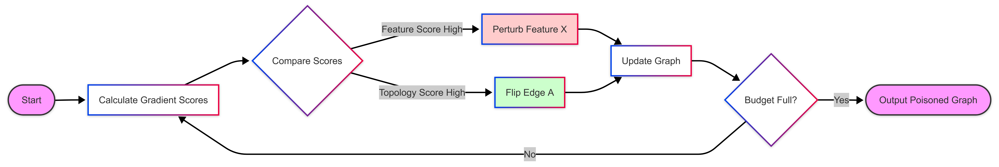
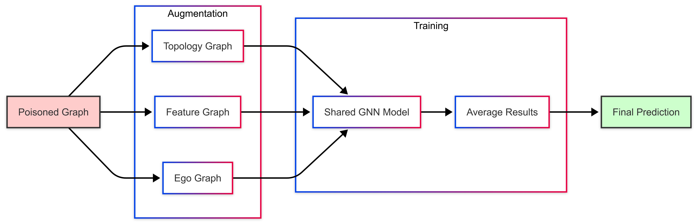

<!--
header: Black-box Adversarial Attack and Defense on Graph Neural Networks
_class: title-page
-->

# **Black-box Adversarial Attack and Defense on Graph Neural Networks**

### ICDE 2022

---

## Catalog
- **Background**
  - Graph
  - Graph Neural Network
  - Adversarial Attack
- **The paper**

---

<!-- header: Background: Graph -->

## **Graph**
Graph is a kind of data structure, which is composed of **Nodes** and **Edges**.
**Nodes** are connected by **Edges** to express the relationship.

---

## **Graph**
Graph is a kind of data structure, which is composed of **Nodes** and **Edges**.
The **Edges** can either be directed or undirected.

---

<!-- header: Background: Graph Neural Network -->

## **Graph Neural Network**

**Neural Network** can convert some vector into another vector.

But it requires the data to be **Sequential**

---

## **Graph Neural Network (GNN)**

Standard Neural Networks (like CNN/RNN) require **Grid** or **Sequence** data.
Graphs differ: **No fixed order**, **Variable neighbors**.

**The Solution: Message Passing**
Each node becomes a "collector", gathering info from friends.

---

## **Graph Neural Network (GNN)**

---

#### **Message Aggregation**

For each **Node** $v$, we aggregate the information from its neighbors $N(v)$ and store the aggregated message $m$:

The calculation is done layer by layer.

- For the $l$-th layer:

$$m_i^{(l + 1)} = \epsilon(\{h_i^{(l)}, h_j^{(l)}, e_{ij}: v_j\in N(v_i)\})$$

where $\epsilon$ is the aggregation function, $h_i, h_j$ is the hidden state of node $v_i, v_j$, $e_{ij}$ is the state between node $v_i$ and $v_j$

---

#### **Status Update**

We update the hidden state of node $v$ with the aggregated message $m_i$ and old hidden state $h_i^{(l)}$:

$$h_i^{(l + 1)} = \sigma(h_i^{(l)}\textcircled{+}m_i)$$

where $\sigma$ is the activation function, and $\textcircled{+}$ is combination method.

---

#### **Usage**

- **Social Network Analysis**: User Classification, Community Detection, Information Propagation
- **Recommendation System**: Item Recommendation, User Preference Prediction
- **NLP**: Relation Extraction
- etc.

---

#### **Why do we Attack Graphs?**

It is not just about being malicious; it's about **Safety**.

-   **Financial Fraud**: Fraudsters disguise themselves by connecting to normal users.
-   **Social Botnet**: Bots follow real celebrities to look "real".
-   **Robustness Testing**: Finding bugs before the bad guys do.

---

<!-- header: Background: Adversarial Attack -->

#### **Adversarial Attack**

Let's use an attack on **image** as an example:

By adding small changes to the image, the prediction result will be completely different.

---

### Attack on **Social Network**

---

#### **Attack on Graph Data**

Unlike images where we change pixels, in graphs, we change the **Structure**.

- **Perturbation**: Adding or deleting edges (relationships).
- **Goal**: Make the GNN classify a specific node (or many nodes) incorrectly.

**Example**:
> *Attacker adds a few fake "friend" connections to a user, causing the system to classify a normal user as a "bot".*

---

### **Quantifying the effectiveness of an attack**

Let $H$, $\hat{H}$ be the representation matrices before and after attack.

**Self-view node representation difference** quantifies the representation change of a single node after attack

$$Dif_1(H, \hat{H}) = \Sigma_{v\in V}||\hat{h}_v-h_v||_p$$

**Global-view node representation difference** quantifies the representation difference between an attacked node and its original neighbors

$$Dif_2(A, H, \hat{H}) = \Sigma_{v\in V}\Sigma_{u\in N_v}||\hat{h}_v-h_v||_p$$

---

<!--
header: PEEGA: Attacking the Black-box GNN
_class: title-page
-->

# PEEGA
**Practical, Effective and Efficient GNN adversarial Attacker**

---

## **How to Attack Without a Model?**

Since we don't have the model parameters ($W$), we need a **Substitute**.

**The Proxy Model**:
We pretend the GNN is simply:
$$H \approx A_{norm}^2 X$$
*If we change $A$ or $X$ to mess up this calculation, we likely mess up the real GNN.*

---

## **The Attack Objective**

We want to maximize the **Difference** (Damage).
Since we don't have labels, we assume: **"A node should look like its neighbors."**

We maximize the difference ($Loss$) between the *original* and *attacked* state:

$$\underbrace{\sum_{v \in V} ||\hat{A}_n^2[v]\hat{X} - A_n^2[v]X||_p}_{\text{Self-View (Change yourself)}} + \lambda \underbrace{\sum_{v \in V} \sum_{u \in N_v} ||\hat{A}_n^2[v]\hat{X} - A_n^2[u]X||_p}_{\text{Global-View (Change from neighbors)}}$$

---

## **Greedy Optimization Algorithm**

We have a budget $\delta$ (e.g., we can only change 5 edges). We use a **Greedy Strategy**.

---

## **3. PEEGA: Time Complexity Breakdown**

How expensive is this? Let's break down the cost per iteration.

| Operation | Formula | Cost |
| :--- | :--- | :--- |
| **Matrix Mult** | Computing $A^2 X$ | $O(d_x \|V\|^2)$ |
| **Gradient** | Computing Scores $S_t, S_f$ | $O(d_x \|V\|^2)$ |
| **Selection** | Finding max value in matrix | $O(\|V\|^2)$ |

---

## **3. PEEGA: Time Complexity Breakdown**

**Total Complexity Calculation**:
$$\text{Total Time} = \underbrace{\delta}_{\text{Iterations}} \times \underbrace{O(d_x |V|^2)}_{\text{Cost per Iteration}} = \mathbf{O(\delta \cdot d_x \cdot |V|^2)}$$

- **Why is this efficient?**
    - It is **linear** to the budget $\delta$.
    - It avoids the expensive "Bi-level Optimization" (retraining GNNs) used by white-box attacks.

---

<!--
header: GNAT: Defending the Black-box GNN
_class: title-page
-->

# Defense: GNAT
**Graph NaugmeNtATion (Graph Augmentation)**

---

**The Problem**: Attackers add edges between *different* classes ("Context Blurring").
**The Fix**: Ignore the bad edges. Construct **3 New Graphs** based on trust.

1.  **Input**: The Poisoned Graph $\hat{G}$.
2.  **Construction**: Build 3 Augmented Graphs ($G^t, G^f, G^e$).
3.  **Training**: Train a shared GCN on all 3 graphs simultaneously.
4.  **Prediction**: Average the outputs.

$$Z_{final} = \frac{1}{3} (Z_{topology} + Z_{feature} + Z_{ego})$$

---

## **GNAT: Three Augmented Graphs**

Since we can't trust the raw edges, GNAT creates 3 views to help:

1.  **Topology Graph ($G^t$)**:
    Connects **Friends of Friends** ($k$-hop). Rebuilds structural context.
2.  **Feature Graph ($G^f$)**:
    Connects nodes with **Similar Features** (Cosine similarity).
3.  **Ego Graph ($G^e$)**:
    Adds **Self-loops**. Forces the node to trust its own data more than neighbors.

---

## **GNAT Architecture**

We train the model on **all three graphs** simultaneously.

---

## **Complexity & Efficiency**

**PEEGA (Attacker)**
-   **Efficient**: Does not require training a model during attack generation.
-   **Practical**: Works without knowing labels or model parameters.

**GNAT (Defender)**
-   **Efficiency**: Only slightly slower than a standard GNN (needs to process 3 graphs).
-   **Speed**: Much faster than "Adversarial Training" methods (which take hours).

---

## **Efficiency Comparison**

How does GNAT compare to a standard GCN?

**Training Complexity**:
$$T_{GNAT} \approx 3 \times T_{GCN} + T_{construction}$$

-   **Construction Cost**:
    -   Topology ($k$-hop): $O(|V| \cdot \text{AvgDegree}^k)$ (Sparse BFS)
    -   Feature (KNN): $O(|V|^2 d_x)$ (Pairwise similarity)

