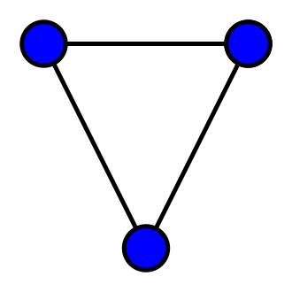
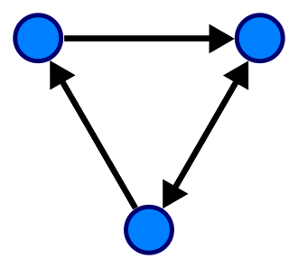
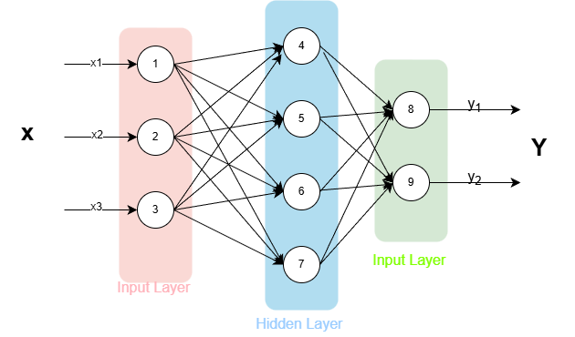

<!--
header: GNN: Adversal Attack and Defence
_class: title-page
-->

## GNN: 
## **Adversal Attack and Defence**

---

<!-- _header: GNN: Catalog -->

## Catalog
- **Background**
  - Graph
  - Graph Neuro Network
  - Adversal Attack
- **Why Large Scale Graph**
- **How to**
  - Related Work

---

<!-- header: Background: Graph -->

## **Graph**
Graph is a kind of data structure, which is composed of **Nodes** and **Edges**.
**Nodes** are connected by **Edges** to express the relationship.

---

## **Graph**
Graph is a kind of data structure, which is composed of **Nodes** and **Edges**.
The **Edges** can either be directed or undirected.

---

<!-- header: Background: Graph Neural Network -->

## **Graph Neural Network**

**Neuro Network** can convert some vector into another vector.

But it requires the data to be **Sequential**

---

## **Graph Neural Network**

If we need to use neural network on a graph, we have to convert the graph into a **Sequence**.

This causes the loss of information:
- **Nodes** are in order, but the order does not matter in graph.
- **Edges** are not considered.
- We cannot percept the **Graph Structure**.

So we need to find a better way to convert **Nodes** into **Vectors**.

---

#### **Message Aggregation**

For each **Node** $v$, we aggregate the information from its neighbors $N(v)$ and store the aggregated message $m$:

The commonly used aggregation functions are:
- **Sum**: $\sum_{v_j \in N(v_i)} RELU(W\cdot h_j + b)$
- **Mean**: $\frac{1}{|N(v_i)|} \sum_{v_j\in N(v_i)}h_j$
- **Max Pooling**: $m_i = \max_{v_j\in N(v_i)}\{h_j\}$

where $h_j$ is the hidden state of node $v_j$, $W$ and $b$ are learnable parameters.

---

#### **Status Update**

We update the hidden state of node $v$ with the aggregated message $m_i$ and old hidden state $h_i^{(l)}$:

$$h_i^{(l + 1)} = \sigma(h_i^{(l)}\textcircled{+}m_i)$$

where $\sigma$ is the activation function, and $\textcircled{+}$ is concatenation or linear transformation.
