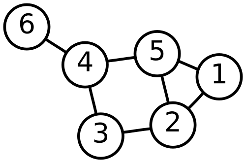

<!--
header: GNN: Adversal Attack and Defence
_class: title-page
-->

## GNN: 
## **Adversal Attack and Defence**

---

<!-- _header: GNN: Catalog -->

## Catalog
- **Background**
  - Graph
  - Graph Neuro Network
  - Adversal Attack
- **Why Large Scale Graph**
- **How to**
  - Related Work

---

<!-- _header: Background: Graph -->

## **Graph**
Graph is a kind of data structure, which is composed of **Nodes** and **Edges**, it's a structure consisting of a set of objects where some pairs of the objects are in some sense "related"

---

<!--  -->
