<!--
header: GNN: Adversarial Attack and Defence
_class: title-page
-->

## GNN: 
## **Adversarial Attack and Defence**

---

<!-- _header: GNN: Catalog -->

## Catalog
- **Background**
  - Graph
  - Graph Neural Network
  - Adversarial Attack
- **Why Large Scale Graph**
- **How to**
  - Related Work

---

<!-- header: Background: Graph -->

## **Graph**
Graph is a kind of data structure, which is composed of **Nodes** and **Edges**.
**Nodes** are connected by **Edges** to express the relationship.

---

## **Graph**
Graph is a kind of data structure, which is composed of **Nodes** and **Edges**.
The **Edges** can either be directed or undirected.

---

<!-- header: Background: Graph Neural Network -->

## **Graph Neural Network**

**Neural Network** can convert some vector into another vector.

But it requires the data to be **Sequential**

---

## **Graph Neural Network (GNN)**

Standard Neural Networks (like CNN/RNN) require **Grid** or **Sequence** data.
Graphs differ: **No fixed order**, **Variable neighbors**.

**The Solution: Message Passing**
Each node becomes a "collector", gathering info from friends.

---

## **Graph Neural Network (GNN)**

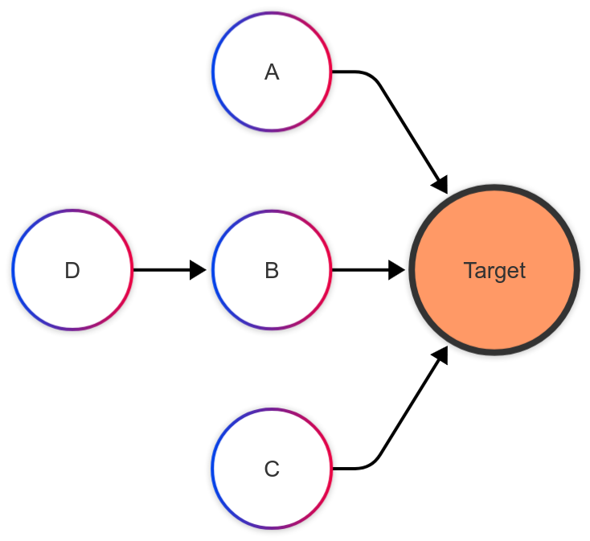

---

#### **Message Aggregation**

For each **Node** $v$, we aggregate the information from its neighbors $N(v)$ and store the aggregated message $m$:

The calculation is done layer by layer.

- For the $l$-th layer:

$$m_i^{(l + 1)} = \epsilon(\{h_i^{(l)}, h_j^{(l)}, e_{ij}: v_j\in N(v_i)\})$$

where $\epsilon$ is the aggregation function, $h_i, h_j$ is the hidden state of node $v_i, v_j$, $e_{ij}$ is the state between node $v_i$ and $v_j$

---

#### **Status Update**

We update the hidden state of node $v$ with the aggregated message $m_i$ and old hidden state $h_i^{(l)}$:

$$h_i^{(l + 1)} = \sigma(h_i^{(l)}\textcircled{+}m_i)$$

where $\sigma$ is the activation function, and $\textcircled{+}$ is combination method.

---

#### **Usage**

- **Social Network Analysis**: User Classification, Community Detection, Information Propagation
- **Recommendation System**: Item Recommendation, User Preference Prediction
- **NLP**: Relation Extraction
- etc.

---

#### **Why do we Attack Graphs?**

It is not just about being malicious; it's about **Safety**.

-   **Financial Fraud**: Fraudsters disguise themselves by connecting to normal users.
-   **Social Botnet**: Bots follow real celebrities to look "real".
-   **Robustness Testing**: Finding bugs before the bad guys do.

---

<!-- header: Background: Adversarial Attack -->

#### **Adversarial Attack**

Let's use an attack on **image** as an example:

By adding small changes to the image, the prediction result will be completely different.

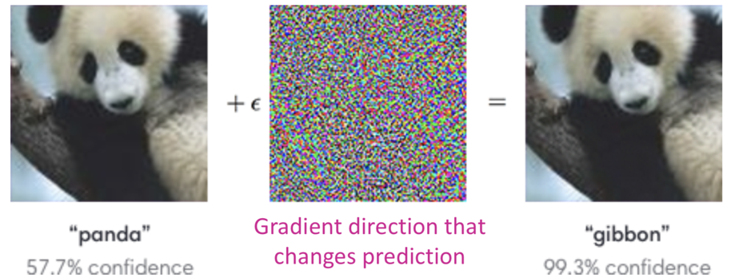

---

### Attack on **Social Network**

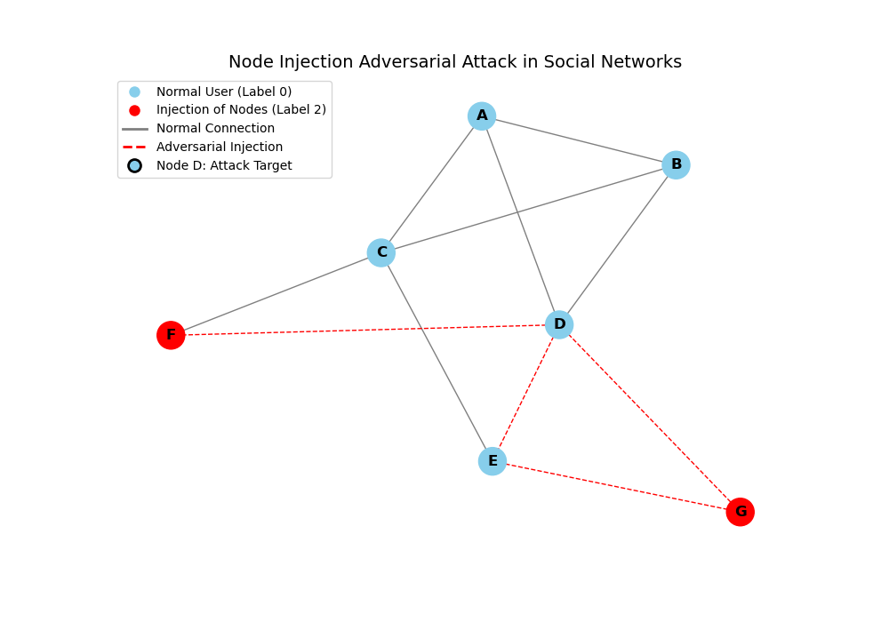

---

#### **Attack on Graph Data**

Unlike images where we change pixels, in graphs, we change the **Structure**.

- **Perturbation**: Adding or deleting edges (relationships).
- **Goal**: Make the GNN classify a specific node (or many nodes) incorrectly.

**Example**:
> *Attacker adds a few fake "friend" connections to a user, causing the system to classify a normal user as a "bot".*

---

## **The Reality Gap**

Most existing research focuses on **Tiny Datasets** (e.g., Cora, PubMed ~20k nodes). 

However, real-world graphs are **Massive**:

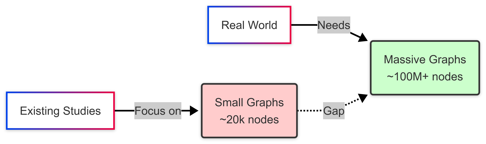

---

## **Why is Scale a Problem?**

**Memory Explosion!** 💥

To attack a graph optimally, we often need to calculate gradients for **all possible edges**.

- **Space Complexity**: $O(n^2)$ (Quadratic)
- For a graph with millions of nodes, storing the dense adjacency matrix requires **Exabytes** of memory. 

---

<!--
_class: title-page
header: Robustness of GNNs at Scale
-->

## Robustness of GNNs at Scale
#### **NeurIPS 2021**

---

### **Challenge 1: The "Wrong" Goal**

Attackers usually use **Cross Entropy (CE)** loss to guide the attack.

On large graphs with small budgets, CE wastes energy attacking nodes that are **already wrong** or **too hard** to flip. 

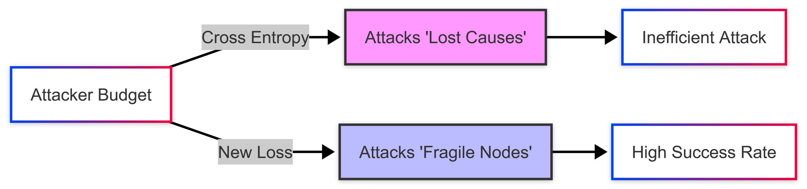

---

### **Deep Dive: The Problem with Cross Entropy (CE)**

To attack a model, we usually maximize the **Cross Entropy Loss**.
$$\mathcal{L}_{CE} = - \log(p_{correct\_class})$$

-   It wants the probability of the correct class ($p_{correct}$) to be **0**.
-   Even if the node is already misclassified (e.g., $p_{correct} = 0.4$, predicted class is wrong), CE is **not satisfied**. It pushes $p_{correct}$ towards $0.0001$.

> CE has an "Infinite Appetite". It keeps attacking nodes that are **already dead** (misclassified).

---

### **Why CE Fails at Scale (Global Attack)**

Imagine you have **1 Million Nodes** but budget to flip only **1,000 Edges**.

**The CE Trap:**
1.  **Gradients**: CE generates huge gradients for nodes that are "very wrong" (low confidence).
2.  **Budget Waste**: The attack spends the limited budget making "wrong" nodes "more wrong" (e.g., probability $0.4 \rightarrow 0.01$).
3.  **Outcome**: The **Accuracy** (0/1 count) doesn't change! You wasted ammo on dead targets.

> We need a loss function that says: **"This node is dead, move on to the next one!"**

---

### **Solution: Defining the "Margin"**

First, let's look at the **Logits** (raw output $z$) instead.

We define the **Classification Margin** $\psi$:
$$\psi = z_{correct} - \max_{c \neq correct} z_{c}$$

-   **$\psi > 0$**: Node is **Correct** (Safe).
-   **$\psi < 0$**: Node is **Wrong** (Misclassified).
-   **$\psi \approx 0$**: Node is on the **Decision Boundary** (Fence-sitter).

*Our Goal: Only attack when $\psi > 0$ but close to 0.*

---

### **The "Magic" of Tanh Margin**

The paper proposes a new loss: **Tanh Margin**.
$$\mathcal{L}_{Tanh} = \tanh(\psi) = \tanh(z_{correct} - z_{best\_other})$$

**How the Gradients Work (The Math of Tanh):**
The derivative of $\tanh(x)$ is $1 - \tanh^2(x)$.

-   **If $\psi \ll 0$ (Already Wrong):** Gradient $\approx 0$. **(Stop Attacking)** 
-   **If $\psi \gg 0$ (Too Safe):** Gradient $\approx 0$. **(Ignore)**
-   **If $\psi \approx 0$ (Boundary):** Gradient is **MAX**. **(Attack Here!)**

---

### **Challenge 2: Memory Limits**

Traditional attacks (like PGD) try to optimize the **entire** adjacency matrix at once.

$$\Theta(n^2) \text{ Memory Usage}$$

For 1 million nodes, $n^2$ is $1,000,000,000,000$ parameters. **Impossible to store.** 

---

### **Solution: PR-BCD**

**Projected Randomized Block Coordinate Descent** 

Instead of looking at the whole graph, we look at a small random **Block** at a time.

- **Memory**: $O(b)$ instead of $O(n^2)$.
- **Speed**: We only update a subset of edge probabilities per step.

---

### **How PR-BCD Actually Works (Step-by-Step)**

We treat the adjacency matrix $A$ as a set of continuous probabilities $P_{ij} \in [0,1]$.

**The Loop:**
1.  **Sample**: Randomly pick a small block of $b$ edges (e.g., $10^5$ out of $10^{12}$).
2.  **Gradient**: Calculate gradients **only** for these $b$ edges.
3.  **Update**: Adjust the probability of flipping these edges.
4.  **Project**: Ensure the sum of probabilities fits our Budget $\Delta$.

---

### **The "Survival of the Fittest" Heuristic**

How do we find the best edges if we don't look at all of them?

**Resampling Strategy**:
At the end of every epoch, we look at our block of $b$ edges:
- **Keep**: The edges with high flip probabilities (The "Strong" attackers).
- **Discard**: The edges with low probabilities (The "Weak" ones).
- **Refill**: Randomly sample new edges from the graph to replace the discarded ones.

---

### **Challenge 3: Defending the Graph**

GNNs aggregate messages from neighbors.
**Sum** or **Mean** aggregation is vulnerable: one malicious "extreme" neighbor ruins the average.

$$\text{Mean}([1, 2, 2, 100]) = 26.25 \quad (\text{Skewed!})$$

$$\text{Median}([1, 2, 2, 100]) = 2 \quad (\text{Robust!})$$

---

### **Solution: Soft Median**

The paper introduces **Soft Median** aggregation. 

- **Robust**: It ignores outliers (attacked edges).
- **Differentiable**: Unlike standard median, it can be trained via backpropagation using a "Temperature" parameter.
- **Scalable**: Much faster and less memory-intensive than previous robust methods (like Soft Medoid).

---

### **Implementing Soft Median**

Standard Median is **sorting**, which breaks backpropagation (gradients can't flow through "sort").

**Soft Median** approximates it using a **Weighted Average**:

$$\mu_{\text{Soft}} = \sum_{x \in \text{Neighbors}} w_x \cdot x$$

The "magic" is in how we calculate the weights $w_x$.

---

### **The Weight Calculation**

We want **Outliers** (attacked edges) to have **Zero Weight**.

1.  Calculate **Distance** $d_i$ between node $i$ and the dimension-wise median.
2.  Compute Weight using **Softmax**:

$$w_i = \text{Softmax}\left( - \frac{d_i}{T} \right)$$

- If distance $d_i$ is **High** (Outlier) $\rightarrow w_i \approx 0$ (Ignored).
- If distance $d_i$ is **Low** (Normal) $\rightarrow w_i$ is high.

---

The temperature parameter $T$ controls the "Softness".

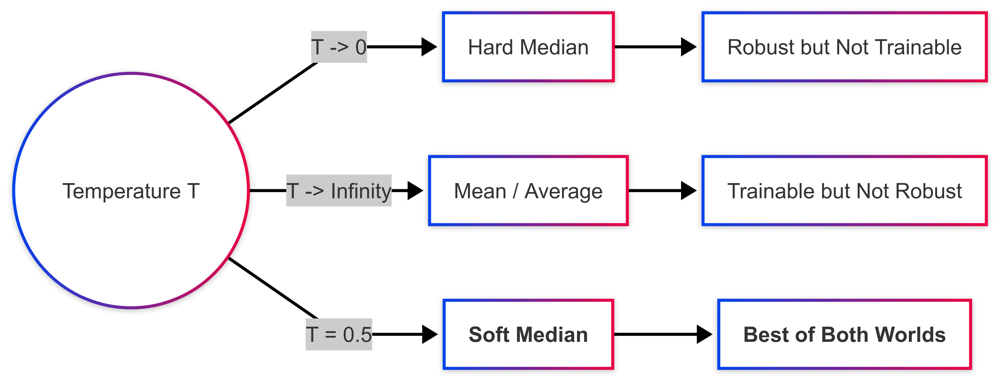

By tuning $T$, we can ignore adversarial attacks.

---

### **Experimental Results**

The authors tested on **Papers100M** (111 million nodes). 

**Attack Performance**:
- PR-BCD is highly effective even with <11GB memory. 

**Defense Performance**:
- Under attack, standard GNN accuracy drops to ~1%.
- **Soft Median** defense keeps accuracy high (~30-80% depending on setup). 

---

<!--
_class: title-page
header: SGA: Simplified Gradient-based Attack
-->
## SGA: Simplified Gradient-based Attack
#### **The Art of "Less is More"**
(TKDE 2021)

---

### **The Bottleneck of Global Attacks**

Standard gradient attacks (like PGD) need to calculate gradients for **every possible edge**.

-   **Graph Size**: $N$ nodes.
-   **Possible Edges**: $N^2$ (Dense Matrix).
-   **For Reddit Dataset**: $230,000$ nodes $\rightarrow$ $53$ Billion possible edges.

**Result**: GPU Memory Overflow (OOM) 💥.

> **SGA's Question**: Do we really need the *entire* graph to attack *one* node?

---

### **Step 1: Subgraph Extraction**

**Intuition**: The "Butterfly Effect" in GNNs is limited.
A change 10 hops away usually won't affect the target node significantly.

**SGA Strategy**:
Extract a **$k$-hop subgraph** centered at the target node (usually $k=2$).

-   **Reduced Space**: From $N$ nodes to just local neighbors (~100s).
-   **Efficiency**: Computations become instantaneous.

---

### **Step 2: Enlarging the Search Space**

Just deleting existing edges is not enough. We want to **Add** malicious edges.
But connecting to *whom*?

---

**Potential Nodes**:
SGA identifies nodes outside the subgraph that carry strong "wrong class" signals.

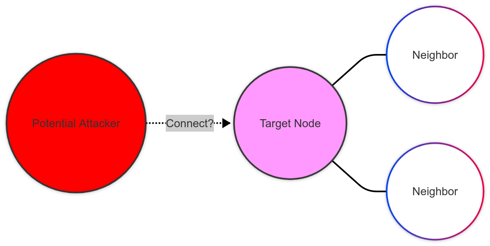

We add these **Potential Nodes** to the subgraph to calculate their gradients.

---

### **Step 3: The "Vanishing Gradient" Problem**

We use a simplified model (SGC) to get gradients: $\nabla = \frac{\partial \mathcal{L}}{\partial A}$.

**The Trap**:
If the model is **Too Confident** (e.g., Probability = 0.9999), the loss curve is flat.
$$\text{Flat Curve} \rightarrow \text{Gradient} \approx 0$$

The attacker gets **No Signal** on how to improve the attack.

---

### **Step 4: Gradient Calibration**

**Solution**: Introduce a Scale Factor $\epsilon$ (Temperature).

$$P = \text{Softmax}\left( \frac{\text{Logits}}{\epsilon} \right)$$

By dividing logits by $\epsilon$ (e.g., $\epsilon=5.0$):
1.  The probability distribution becomes **Softer**.
2.  The gradients become **Non-Zero**.
3.  The attacker "sees" the direction again.

---

### **Step 5: The Iterative Attack Loop**

SGA attacks sequentially to be precise.

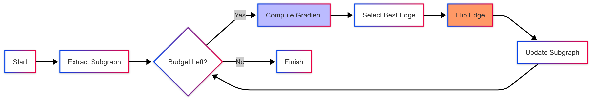

> **Note**: If we add an edge to a distant node, we must **Update the Subgraph** to include that node's neighbors for the next step.

---

<!--
_class: title-page
header: GRB: Graph Robustness Benchmark
-->

## GRB: Graph Robustness Benchmark
#### **NeurIPS 2021**

---

### **The "Wild West" of GNN Security**

Before this paper, comparing different defense methods was like comparing **Apples to Oranges**.

- **Different Datasets**: One paper uses *Cora*, another uses *Reddit*.
- **Different Settings**: One assumes the attacker knows everything (White-box), another assumes nothing (Black-box).
- **Tiny Scales**: Most defenses only worked on graphs with < 5,000 nodes.

> **Problem**: We don't know which defense is actually robust in the real world. 

---

### **The 3 Major Flaws in Previous Benchmarks**

1.  **Unrealistic Assumptions**:
    Attackers often assume they can modify *any* edge. In reality, you can't just delete a Facebook friendship between two strangers. 
2.  **Lack of Unity**:
    No standardized protocol. Paper A attacks 5% of nodes; Paper B attacks 10%. Results are incomparable. 
3.  **Scalability Issues**:
    Existing benchmarks ignored large graphs. A defense that works on 1,000 nodes might crash on 1 million. 

---

#### **GRB: The Unified Framework**

GRB proposes a standardized pipeline to fix these issues.

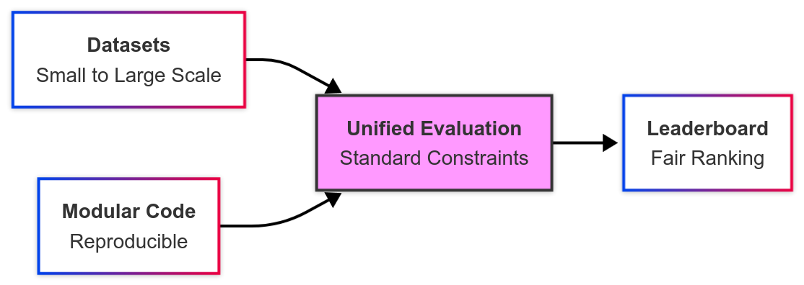

It focuses on **Reproducibility** and **Realism**. 

---

### **Scenario 1: Modification (The Classic View)**

Attackers modify the **Existing Structure** of the graph.

-   **Action**: Add/Remove edges between existing nodes.
-   **Perturb Features**: Change the attributes of a user.
-   **Reality Check**: Hard to do in real life. (Requires hacking the database or compromising specific users). 

---

### **Scenario 2: Graph Injection (Realism)**

**Modification Attack** (Modifying existing edges) is hard in reality.
> *You cannot force two strangers on Facebook to become friends.*

**Injection Attack** (Adding new nodes) is realistic.
> *You CAN create 100 fake bot accounts and have them follow the target.*

GRB focuses heavily on this **Injection** scenario.

---

## **Summary**

| Paper | Problem | Key Innovation | Takeaway |
| :--- | :--- | :--- | :--- |
| **Robustness at Scale** | Memory $O(N^2)$ | **PR-BCD**: Random Block Sampling **Tanh Margin**: Better Loss | Optimize sparse blocks; Stop attacking dead nodes. |
| **SGA** | Time Complexity | **Subgraph**: Ignore far nodes **Calibration**: Fix vanishing grad | Local info is enough; Scale factor matters. |
| **GRB** | Evaluation Chaos | **Standardization**: Unified Pipeline **Leaderboard**: Matrix Evaluation | Focus on **Injection** attacks and **Scalable** datasets. |

---

### **Visualizing Injection Attack**

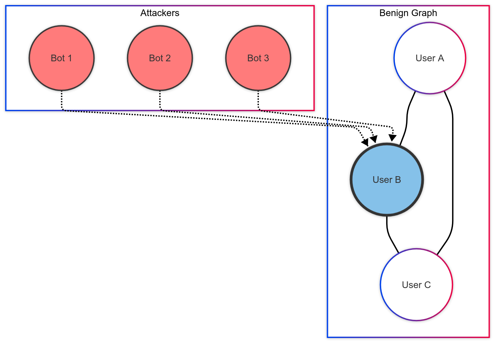

---

### **The Unified Rules**

To make comparisons fair, GRB sets strict rules:

1.  **Black-box**: Attackers know the graph data, but **NOT** the model weights or defense strategy. 
2.  **Inductive**: The model is trained on one set of nodes, but attacked on **Unseen Nodes** (New users). 
3.  **Evasion**: The attack happens during **Inference** (Deployment), not during training. 

---

### **Data: From Tiny to Huge**

GRB includes 5 datasets to test **Scalability**.

| Dataset | Type | Nodes | Edges | Scale |
| :--- | :--- | :--- | :--- | :--- |
| **grb-cora** | Citation | ~2.6k | ~5k | Tiny |
| **grb-flickr** | Social | ~89k | ~450k | Medium |
| **grb-reddit** | Social | ~232k | ~11.6M | **Large** |
| **grb-aminer** | Academic | ~659k | ~2.8M | **Large** |

---

### **Not All Nodes are Equal**

GRB discovered that **Degree** (number of connections) determines robustness.

-   **Low Degree**: Easy to attack. (Few friends = easy to influence).
-   **High Degree**: Hard to attack. (Many friends = stable opinion).

**The Splitting Scheme**:
GRB splits the test set into **Easy, Medium, and Hard** subsets based on node degree to analyze defenses in depth. 

---

### **The "Arms Race" Leaderboard**

A defense isn't good if it only stops *one* specific attack.
GRB evaluates a **Matrix** of battles.

This prevents "overfitting" a defense to a specific attack method. 

---

$$\text{Score} = \text{Weighted Average against ALL Attacks}$$

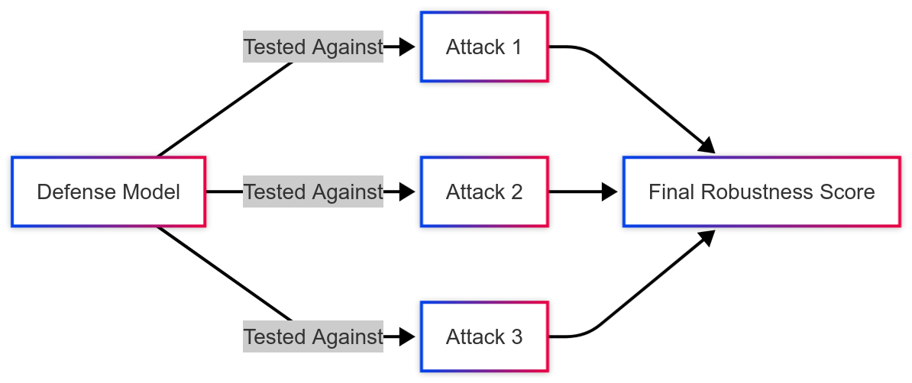

---

<!--
header: TDGIA: Topological Defective Graph Injection Attack
_class: title-page
-->

## TDGIA
#### **KDD 2021**

---

### **Attack Scenario: Modification vs. Injection**

**Graph Modification Attack (GMA)**:
> "I will hack the database and delete the friendship between Alice and Bob."
> *Unrealistic: Requires high-level server access.* 

**Graph Injection Attack (GIA)**:
> "I will create a fake account (Bot) and follow Alice."
> *Realistic: Anyone can sign up for a new account.* 

---

### **Visualizing the Difference**

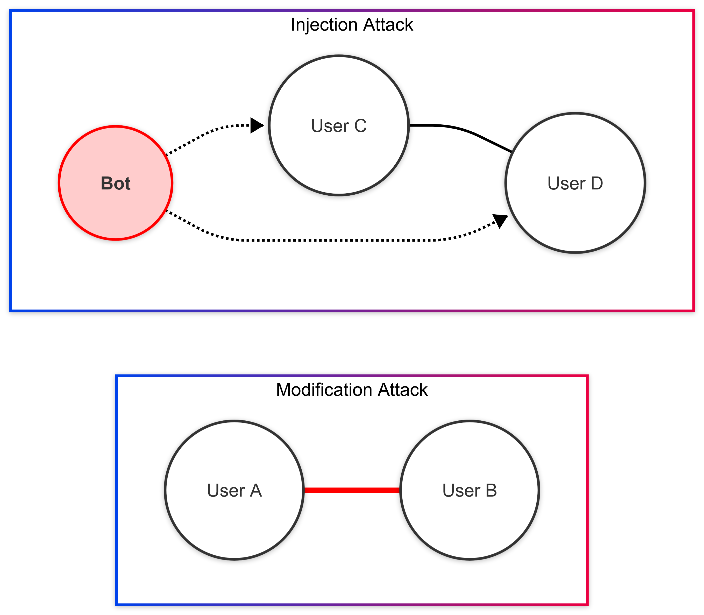

**TDGIA** focuses on the **Injection** scenario (Right). 

---

### **The Two Big Questions**

When you inject a "Bot" node into a graph, it starts as a blank slate. To do damage, you must answer two questions:

1.  **Who do I connect to?** (Topological Structure)
    * We need to pick targets that are "vulnerable".
2.  **What do I post?** (Node Features)
    * We need to generate content that tricks the GNN.

**TDGIA** solves these with a two-step framework. 

---

### **Step 1: Topological Defective Edge Selection**

How does a GNN update a node's status? By **Weighted Aggregation**.

$$h_v^{(k)} = \text{Combine}\left( h_v^{(k-1)}, \sum_{u \in Neighbors} w_{uv} \cdot h_u^{(k-1)} \right)$$

TDGIA analyzes these weights ($w_{uv}$) to find the "weakest spots" in the graph. 

---

### **Finding the Vulnerable Targets**

Different GNNs (GCN, GraphSAGE) use different normalization weights. TDGIA combines them to define a **Defect Score** $\lambda_v$:

$$\lambda_{v} = k_{1}\frac{1}{\sqrt{deg(v) \cdot d}} + k_{2}\frac{1}{deg(v)}$$

-   $deg(v)$: Degree of the target node.
-   $d$: Budget (max degree of our bot).

> This formula aims to simulate the weight function during aggregation process of different GNNs.

---

### **Step 2: Smooth Adversarial Optimization**

Now we have connections. We need to generate the **Features** (content) for the Bot.
**The Problem with Standard Loss (e.g., Cross Entropy):**
-   **Gradient Explosion**: If the model is very wrong ($p \approx 0$), gradients go to $\infty$.
-   **Gradient Vanishing**: If the model is confident ($p \approx 1$), gradients go to $0$.

> Unstable gradients make it hard to "learn" the perfect fake features. 

---

### **The Solution: Smooth Loss**

TDGIA uses a custom **Smooth Loss** function to keep training stable:

$$\mathcal{L}_{v} = \max(r + \ln p_{v}, 0)^{2}, p\in(0, 1]$$

$$
\frac{\partial \mathcal{L}_{v}}{\partial p_{v}} = 
\begin{cases} 
\frac{2(r + ln\ p_{v})}{p_{v}} & p_{v} > e^{-r} \\
0 & p_{v} \leq e^{-r}
\end{cases}
$$

-   It creates a "buffer zone" where gradients behave nicely.
-   It prevents the attack from being "too greedy" or "giving up". 

---

### **Handling Feature Constraints**

Real systems detect outliers. If valid features are $[-1, 1]$, and our attack generates $100$, we get caught.

**Standard Way (Clipping)**:
If $x > 1$, force $x = 1$. $\rightarrow$ **Gradient becomes 0** (Learning stops).

**TDGIA Way (SmoothMap)**:
Remaps values using `Sin` and `Cos` functions.
$$\text{Smoothmap}(x, \text{min}, \text{max}) = \frac{\text{max} + \text{min}}{2} + \frac{\text{max} - \text{min}}{2} \times \sin(x)$$
Gradients **never** die, allowing continuous optimization. 

---

### **Comparison: KDD-CUP 2020**

TDGIA was tested against the top defenders from the KDD-CUP competition.

| Attack Method | Method Type | Weighted Accuracy Reduction |
| :--- | :--- | :--- |
| **u1234** (Comp. Winner) | Unknown | **3.70%** |
| **TDGIA** (Proposed) | Injection + Smooth Opt | **8.08%** |

TDGIA causes **double** the damage of the competition winner. 

---

### **Why TDGIA Wins**

1.  **Scalability**:
    It does not require complex Reinforcement Learning (like NIPA). It runs efficiently on large graphs ($O(T)$ complexity). 
2.  **Transferability**:
    It attacks the **Topological** weakness (Equation logic), which is shared by almost all GNNs (GCN, SAGE, GIN). 
3.  **Stability**:
    The **Smooth** optimization ensures we find the best attack features without crashing the math. 

---

<!--
header: GCORN: Graph Convolutional Orthonormal Robust Networks
_class: title-page
-->

## GCORN
#### **ICLR 2024**
*Bridging Theory and Practice in Feature Robustness*

---

### **The Missing Piece: Feature Attacks**

Most previous works (like PR-BCD, GRB) focus heavily on **Structural Attacks** (Edges).
But **Feature Attacks** are equally dangerous.

**Example**:
- **E-commerce**: Changing the description of a product to evade fraud detection.
- **Social Media**: A bot changing its profile text to look human.

> **GCORN** focuses on making GCNs robust against changes in **Node Features** ($X$), not just structure ($A$).

---

### **Theory: Worst-Case vs. Expected**

Existing defenses often look for the **Worst-Case** scenario (The single most damaging attack).
GCORN proposes **Expected Adversarial Robustness**.

**Why?**
Worst-case is often too pessimistic and computationally expensive to find.
**Expected Robustness** measures how likely the model is to fail in a "ball" around the input.

---

### **Theory: Worst-Case vs. Expected**

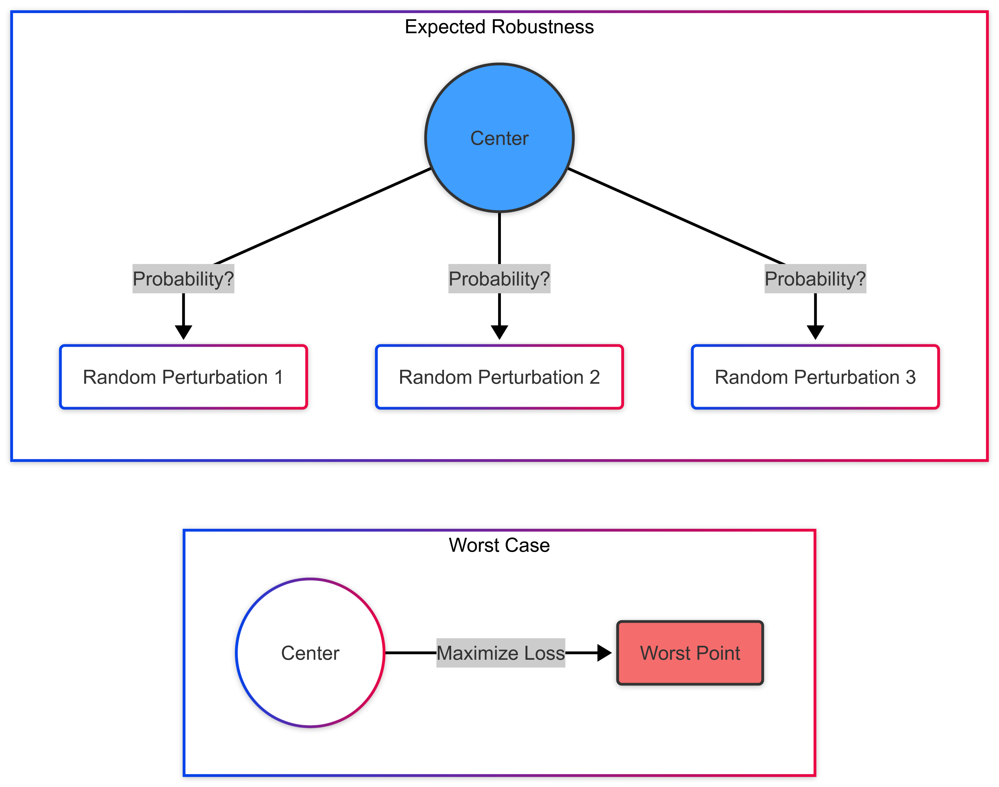

---

### **The "Butterfly Effect" in GCNs**

How does a small change in input features ($\epsilon$) become a wrong prediction?
It gets **Amplified** layer by layer.

$$h^{(l)} = \sigma( \tilde{A} h^{(l-1)} W^{(l)} )$$

The **Weight Matrix** $W$ acts as a multiplier.
If $W$ has a large magnitude (Norm), small noise explodes.

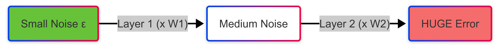

---

### **The Mathematical Bound**

The authors derived a theoretical **Upper Bound** for the vulnerability.

$$\text{Vulnerability} \le \prod_{l=1}^{L} \| W^{(l)} \|\epsilon(\Sigma_{u\in V}\hat{w_u})/\sigma$$
The vulnerability is directly proportional to the product of the **Norms** of the weight matrices ($\|W\|$).

-   **Big $\|W\|$** $\rightarrow$ High Vulnerability (Unstable).
-   **Small $\|W\|$** $\rightarrow$ Low Vulnerability (Robust).

---

### **The Solution: Controlling the Norm**

We want to minimize the upper bound.
**Goal**: Make $\prod \|W^{(l)}\|$ as small as possible.
**Constraint**: We can't make $W = 0$ (The model won't learn anything).
**The Sweet Spot: Orthonormality**
An **Orthonormal Matrix** has a spectral norm of exactly **1**.
$$\| W \|_2 = 1 \quad \text{if} \quad W^T W = I$$

> If every layer has $\|W\|=1$, then the amplification factor is $1 \times 1 \dots = 1$.

---

### **Visualizing Orthonormality**

Why is an Orthonormal matrix "safe"?
It only performs **Rotation** . It never **Stretches** (Scales) the vector.

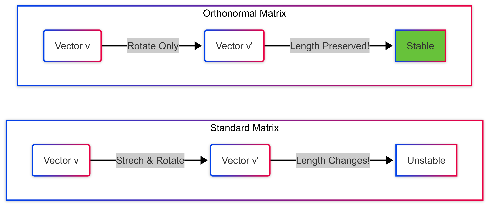

---

### **How GCORN Works (The Algorithm)**

During training, before every forward pass, we project $W$ to the closest orthonormal matrix $\hat{W}$.
$$\hat{W}_{k+1} = \hat{W}_k \left(I + \frac{1}{2}Q_k + ... + (-1)^p \binom{-1/2}{p} Q_k^p\right)$$
-   **Iterative**: Uses a Taylor expansion formula (Newton-Schulz iteration).
-   **Differentiable**: We can backpropagate through this process!
-   **Low Cost**: Only takes a few iterations to converge.

---

### **A New Way to Measure: Probabilistic Evaluation**

Instead of running a specific attack (like PGD or Nettack), they use a specific formulation to measure the robustness.

$$Adv_{\epsilon}^{\alpha,\beta}[f] = \mathbb{E}_{\substack{(G,X) \sim \mathcal{D}_{\mathcal{G},\mathcal{X}} \\ (\tilde{G},\tilde{X}) \in B^{\alpha,\beta}(G,X,\epsilon)}} \left[ 1\left\{ d_{\mathcal{Y}}(f(\tilde{G},\tilde{X}), f(G,X)) > \sigma \right\} \right]$$

- $\mathbb{E}$: Expected value over the distribution.
- $B^{\alpha,\beta}(G,X,\epsilon)$: Ball of radius $\epsilon$ around $(G,X)$.
- $d_{\mathcal{Y}}$: Distance metric.
- $1\left\{\cdot\right\}$: Indicator function (1 if true, 0 otherwise).

---

### **Experimental Results**

**Performance (Accuracy under Feature Attack):**

| Method | Clean Accuracy | Attacked Accuracy (Random) | Attacked Accuracy (PGD) |
| :--- | :--- | :--- | :--- |
| **Standard** | 79.2% | 68.4% | 54.1% |
| **GCORN** | **79.8%** | **77.1%** | **71.1%** |

-   **Takeaway 1**: GCORN maintains high accuracy even when attacked.
-   **Takeaway 2**: Unlike other defenses, it doesn't sacrifice Clean Accuracy (sometimes even improves it!).

---

### **Why GCORN Matters?**

1.  **Theoretical Guarantee**: It's not just a heuristic; it's based on mathematically bounding the Lipschitz constant of the network.
2.  **Architecture Agnostic**: The idea of "Orthonormal Weights" can be applied to GCN, GAT, GIN, or any Deep Learning model.
3.  **Stability**: It solves the "Exploding Gradient" problem implicitly, making training deeper GNNs easier.

---

<!--
header: GOttack: Universal Adversarial Attacks via Graph Orbits
_class: title-page
-->

## GOttack
#### **ICLR 2025**

---

### **A New Perspective: Topology**

Previous methods (like **SGA**) focused on **Local Neighborhoods**.
> *"I will attack the neighbors of the target."*

**GOttack** asks a different question:
> *"Does the **Shape** of the connection matter?"*

Instead of looking at *who* connects to whom, we look at the **structural role** (Topology) of the nodes.

---

### **Concept: Graphlets (The "Lego Bricks")**

A **Graphlet** is a small, connected subgraph pattern (usually 3 to 5 nodes).
Think of them as the atomic building blocks of a network.

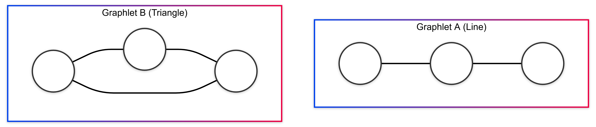

Any large graph is made up of millions of these tiny shapes.

---

### **Concept: Orbits (The "Position")**

Within a Graphlet, not all nodes are equal. Their **Position** is called an **Orbit**.

**Example:** In a 3-node Line (A-B-C):
- **Nodes A & C**: Are at the ends. They are topologically equivalent (Symmetric). They share **Orbit 1**.
- **Node B**: Is in the center. It is unique. It occupies **Orbit 2**.

> **Orbit = Structural Role**

---

### **Concept: Graph Orbit Vector(GOV)**

There are **30** distinct graphlets of **5-nodes**, creating **73** distinct orbits

$GOV_v$ of a node $v$ is an **73-dimensional** vector, where each dimension corresponds to **the count** of a specific orbit touched by node $v$

---

### **The Discovery: Periphery Orbits**

The authors analyzed successful attacks from older models (like Nettack).
They found a **Universal Pattern**:

Most successful attacks target nodes belonging to **Orbit 15** and **Orbit 18**.

| Orbit 15 (Tail) | Orbit 18 (Edge) |
| :---: | :---: |
| Nodes at the **end** of a 5-node chain. | Nodes just off the center, creating a "peninsula". |

---

### **Why Orbits 15 & 18? (The Intuition)**

These orbits represent the **Periphery** (The edge of a community).

1.  **Distance**: They are topologically "far" from the dense center of a cluster.
2.  **Difference**: In graphs, "far" usually means "different label".
3.  **Influence**: Connecting a target node to these "far" nodes introduces a strong **Conflicting Signal** without looking too suspicious.

---

### **The "Peninsula" Effect**

Connecting to a dense center is obvious. Connecting to a tail is subtle.

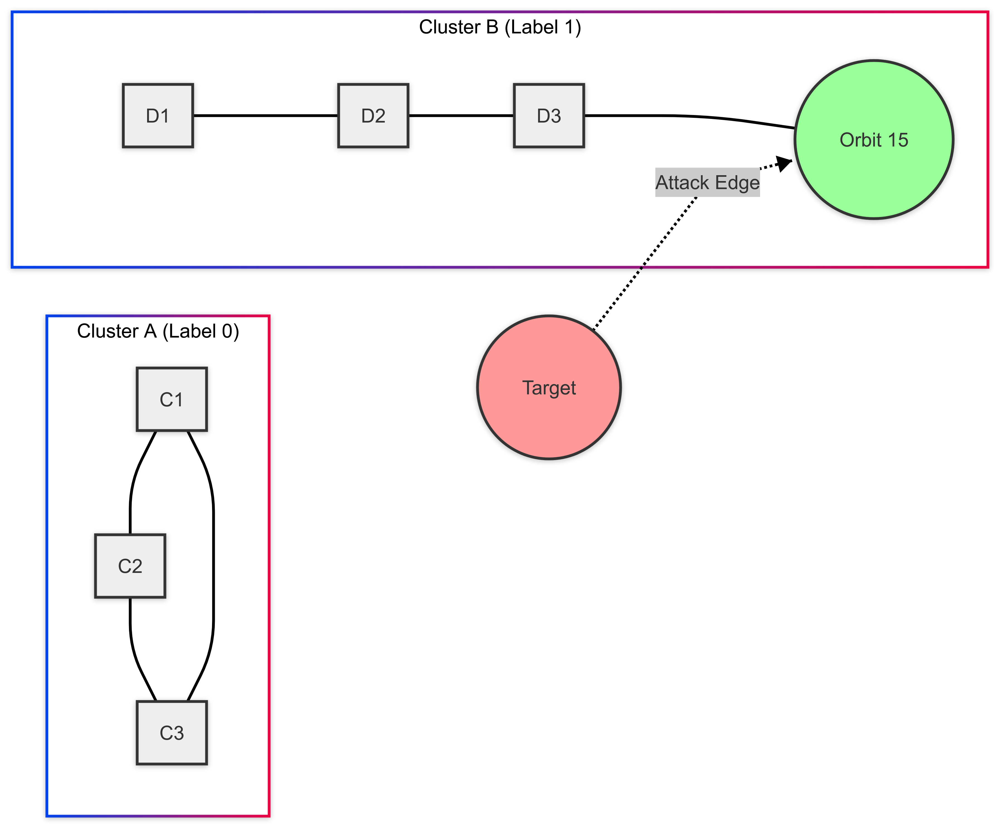

---

### **The Attack Goal**
The goal is to the graph's structure so that the classification of node $v$ changes from $y_v$ to $y_v^{'}$.
The proposed attacks can be mathematically formulated as a bi-level optimization problem.
$$\arg\max_{(A', X) \in G'} \max_{y_{v'} \neq y_v} \ln Z_{v, y_{v'}}^* - \ln Z_{v, y_v}^*$$

- $Z^* = f_{\theta^*}(A', X)$: the probability distribution.
- $\theta^* = \arg\min_{\theta} L(\theta; A', X)$: the optimal parameters.

---

### **The GOttack Pipeline**

How to attack using this knowledge?

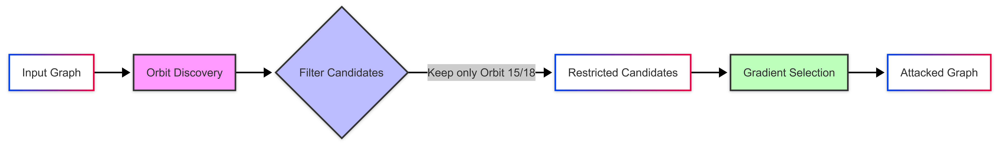

1.  **Count Orbits**: Use the **ORCA** algorithm
2.  **ORCA**: $O(|E|\times d + |V|\times d^4)$, $d$ is the maximum degree.
3.  **Filter**: Only keep those in "Periphery Orbits".
4.  **Optimize**: Use gradients only on this small list.

---

### **The Optimize Process**

We use **Surrogate Loss** to simulate the prediction of the model.

The approximate probability distribution distribution of GNN:
$$Z' = softmax\left( \hat{A}^2 X W \right)$$

The attack goal is to maximize the difference between the probability of the true label and the probability of the predicted label:

$$L_s(A', X; W, v) = \max_{y_{v'} \neq y_v} \left[ \hat{A}^2 X W \right]_{v, y_{v'}} - \left[ \hat{A}^2 X W \right]_{v, y_v}$$

---

### **Why is this Scalable?**

Remember the **$O(N^2)$** problem?

-   **Global Attacks**: Check $N \times N$ edges.
-   **SGA**: Checks $K$-hop neighbors (Local).
-   **GOttack**: Checks only **Topologically Vulnerable** nodes.

The Orbit Discovery is linear $O(E)$.
The candidate set is drastically reduced (often by 75-80%).

---

### **Results: Accuracy vs Efficiency**

GOttack is not just fast; it breaks models better.

| Method | Misclassification Rate (Higher is Better) | Time (Lower is Better) |
| :--- | :--- | :--- |
| **Nettack** | 47% | Slow |
| **SGA** | 32% | Fast |
| **PR-BCD** | 42% | Medium |
| **GOttack** | **52%** | **Very Fast** |

*Average results across standard benchmarks.*
