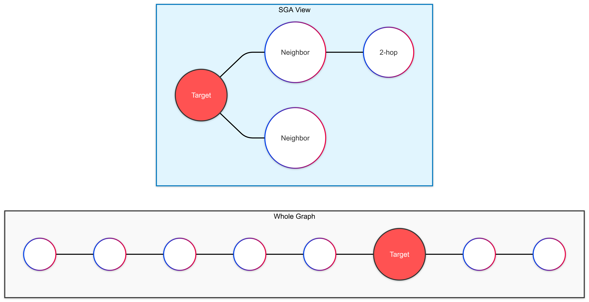

<!--
header: GNN: Adversal Attack and Defence
_class: title-page
-->

## GNN: 
## **Adversal Attack and Defence**

---

<!-- _header: GNN: Catalog -->

## Catalog
- **Background**
  - Graph
  - Graph Neuro Network
  - Adversal Attack
- **Why Large Scale Graph**
- **How to**
  - Related Work

---

<!-- header: Background: Graph -->

## **Graph**
Graph is a kind of data structure, which is composed of **Nodes** and **Edges**.
**Nodes** are connected by **Edges** to express the relationship.

---

## **Graph**
Graph is a kind of data structure, which is composed of **Nodes** and **Edges**.
The **Edges** can either be directed or undirected.

---

<!-- header: Background: Graph Neural Network -->

## **Graph Neural Network**

**Neuro Network** can convert some vector into another vector.

But it requires the data to be **Sequential**

---

## **Graph Neural Network**

If we need to use neural network on a graph, we have to convert the graph into a **Sequence**.

This causes the loss of information:
- **Nodes** are in order, but the order does not matter in graph.
- **Edges** are not considered.
- We cannot percept the **Graph Structure**.

So we need to find a better way to convert **Nodes** into **Vectors**.

---

#### **Message Aggregation**

For each **Node** $v$, we aggregate the information from its neighbors $N(v)$ and store the aggregated message $m$:

The calculation is done layer by layer.

- For the $l$-th layer:

$$m_i^{(l + 1)} = \epsilon(\{h_i^{(l)}, h_j^{(l)}, e_{ij}: v_j\in N(v_i)\})$$

where $\epsilon$ is the aggregation function, $h_i, h_j$ is the hidden state of node $v_i, v_j$, $e_{ij}$ is the state between node $v_i$ and $v_j$

---

#### **Status Update**

We update the hidden state of node $v$ with the aggregated message $m_i$ and old hidden state $h_i^{(l)}$:

$$h_i^{(l + 1)} = \sigma(h_i^{(l)}\textcircled{+}m_i)$$

where $\sigma$ is the activation function, and $\textcircled{+}$ is combination method.

---

#### **Usage**

- **Social Network Analysis**: User Classification, Community Detection, Information Propagation
- **Recommendation System**: Item Recommendation, User Preference Prediction
- **NLP**: Relation Extraction
- etc.

---

<!-- header: Background: Adversal Attack -->

#### **Adversarial Attack**

Let's use an attack on **image** as an example:

By adding small changes to the image, the prediction result will be completely different.

---

### Attack on **Social Network**

---

#### **Attack on Graph Data**

Unlike images where we change pixels, in graphs, we change the **Structure**.

- **Perturbation**: Adding or deleting edges (relationships).
- **Goal**: Make the GNN classify a specific node (or many nodes) incorrectly.

**Example**:
> *Attacker adds a few fake "friend" connections to a user, causing the system to classify a normal user as a "bot".*

---

## **The Reality Gap**

Most existing research focuses on **Tiny Datasets** (e.g., Cora, PubMed ~20k nodes). 

However, real-world graphs are **Massive**:

---

## **Why is Scale a Problem?**

**Memory Explosion!** 💥

To attack a graph optimally, we often need to calculate gradients for **all possible edges**.

- **Space Complexity**: $O(n^2)$ (Quadratic)
- For a graph with millions of nodes, storing the dense adjacency matrix requires **Exabytes** of memory. 

---

<!-- _class: title-page -->

## Robustness of GNNs at Scale
#### **NeurIPS 2021**

---

### **Challenge 1: The "Wrong" Goal**

Attackers usually use **Cross Entropy (CE)** loss to guide the attack.

On large graphs with small budgets, CE wastes energy attacking nodes that are **already wrong** or **too hard** to flip. 

---

### **Solution: Tanh Margin**

The paper proposes **Tanh Margin Loss**. 

- **Focus**: Ignore nodes that are already misclassified.
- **Target**: Concentrate purely on nodes close to the **decision boundary** (the "fence-sitters").

**Result**:
> The attack strength effectively **doubles** compared to standard methods. 

---

### **Challenge 2: Memory Limits**

Traditional attacks (like PGD) try to optimize the **entire** adjacency matrix at once.

$$\Theta(n^2) \text{ Memory Usage}$$

For 1 million nodes, $n^2$ is $1,000,000,000,000$ parameters. **Impossible to store.** 

---

### **Solution: PR-BCD**

**Projected Randomized Block Coordinate Descent** 

Instead of looking at the whole graph, we look at a small random **Block** at a time.

- **Memory**: $O(b)$ instead of $O(n^2)$.
- **Speed**: We only update a subset of edge probabilities per step.

---

### **Challenge 3: Defending the Graph**

GNNs aggregate messages from neighbors.
**Sum** or **Mean** aggregation is vulnerable: one malicious "extreme" neighbor ruins the average.

$$\text{Mean}([1, 2, 2, 100]) = 26.25 \quad (\text{Skewed!})$$

$$\text{Median}([1, 2, 2, 100]) = 2 \quad (\text{Robust!})$$

---

### **Solution: Soft Median**

The paper introduces **Soft Median** aggregation. 

- **Robust**: It ignores outliers (attacked edges).
- **Differentiable**: Unlike standard median, it can be trained via backpropagation using a "Temperature" parameter.
- **Scalable**: Much faster and less memory-intensive than previous robust methods (like Soft Medoid).

---

### **Experimental Results**

The authors tested on **Papers100M** (111 million nodes). 

**Attack Performance**:
- PR-BCD is highly effective even with <11GB memory. 

**Defense Performance**:
- Under attack, standard GNN accuracy drops to ~1%.
- **Soft Median** defense keeps accuracy high (~30-80% depending on setup). 

---

<!-- _class: title-page -->

## SGA: Simplified Gradient-based Attack
#### **TKDE 2021**

---

In the previous section, we talked about the **Scale** problem.

**SGA** proposes a lightweight framework to attack GNNs on large graphs efficiently.

- **Core Idea**: We don't need the whole graph. A smaller **Subgraph** is enough! 
- **Key Technique**: Gradient Calibration. 

---

### **The Intuition**

Imagine you want to influence a specific person (Target Node).
Do you need to analyze the relationships of everyone in the world?

**No.** You only need to focus on:
1.  Their direct friends.
2.  Friends of friends.

**SGA** simplifies the calculation by extracting a **$k$-hop subgraph** centered at the target. 

---

#####   **Visualizing the Simplification**

By ignoring irrelevant nodes, the memory usage drops from $O(N^2)$ or $O(|E|)$ to the size of the subgraph ($d^k$). 

---

### **Problem: The "Overconfidence" Trap**

When we try to attack a trained GNN model, we often use **Gradients** to find the weak spot.

However, trained models are often **Overconfident**:
- Prediction for "Class A": **99.99%**
- Prediction for "Class B": **0.01%**

When the probability is close to 1 or 0, the **Gradient becomes almost Zero**.
$\rightarrow$ The attacker learns nothing! (Gradient Vanishing) 

---

### **Solution: Scale Factor $\epsilon$**

SGA introduces a **Scale Factor** ($\epsilon$) to calibrate the model output during the attack phase. 

$$Z^{(sub)} = \text{softmax}(\frac{\hat{A}^{(sub)}XW}{\epsilon})$$

- By dividing the logits by $\epsilon$ (e.g., $\epsilon=5.0$), the distribution becomes flatter.
- **Result**: The gradients are recovered, allowing the attacker to find the best edges to flip. 

---

### **Attack Strategy: Constructing the Subgraph**

SGA doesn't just delete edges; it can also **Add** edges. But adding edges is expensive (too many choices).

**Strategy**:
1.  Extract $k$-hop neighbors (usually $k=2$).
2.  Identify a small set of **Potential Nodes** outside the subgraph (nodes likely to belong to a different class). 
3.  Add these potential nodes to the subgraph calculation.

This allows powerful "Influence Attacks" without processing the whole graph. 

---

## **Are We Being Noticed?**

An attack is bad if it's easily detected.
*e.g., A user suddenly adds 100 new friends in 1 second.*

How do we measure if an attack is **Stealthy**?
- **Previous methods**: Check Degree Distribution (Complex math). 
- **SGA Proposal**: **DAC (Degree Assortativity Change)**. 

---

### **Degree Assortativity Change (DAC)**

**Assortativity**: "Do birds of a feather flock together?"
In social networks, high degree nodes tend to connect with high degree nodes.

**DAC** measures how much this "connection pattern" changes before and after the attack. 

$$DAC = \frac{\mathbb{E}_r(|r_G - r_{G'}|)}{r_G}$$

- **Lower DAC** = Harder to detect (Better for attacker).
- SGA achieves low DAC while being extremely fast. 

