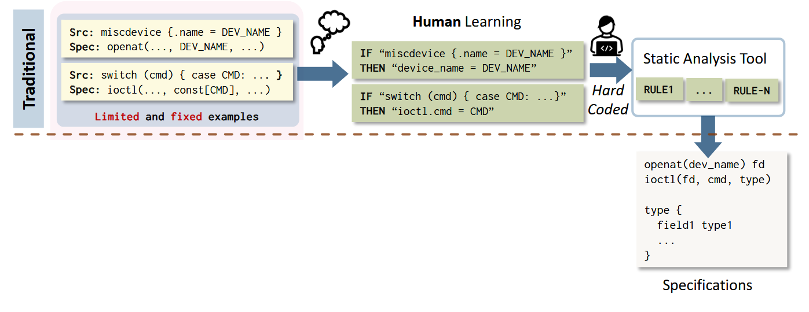
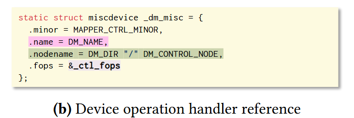
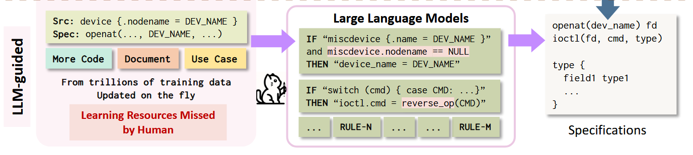
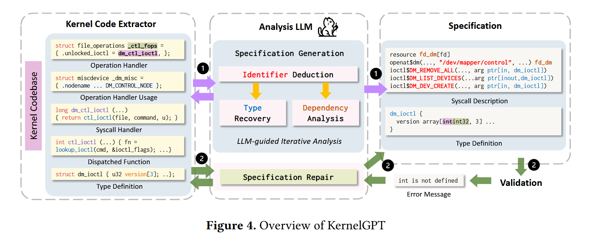

<!-- slide -->

## Kernel GPT
#### 通过大型语言模型增强内核模糊测试
****
&emsp;&emsp;&emsp;&emsp;&emsp;&emsp;&emsp;&emsp;&emsp;&emsp;&emsp;@Kingcq 2025

<!-- slide -->

  
• 模糊测试技术

  
模糊测试技术已经被使用了数十年

  
这些技术生成大量的系统调用作为测试用例

  
这些测试用例旨在检测可能存在的内核错误（崩溃、越界写入等 ）

<!-- slide vertical data-auto-animate -->

  
• 模糊测试技术

  
在这些技术中，<strong>Syzkaller</strong> 是最流行的工具之一

  
它提供了一种叫做 <strong>syzlang</strong> 的语言，用以规范系统调用的生成过程

  
一条编写良好的 <strong>syzlang</strong> 能有效规范系统调用的语法及依赖关系

  
从而使其能够生成更有效的系统调用序列，测试能够更加深入

<!-- slide vertical data-auto-animate -->

  
• 模糊测试技术

  
然而，编写这样一个完备的规范是十分困难的。

  
最简单的想法是使用静态分析技术配合人工编写规范。

  

<!-- slide vertical data-auto-animate -->

  
• 模糊测试技术

  
这种流程由专家手动定义规则开始，再经过静态分析工具总结规范

  
但这很大程度上依赖于专家对于现有代码库和 <strong>Syzkaller</strong> 的理解

  
此外，随着内核代码的演变，由专家定义的这些规则还需要频繁更新

  

<!-- slide vertical data-auto-animate -->

  
• 模糊测试技术

  
一些特殊情况的出现，就会导致错误的系统调用规范

  
比如下图中的数据结构

  

<!-- slide vertical data-auto-animate -->

  
• 模糊测试技术

  
现有的系统调用规范生成器会使用 <strong>name</strong> 字段来确定驱动交互的设备名称

  
然而，在一种合法但少见的用例中

  
正确的设备名称是在 <strong>nodename</strong> 字段中指定的

  

<!-- slide vertical -->

  
• 模糊测试技术

  
关键在于，我们能否自动化并改进生成规则的过程，同时减少工作量？

<!-- slide data-auto-animate -->

  
• 使用 LLM

  
大语言模型在预训练过程中基础过相关的训练数据

  
其优越的知识库使它能分析代码并生成高质量、可读的规范

<!-- slide vertical data-auto-animate -->

  
• 使用 LLM

  
如图所示，我们可以自动化从代码库到 syscall 规范的规则推断过程

  
因为 LLM 本身可以分析代码，

  
这种方法消除了在复杂的静态分析工具中硬编码规则的需要

  
这大大简化了适应内核代码库变化的过程

  

<!-- slide vertical data-auto-animate -->

  
• 使用 LLM

  
传统方法的限制

  
• L-1：建模不完整。基于规则的方法难以捕捉内核代码模式的多样性，导致覆盖范围有限。维护这些规则具有挑战性且不切实际。

  
• L-2：可读性。静态分析生成的规范通常难以理解，阻碍了验证和维护。

  
• L-3：文本理解。这些工具难以从文本信息（如注释）中推断规范，限制了它们捕捉 syscall 行为的底层含义和意图的能力。

<!-- slide vertical -->

  
• 使用 LLM

  
利用 LLM 优势的新方法

  
• 缓解 L-1：LLM 在大量代码库上进行预训练，使其能够比静态分析规则更有效地处理更广泛的情况。

  
• 缓解 L-2：LLM 可以根据代码生成规范中的描述性和人类可读的名称，增强可读性和维护性。

  
• 缓解 L-3：LLM 擅长解释文本信息，生成能够捕捉 syscall 行为底层含义和意图的规范。

<!-- slide data-auto-animate -->

  
• KernelGPT

  
下图展示了 KernelGPT 的概述工作流程

  
它分为两个阶段进行操作并迭代这个过程进行分析

  

<!-- slide vertical data-auto-animate -->

  
• KernelGPT

  
这种管道结构使得 LLM 能够专注于特定片段，避免来自不相关片段的误导

  

