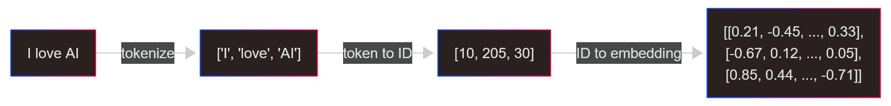
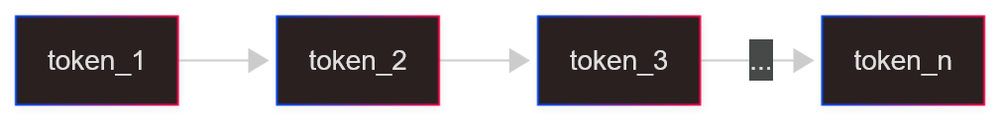
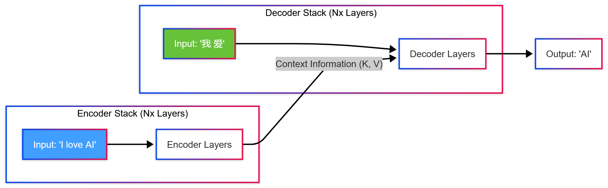
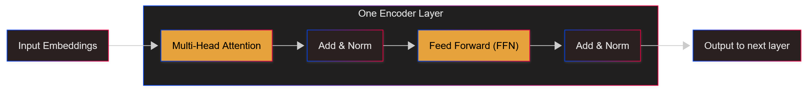
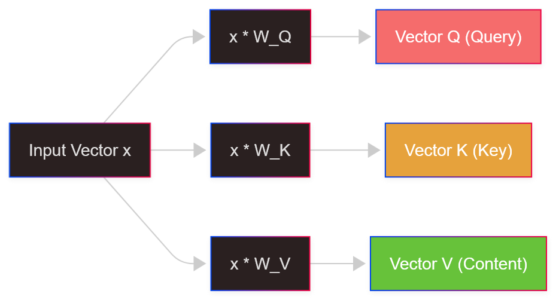
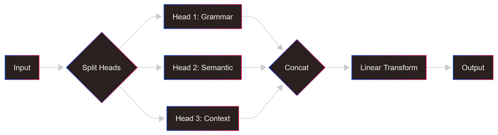
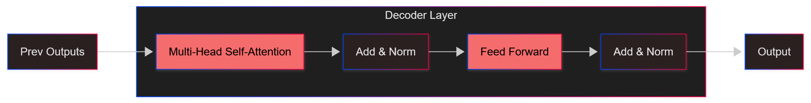
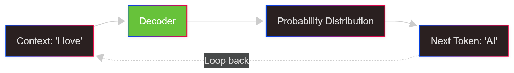
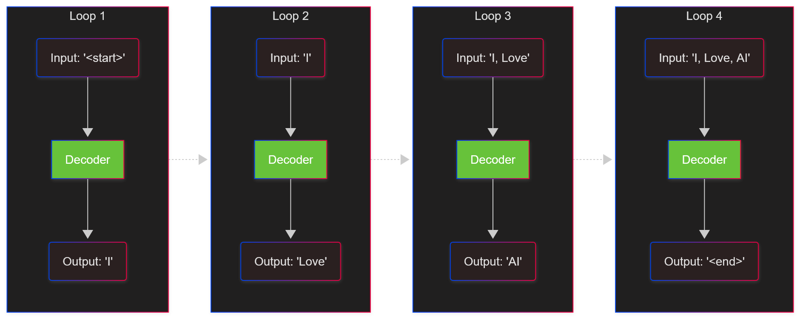
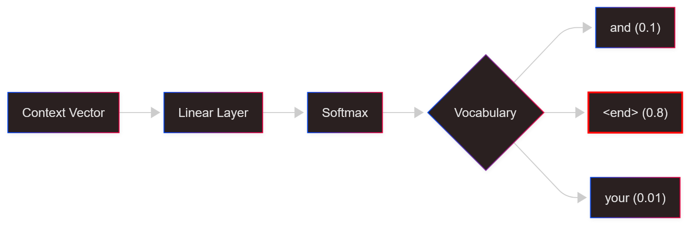

<!-- _class: title-page -->

## Overview of LLM:
## **Reasoning** and **Optimization**

---

<!-- _header: Catalog -->

- #### Transformer
  - What does NLP want to solve
  - Before the Transformers
  - Transformer
- #### LLM
  - The challenge
  - KV Cache
- #### Optimizations
---

<!--
_class: title-page
_header: Transformer
-->

## NLP:
## **What We Want to Solve**
## And **How to Solve It**

---

<!-- header: NLP (Nature Language Processing) -->

- ###### What does NLP want to solve?

---

- ###### What does NLP want to solve?

The application for NLP is **translation**.

In translation, we want to translate a sentence to another sentence.

---

- ###### What does NLP want to solve?

The application for NLP is **translation**.

In **translation**, we want to translate a sentence to another sentence.

The sentence and the translation result can be **anything**, for example:

---

- ###### What does NLP want to solve?

To put it more vividly, given the sentence as context, we need to **predict what's next**.

---

- ###### How to represent words so that computers can **understand** them?

---

- ###### How to represent words so that computers can **understand** them?
  
- **Solution**: Represent words as **vectors** (embeddings)

- Through the help of a pretrained matrix, each token is converted into a vector of size $d_{model}$, which every number in the vector represents a sematic feature of the token.

---

<!-- header: Before the **Transformers** -->

- ###### So before the **Transformers**, how did we translate the embeddings?

---

- ###### So before the **Transformers**, how did we translate the embeddings?

**RNN(Rerrent Neuro Network)** is commonly used for translation

**Neuro Network** can convert some vector into another vector.

---

- ###### How does **RNN** work?

Based on the **Fully Connected Neural Network**, **RNN** can remember the weighed values for all the hidden layers of the previous embedding.

This helps **RNN** to take in embeddings one by one and remember the context.

---

- ###### How does **RNN** work?

After taking in all the embeddings, **RNN** can remember the combined context of all the tokens.

Afterwards, **RNN** can output a vector representing the chance of which token should be the next token.

Similarly, **RNN** takes in the token and predicts the next token.

---

<!-- header: Drawbacks of **RNN** -->

- Then why **RNN** should be replaced?

**RNN** can only take in the embeddings one by one, which means that **RNN** cannot take in a token before all the tokens before it are taken in.

This takes really a long time, and is hard to be optimized.

Also, as **RNN** read more tokens, the context may be lost.

---

<!--
_class: title-page
header: Transformer
-->

## Transformer:
## **A Brand New Approach**

###### Attention is All You Need (NeuroIPS 2017)

---

- ###### How Transformer improves upon RNN?

**RNN** processes data sequentially (Time-step $t$ relies on $t-1$).
**Transformer** processes data **in Parallel**.

1.  **Parallelism**: It takes the whole sentence at once. No more waiting for the previous word.
2.  **Long-term Dependency**: Through **Self-Attention**, the first word can directly "see" the last word, regardless of distance.

---

<!-- _header: Transformer - **The Structure** -->

- ###### The Big Picture: Encoder-Decoder Structure

Transformer follows the standard **Encoder-Decoder** structure.

---

<!-- _header: Transformer - **Encoder** -->

- ###### Zooming into the **Encoder**

The Encoder is a stack of $N$ identical layers (e.g., $N=6$).
Each layer consists of two main sub-layers:

1.  **Multi-Head Self-Attention**: To find relationships between tokens.
2.  **Feed-Forward Network (FFN)**: To process and digest the information.

---

<!-- header: Transformer - **Multi-Head Self-Attention** -->

---

- ###### The Calculation of **Q, K, V**
  - **Query ($Q$)**: What I am looking for.
  - **Key ($K$)**: The label/tag of the file.
  - **Value ($V$)**: The actual content of the file.

- **The Attention Score**:
$$Attention(Q, K, V) = Softmax(\frac{Q\times K^T}{\sqrt{d_k}})\times V$$

---

- ###### The Calculation of **Attention**
  - **$Q\times K^T$**: Find the tokens that are related to the query.
  - **$Softmax$ & $\sqrt{d_k}$**: Normalize the scores.
  - **$\times V$**: Extract the meanings of the matched tokens.

- **The Attention Score**:
$$Attention(Q, K, V) = Softmax(\frac{Q\times K^T}{\sqrt{d_k}})\times V$$

---

- ###### Why **Multi-Head**?

Language is complex.

---

- ###### Why **Multi-Head**?

Language is complex.

We split $Q, K, V$ into `n_heads` heads, calculate relationships indepedently, and then concatenate the results.

---

<!-- header: Transformer - **Feed Forward Network & Add & LayerNorm** -->

Attention is for **"Gathering Info from other tokens"**, **FFN** is for **"Processing Info independently"**.

- **Feed Forward Network**: 
  - A simple MLP to digest the context information.
  - Expands the dimension (e.g., $512 \to 2048$) and compresses it back.

- **Add & Norm**: 
  - **Add (Residual)**: $x + Layer(x)$. Prevents information loss.
  - **Norm (LayerNorm)**: Stabilizes the numbers for training.

---

<!-- header: Transformer - **Decoder** -->

- ###### While the **Encoder** understands the past (Context), the **Decoder** predicts the future (Generation).

- **The Goal**: Autoregressive Generation.
Given tokens $x_1, ..., x_{t-1}$, predict $x_t$.

---

- ###### Zooming into the **Decoder**: The generation process

Its layer is similar to the **Encoder**, but a little different:

---

<!-- header: Transformer: **Multi-Head Self-Attention (for Decoder)** -->

Suppose we have generated "I", "Love". Now the input is "AI".
We need to calculate the **Query**, **Key**, and **Value** for this **new token** only.

$$
q_{new} = x_{AI} \times W_Q, \quad k_{new} = x_{AI} \times W_K, \quad v_{new} = x_{AI} \times W_V
$$

- **$q_{new}$**: The new query vector. "What relates to 'AI'?"
- **$k_{new}$**: The new key vector. The label for "AI".
- **$v_{new}$**: The new content vector. The meaning of "AI".

---

To predict the next word, "AI" must "look back" at "I" and "Love".
We combine the **Past Keys** with the **New Key**.

The **Values** are the same for all tokens.

$$
K_{total} = Concat([K_{past}, k_{new}])
$$

$$
V_{total} = Concat([V_{past}, v_{new}])
$$

---

We calculate how much the **New Query** matches **All Keys** (Past + Present).

$$
Scores = q_{new} \times K_{total}^T
$$

Finally, we calculate the **Output**.

$$
Output = Softmax(\frac{Scores}{\sqrt{d_k}}) \times V_{total}
$$

- This vector now contains the **Full Context** needed to predict the next word.

---

After all the process, the output vector is projected to the vocabulary size to get probabilities.

$$
Probabilities = Softmax(Output \times W_{vocab})
$$

 

---

<!-- header: Transformer: **KV Cache** -->

- ###### The Naive Inference Strategy (Without Cache)

Let's look at how a standard Transformer generates text **without any optimization**.
To generate the token at step $t$, we must input the **entire sequence** $x_1, ..., x_{t-1}$.

1. **Step 1**: Input `["I"]` $\to$ Compute Attention for 1 token.
2. **Step 2**: Input `["I", "Love"]` $\to$ Compute Attention for 2 tokens.
3. **Step 3**: Input `["I", "Love", "AI"]` $\to$ Compute Attention for 3 tokens.

---

**Do you see the problem?**
We calculated the embedding and attention for "I" in Step 1.
We calculated it **AGAIN** in Step 2.
We calculated it **YET AGAIN** in Step 3.

**As sequence length grows, the "Redundant Calculation" forms a huge pyramid.**

---

Let's do the math for generating a sequence of length $N$.

At **Step $t$** (current length $t$):
* We input a matrix of shape $(t \times d)$.
* **Self-Attention Cost**: $Q(t \times d) \times K^T(d \times t) \to \text{Score}(t \times t)$.
* Matrix Multiplication Complexity: **$O(t^2 \cdot d)$**.

**Total Inference Cost** (Sum of all steps):
$$
\text{Total} = \sum_{t=1}^{N} O(t^2 \cdot d) \approx O(N^3 \cdot d)
$$

---

- ###### The Grand Summary: Why we need optimization?

We face two main enemies in the standard Transformer:

| Problem | Symptom | Source | Solution |
| :--- | :--- | :--- | :--- |
| **Redundant Compute** | Slow Speed ($O(N^3)$) | Re-calculating $K, V$ for past tokens every step | **KV Cache** |

---

<!--
header: Complexity Analysis: **Step-by-Step**
_class: title-page
-->

## The Real Cost:
## **Time & Space** Breakdown

---

<!--
header: Complexity Analysis: **Encoder Layer**
-->

- **QKV**:
  - **Time**: $[n, d_{model}]\times [d_{model}, d_{model}] \Rightarrow O(Nd_{model}^2)$
- **Self-Attention**: 
  - **Time**: $[n, d_{heads}]\times [d_{heads}, n] \times [n, d_{heads}] \Rightarrow O(N^2d_{heads})$
- **FNN**:
  - **Time**: $[n, d_{model}]\times [d_{model}, d_{model}] \Rightarrow O(Nd_{model}^2)$

- **Total**:
  - **Time**: $O(Nd^2 + N^2d)$

---

<!--
header: Complexity Analysis: **Decoder Layer**
-->

- **QKV**:
  - **Time**: $[1, d_{model}]\times [d_{model}, d_{model}] \Rightarrow O(d_{model}^2)$
- **Self-Attention**: 
  - **Time**: $[1, d_{heads}]\times [d_{heads}, t] \times [t, d_{heads}] \Rightarrow O(td_{heads})$
- **FNN**:
  - **Time**: $[1, d_{model}]\times [d_{model}, d_{model}] \Rightarrow O(d_{model}^2)$

- **Total(For generating length of m)**:
  - **Time**: $O(m(d^2 + nd))$
