<!-- _class: title-page -->

## Overview of LLM:
## **Reasoning** and **Optimization**

---

<!-- _header: Catalog -->

- #### Transformer
  - What does NLP want to solve
  - Before the Transformers
  - Transformer
- #### LLM
  - The challenge
  - KV Cache
- #### Optimizations
---

<!--
_class: title-page
_header: Transformer
-->

## NLP:
## **What We Want to Solve**
## And **How to Solve It**

---

<!-- header: NLP (Nature Language Processing) -->

- ###### What does NLP want to solve?

---

- ###### What does NLP want to solve?

The application for NLP is **translation**.

In translation, we want to translate a sentence to another sentence.

---

- ###### What does NLP want to solve?

The application for NLP is **translation**.

In **translation**, we want to translate a sentence to another sentence.

The sentence and the translation result can be **anything**, for example:


---

- ###### What does NLP want to solve?


To put it more vividly, given the sentence as context, we need to **predict what's next**.

---

- ###### How to represent words so that computers can **understand** them?

---

- ###### How to represent words so that computers can **understand** them?
  
- **Solution**: Represent words as **vectors** (embeddings)


- Through the help of a pretrained matrix, each token is converted into a vector of size $d_{model}$, which every number in the vector represents a semantic feature of the token.

---

<!-- header: Before the **Transformers** -->

- ###### So before the **Transformers**, how did we translate the embeddings?

---

- ###### So before the **Transformers**, how did we translate the embeddings?

**RNN(Recurrent Neural Network)** is commonly used for translation


**Neuro Network** can convert some vector into another vector.

---

- ###### How does **RNN** work?

Based on the **Fully Connected Neural Network**, **RNN** can remember the weighed values for all the hidden layers of the previous embedding.

This helps **RNN** to take in embeddings one by one and remember the context.


---

- ###### How does **RNN** work?


After taking in all the embeddings, **RNN** can remember the combined context of all the tokens.

Afterwards, **RNN** can output a vector representing the chance of which token should be the next token.

Similarly, **RNN** takes in the token and predicts the next token.

---

<!-- header: Drawbacks of **RNN** -->

- Then why **RNN** should be replaced?

**RNN** can only take in the embeddings one by one, which means that **RNN** cannot take in a token before all the tokens before it are taken in.


This takes really a long time, and is hard to be optimized.

Also, as **RNN** read more tokens, the context may be lost.

---

<!--
_class: title-page
header: Transformer
-->

## Transformer:
## **A Brand New Approach**

###### Attention is All You Need (NeuroIPS 2017)

---

- ###### How Transformer improves upon RNN?

**RNN** processes data sequentially (Time-step $t$ relies on $t-1$).
**Transformer** processes data **in Parallel**.

1.  **Parallelism**: It takes the whole sentence at once. No more waiting for the previous word.
2.  **Long-term Dependency**: Through **Self-Attention**, the first word can directly "see" the last word, regardless of distance.

---

<!-- _header: Transformer - **The Structure** -->

- ###### The Big Picture: Encoder-Decoder Structure

Transformer follows the standard **Encoder-Decoder** structure.


---

<!-- _header: Transformer - **Encoder** -->

- ###### Zooming into the **Encoder**

The Encoder is a stack of $N$ identical layers (e.g., $N=6$).
Each layer consists of two main sub-layers:

1.  **Multi-Head Self-Attention**: To find relationships between tokens.
2.  **Feed-Forward Network (FFN)**: To process and digest the information.


---

<!-- header: Transformer - **Multi-Head Self-Attention** -->


---

- ###### The Calculation of **Q, K, V**
  - **Query ($Q$)**: What I am looking for.
  - **Key ($K$)**: The label/tag of the file.
  - **Value ($V$)**: The actual content of the file.

- **The Attention Score**:
$$Attention(Q, K, V) = Softmax(\frac{Q\times K^T}{\sqrt{d_k}})\times V$$

---

- ###### The Calculation of **Attention**
  - **$Q\times K^T$**: Find the tokens that are related to the query.
  - **$Softmax$ & $\sqrt{d_k}$**: Normalize the scores.
  - **$\times V$**: Extract the meanings of the matched tokens.

- **The Attention Score**:
$$Attention(Q, K, V) = Softmax(\frac{Q\times K^T}{\sqrt{d_k}})\times V$$

---

- ###### Why **Multi-Head**?

Language is complex.

---

- ###### Why **Multi-Head**?

Language is complex.

We split $Q, K, V$ into `n_heads` heads, calculate relationships independently, and then concatenate the results.


---

<!-- header: Transformer - **Feed Forward Network & Add & LayerNorm** -->

Attention is for **"Gathering Info from other tokens"**, **FFN** is for **"Processing Info independently"**.

- **Feed Forward Network**: 
  - A simple MLP to digest the context information.
  - Expands the dimension (e.g., $512 \to 2048$) and compresses it back.

- **Add & Norm**: 
  - **Add (Residual)**: $x + Layer(x)$. Prevents information loss.
  - **Norm (LayerNorm)**: Stabilizes the numbers for training.

---

<!-- header: Transformer - **Decoder** -->

- ###### While the **Encoder** understands the past (Context), the **Decoder** predicts the future (Generation).

- **The Goal**: Autoregressive Generation.
Given tokens $x_1, ..., x_{t-1}$, predict $x_t$.


---

- ###### Zooming into the **Decoder**: The generation process

Its layer is similar to the **Encoder**, but a little different:


---

<!-- header: Transformer: **Multi-Head Self-Attention (for Decoder)** -->

Suppose we have generated "I", "Love". Now the input is "AI".
We need to calculate the **Query**, **Key**, and **Value** for this **new token** only.

$$
q_{new} = x_{AI} \times W_Q, \quad k_{new} = x_{AI} \times W_K, \quad v_{new} = x_{AI} \times W_V
$$

- **$q_{new}$**: The new query vector. "What relates to 'AI'?"
- **$k_{new}$**: The new key vector. The label for "AI".
- **$v_{new}$**: The new content vector. The meaning of "AI".

---

To predict the next word, "AI" must "look back" at "I" and "Love".
We combine the **Past Keys** with the **New Key**.

The **Values** are the same for all tokens.

$$
K_{total} = Concat([K_{past}, k_{new}])
$$

$$
V_{total} = Concat([V_{past}, v_{new}])
$$

---

We calculate how much the **New Query** matches **All Keys** (Past + Present).

$$
Scores = q_{new} \times K_{total}^T
$$

Finally, we calculate the **Output**.

$$
Output = Softmax(\frac{Scores}{\sqrt{d_k}}) \times V_{total}
$$

- This vector now contains the **Full Context** needed to predict the next word.

---

After all the process, the output vector is projected to the vocabulary size to get probabilities.

$$
Probabilities = Softmax(Output \times W_{vocab})
$$

 

---

<!-- header: Transformer: **KV Cache** -->

- ###### The Naive Inference Strategy (Without Cache)

Let's look at how a standard Transformer generates text **without any optimization**.
To generate the token at step $t$, we must input the **entire sequence** $x_1, ..., x_{t-1}$.

1. **Step 1**: Input `["I"]` $\to$ Compute Attention for 1 token.
2. **Step 2**: Input `["I", "Love"]` $\to$ Compute Attention for 2 tokens.
3. **Step 3**: Input `["I", "Love", "AI"]` $\to$ Compute Attention for 3 tokens.

---

**Do you see the problem?**
We calculated the embedding and attention for "I" in Step 1.
We calculated it **AGAIN** in Step 2.
We calculated it **YET AGAIN** in Step 3.

**As sequence length grows, the "Redundant Calculation" forms a huge pyramid.**

---

Let's do the math for generating a sequence of length $N$.

At **Step $t$** (current length $t$):

---

Let's do the math for generating a sequence of length $N$.

At **Step $t$** (current length $t$):
* We input a matrix of shape $(t \times d)$.

---

Let's do the math for generating a sequence of length $N$.

At **Step $t$** (current length $t$):
* We input a matrix of shape $(t \times d)$.
* **Self-Attention Cost**: $Q(t \times d) \times K^T(d \times t) \to \text{Score}(t \times t)$.

---

Let's do the math for generating a sequence of length $N$.

At **Step $t$** (current length $t$):
* We input a matrix of shape $(t \times d)$.
* **Self-Attention Cost**: $Q(t \times d) \times K^T(d \times t) \to \text{Score}(t \times t)$.
* Matrix Multiplication Complexity: **$O(t^2 \cdot d)$**.

---

Let's do the math for generating a sequence of length $N$.

At **Step $t$** (current length $t$):
* We input a matrix of shape $(t \times d)$.
* **Self-Attention Cost**: $Q(t \times d) \times K^T(d \times t) \to \text{Score}(t \times t)$.
* Matrix Multiplication Complexity: **$O(t^2 \cdot d)$**.

**Total Inference Cost** (Sum of all steps):
$$
\text{Total} = \sum_{t=1}^{N} O(t^2 \cdot d) \approx O(N^3 \cdot d)
$$

---

- ###### The Grand Summary: Why we need optimization?

We face two main enemies in the standard Transformer:

| Problem | Symptom | Source | Solution |
| :--- | :--- | :--- | :--- |
| **Redundant Compute** | Slow Speed ($O(N^3)$) | Re-calculating $K, V$ for past tokens every step | **KV Cache** |

---

<!--
header: Complexity Analysis: **Step-by-Step**
_class: title-page
-->

## The Real Cost:
## **Time & Space** Breakdown

---

<!--
header: Complexity Analysis: **Encoder Layer**
-->

- **QKV**:
  - **Time**: $[n, d_{model}]\times [d_{model}, d_{model}] \Rightarrow O(nd_{model}^2)$
- **Self-Attention**: 
  - **Time**: $[n, d_{heads}]\times [d_{heads}, n] \times [n, d_{heads}] \Rightarrow O(n^2d_{heads})$
- **FFN**:
  - **Time**: $[n, d_{model}]\times [d_{model}, d_{model}] \Rightarrow O(nd_{model}^2)$

- **Total**:
  - **Time**: $O(nd^2 + n^2d)$

---

<!--
header: Complexity Analysis: **Decoder Layer**
-->

- **QKV**:
  - **Time**: $[1, d_{model}]\times [d_{model}, d_{model}] \Rightarrow O(d_{model}^2)$
- **Self-Attention**: 
  - **Time**: $[1, d_{heads}]\times [d_{heads}, n+t] \times [n+t, d_{heads}] \Rightarrow O(td_{heads})$
- **FFN**:
  - **Time**: $[1, d_{model}]\times [d_{model}, d_{model}] \Rightarrow O(d_{model}^2)$

- **Total(For generating length of m)**:
  - **Time**: $O(m(d^2 + (n+m)d))$

---

<!--
header: Transformer: **Training**
_class: title-page
-->

## Transformer:
## **How to Train**

###### From Randomness to Intelligence

---

- ###### The Transformation

**Training** = Tuning the matrices ($W$) to minimize error.

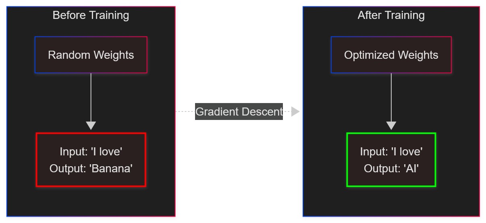

---

- ###### Step 1: We construct the **Question** (Input) and **Answer** (Target) from the raw text.

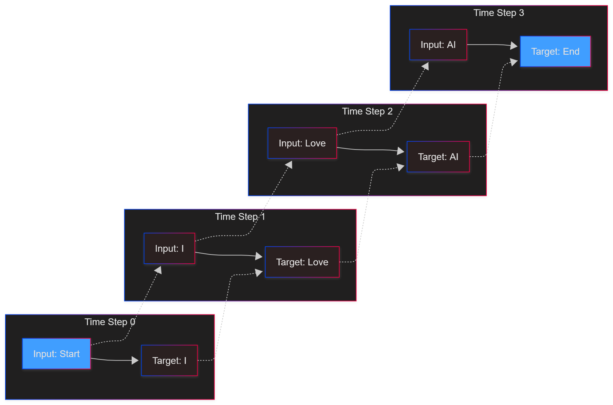

---

- ###### Step 2: The Problem of "Cheating"

If we feed the whole sequence, Position 1 ("I") can see Position 2 ("Love").
This is **Data Leakage**.

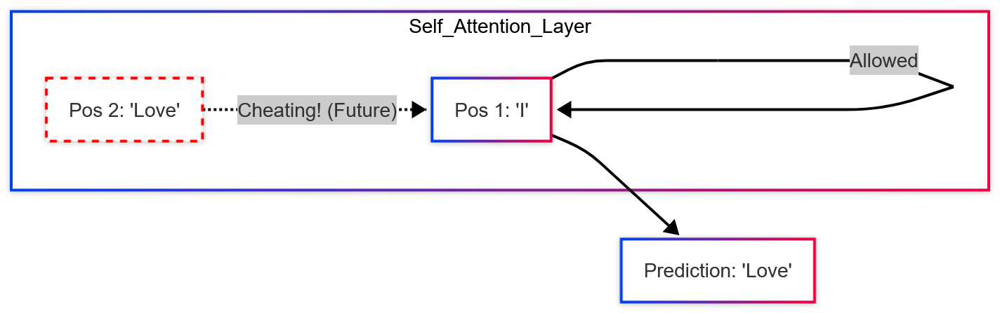

---

- ###### Step 3: The Mask Matrix (The Blindfold)

We add $-\infty$ to the upper triangle to block future connections.

$$
\text{Attention Scores} + \text{Mask} \rightarrow \text{Softmax}
$$

$$
\begin{bmatrix} 
\text{Sim}(I, I) & \text{Sim}(I, Love) \\ 
\text{Sim}(Love, I) & \text{Sim}(Love, Love) 
\end{bmatrix}
+
\begin{bmatrix} 
0 & \mathbf{-\infty} \\ 
0 & 0 
\end{bmatrix}
\approx
\begin{bmatrix} 
\text{Score} & \mathbf{0} \\ 
\text{Score} & \text{Score} 
\end{bmatrix}
$$

* **Result**:
  * Row 1 can **ONLY** see Col 1.
  * Row 2 can see Col 1 & 2.

---

- ###### Step 4: Parallel Loss Calculation

We calculate errors for **ALL** positions simultaneously.

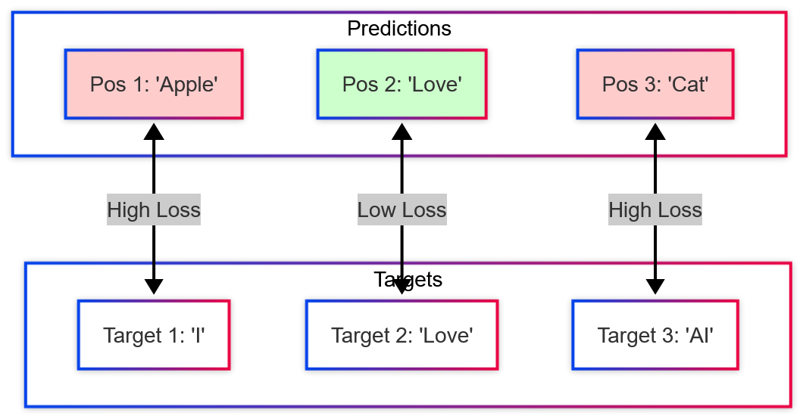

$$
\text{Total Loss} = \text{Loss}_1 + \text{Loss}_2 + \text{Loss}_3
$$

---

- ###### Step 5: The Learning Cycle

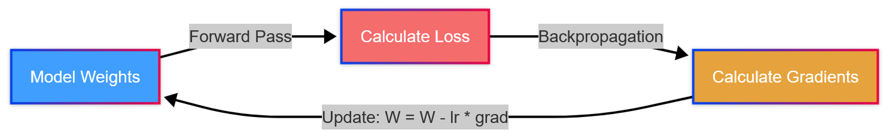

**Repeat this loop billions of times.**

---

- ###### Comparison: Training vs Inference

| Feature | Training | Inference |
| :--- | :--- | :--- |
| **Strategy** | **Parallel** (Teacher Forcing) | **Serial** (Autoregressive) |
| **Input** | Whole Sentence | Past Tokens Only |
| **Future** | **Masked** (Artificial) | **Non-existent** |
| **Complexity** | $O(N^2)$ (One Pass) | $O(N^3)$ (Loop) |

---

<!--
header: Transformer: **Memory IO**
_class: title-page
-->

## Transformer:
## **Memory IO**

###### The cost in the hardware reality

---

Understanding **Data Movement** is key to optimization.

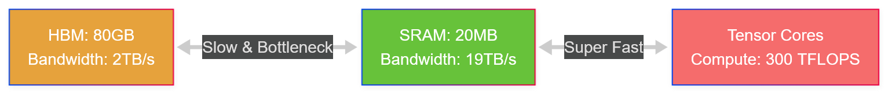

**Rule**: Computation can ONLY happen in SRAM. 
Data must be loaded **HBM $\to$ SRAM** to be processed, then written back.

---

- IO Complexity of Self-Attention:

| Operation               | Read HBM           | Write HBM   | Complexity            |
| ---------------- | -------------- | ------ | -------------- |
| $S = QK^T$        | Q, K (2Nd)     | S (N²) | O(Nd + N²)     |
| $P = softmax(S)$ | S (N²)         | P (N²) | O(N²)          |
| $O = PV$         | P, V (N² + Nd) | O (Nd) | O(Nd + N²)     |
| **Total**     |                  |                |         **O(Nd + N²)** |

Frequently moving data between HBM and SRAM is **expensive**.

---

<!--
header: Transformer: **FlashAttention Optimization**
_class: title-page
-->

## Transformer Optimization:
## **FlashAttention**

###### Fast and Memory-Efficient Exact Attention with IO-Awareness

---

- ###### Phase 1: Prefilling (**The QKV**)

**Target**: Calculate $S = QK^T, P = Softmax(S), O = PV$

1. Read $Q, K$ from HBM $\to$ Compute $S$ $\to$ **Write $S$ to HBM**.
2. Read $S$ from HBM $\to$ Compute $P$ $\to$ **Write $P$ to HBM**.
3. Read $P, V$ from HBM $\to$ Compute $O$ $\to$ Write $O$ to HBM.

Frequently moving data between HBM and SRAM is **expensive**.

**The bottleneck is reading/writing $N^2$ elements to HBM.**

---

- ###### FlashAttention: The Core Idea

**"IO-Awareness"**: minimize HBM accesses.

Two key techniques:
1. **Tiling**: Compute attention by **blocks**. Load small blocks of $Q, K, V$ to SRAM, compute, and update output without writing full matrix $S$ to HBM.
2. **Recomputation**: Do not save the attention matrix for backward pass. Recompute it on-the-fly.

---

<!-- header: FlashAttention: **Tiling** -->

- ###### Technique 1: Tiling (Forward Pass)

Instead of computing the full $N \times N$ matrix, we  try to **split $Q, K, V$ into blocks** that fit in **SRAM**.

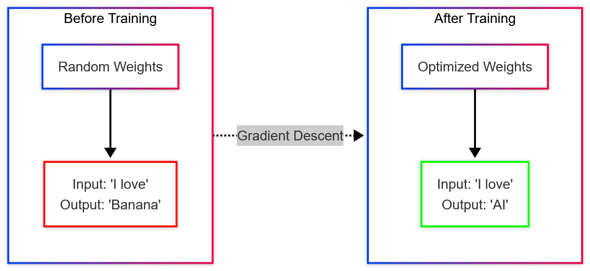

---

<!-- header: Tiling: **How to Calculate?** -->

- ###### The Softmax Problem

Standard Softmax needs the **entire row** to calculate the normalization factor (denominator).

$$Softmax(x_i) = \frac{e^{x_i}}{\sum_{j=1}^{N} e^{x_j}}$$

---

<!-- header: Softmax: **Merging the blocks** -->

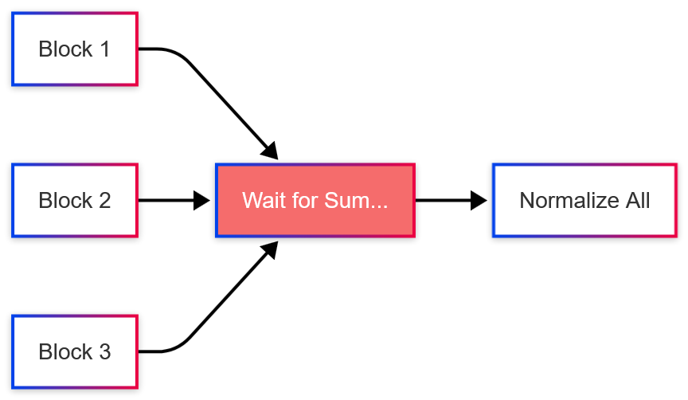

If we slice the matrix, **we don't have the global sum!**

---

- ###### The Solution: Online Softmax

We can update the Softmax result **incrementally**.
We track local statistics: **Max ($m$)** and **Sum ($l$)**.

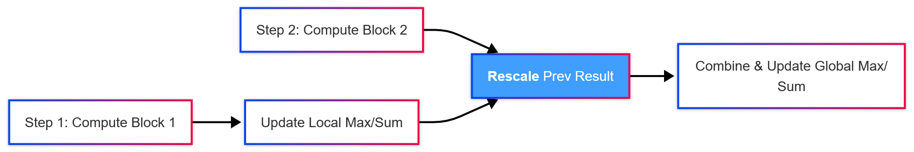

**Key**: When a new max value is found, shrink the old sum to keep the math correct.

---

The softmax of vector $x\in R^B$ is computed as:

- $m(x) = \underset{i}{\max}\ x_i$
- $f(x) = [e^{x_1 - m(x)}\ \ldots\ e^{x_B - m(x)}]$
- $softmax(x) = \frac{f(x)}{l(x)}$

---

For vectors **$x^{(1)},x^{(2)}\in \mathbf{R}^B$**, we can decompose the softmax of the concatenated **$x = [x^{(1)}, x^{(2)}]\in \mathbf{R}^{2B}$** as:

- $m(x) = \max(m(x^{(1)}), m(x^{(2)}))$
- $f(x) = [e^{m(x^{(1)}) - m(x)}f(x^(1))\ \ e^{m(x^{(2)}) - m(x)}f(x^{(2)})]$
- $l(x) = e^{m(x^{(1)}) - m(x)}l(x^{(1)}) + e^{m(x^{(2)} - m(x))l(x^{(2)})}$

- $P = Softmax(x) = \frac{f(x)}{l(x)}$

---

<!-- header: Transformer: **FlashAttention Optimization** -->

- ###### Computing the Partial Output

Once we have the Attention Probabilities ($P_{ij}$) for the current block, we multiply them by Value ($V_j$).

$$O_{ij} = P_{ij} \times V_j$$

But we cannot just "Add" this to the previous result, because the **Softmax Denominator** changes!

---

- ###### Rescaling and Merging

To merge the **Old Output** with the **New Partial Output**, we must **Rescale** the old data using the updated Softmax statistics.

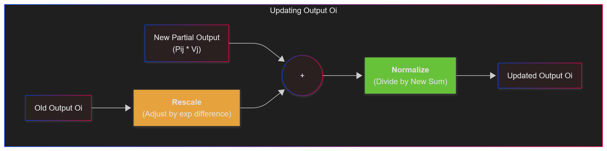

---

**The Update Formula:**

$$
O_{new} = \frac{1}{\ell_{new}} \left( \underbrace{\ell_{old} e^{m_{old} - m_{new}} O_{old}}_{\text{Rescaled Old Output}} + \underbrace{e^{\tilde{m_{ij}} - m_{new}} \tilde{P_{ij}} V}_{\text{New Block Output}} \right)
$$

- **$\tilde{m_{ij}}, \tilde{P_{ij}}$**: $rowmax(S_{ij})$ and $e^{S_{ij} - \tilde{m_{ij}}}$.

> **Meaning**: "Shrink" the old result based on how much the Max value increased, then add the new weighted contribution.

---

```python
# Load Q, K, V from HBM. Split into blocks.
for j in range(Tc):  # Outer Loop: Load K, V blocks (Fits in SRAM)
    K_j, V_j = load_from_HBM(j) 
    for i in range(Tr):  # Inner Loop: Load Q blocks (Fits in SRAM)
        Q_i, O_i, l_i, m_i = load_from_HBM(i)
        # 1. Compute Attention Score
        S_ij = Q_i @ K_j.T
        # 2. Compute Local Softmax Stats
        m_tilde = rowmax(S_ij)
        P_tilde = exp(S_ij - m_tilde)
        l_tilde = rowsum(P_tilde)
        # 3. Update Global Stats (Online Softmax)
        m_new = max(m_i, m_tilde)
        l_new = exp(m_i - m_new) * l_i + exp(m_tilde - m_new) * l_tilde
        # 4. Rescale and Update Output (The Formula)
        O_i = (1 / l_new) * ( 
            l_i * exp(m_i - m_new) * O_i + 
            exp(m_tilde - m_new) * (P_tilde @ V_j) 
        )
        # 5. Write back to HBM
        write_to_HBM(O_i, l_new, m_new)
```

---

- ###### Analysis: Why Tiling saves HBM Access?

Let's compare the **HBM Access** (Data movement) count.

**Standard Attention**:

1.  Read $Q, K$ ($N\times d$) $\to$ Write $S$ ($N^2$).
2.  Read $S$ ($N^2$) $\to$ Write $P$ ($N^2$).
3.  Read $P, V$ ($N^2$, $N\times d$) $\to$ Write $O$ ($N\times d$).

**Total HBM Access**: $O(Nd + N^2)$

---

- ###### Analysis: FlashAttention IO Complexity

1. Block size: **$B_c = B_r = O(\frac{M}{d})$**
2. Load blocks of $K, V$ into SRAM (**$\frac{N}{B_c}\times 2B_cd = O(Nd)$**).
3. Load blocks of $Q$ into SRAM (**$\frac{N}{B_c}\times\frac{N}{B_r}\times B_rd = O(\frac{N^2d^2}{M})$**).
4. Compute and Write $O$ block (**The same**).

**Total HBM Access**: $O(Nd + N^2 d^2 M^{-1})$, where $M$ is the size of SRAM

- Since $d^2 \ll M$, the number of accesses is reduced significantly.

---

<!--
header: Transformer: **Block-Sparse FlashAttention Optimization**
_class: title-page
-->

## Extension:

## **Block-Sparse FlashAttention**

###### Scaling to Infinite Context?

---

  - ###### What if we skip some blocks?

For extremely long sequences (e.g., 64k+), even $O(N^2)$ compute is too slow.

**Observation**: The Attention Matrix is usually sparse (many values are near 0).

**Idea**: Use a predefined mask $\tilde{M}$. If a block is zero in the mask, **skip loading and computing it**.

---

- ###### The Block-Sparse Algorithm

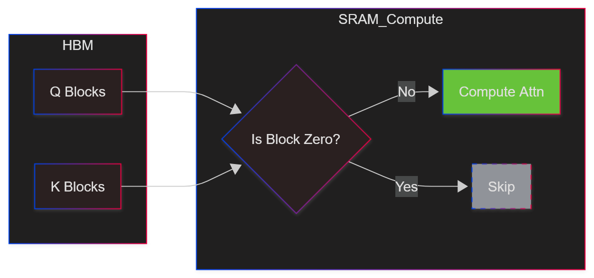

---

- ###### Block-Sparse Complexity

Let $s$ be the fraction of non-zero blocks.

- **Standard FlashAttention**:
  - HBM Access: $O(N^2 d^2 M^{-1})$

- **Block-Sparse FlashAttention**:
  - HBM Access: $O(N^2 d^2 M^{-1} s)$

* Fo large sequence length $N$, $s$ is often $N^{-1/2}$ or $N^{-1}\log N$.

---

<!--
header: Transformer: **PagedAttention Optimization**
_class: title-page
-->

## Optimization:

## **PagedAttention** (vLLM)

###### Breaking the Contiguous Memory Requirement

---

- ###### The Memory Problem in Decoding

In existing systems, KV Cache requires **Contiguous Memory**.
But we don't know how long the output will be\!

**Result**: We must **Pre-allocate** max length (e.g., 2048).

* **Internal Fragmentation**: Reserved but unused slots.
* **External Fragmentation**: Memory allocator cannot find huge contiguous chunks.
* **Result**: **60% - 80%** of GPU memory is wasted!

---

  - ###### The Solution: Virtual Memory

Inspired by **OS Virtual Memory (Paging)**.

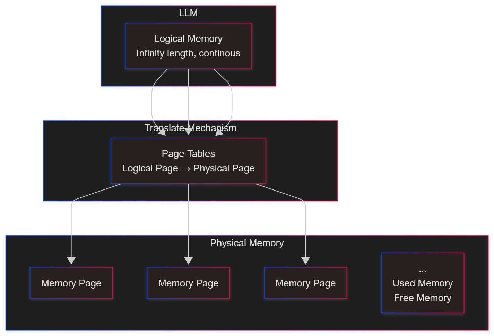

---

  - ###### Block-wise Attention Computation

We modify the Attention calculation to fetch data block-by-block via the Block Table.

for embedding **$x_i$**，we have **$q_i = W_qx_i, k_i = W_kx_i, v_i = W_vx_i$**

then calculate the attention and output:

$$
a_{ij} = \frac{\exp(q_i^T k_j / \sqrt{d})}{\sum_{t=1}^{i} \exp(q_i^T k_{t} / \sqrt{d})}, o_{ij} = \Sigma_{j=1}^{i} a_{ij} v_{j}
$$

$$(Softmax(x_i) = \frac{e^{x_i}}{\sum_{j=1}^{N} e^{x_j}})$$

---

- **Process**:
  1.  Identify logical blocks for current request.
  2.  Lookup physical addresses in **Block Table**.
  3.  Fetch non-contiguous blocks from HBM to SRAM.
  4.  Compute Attention.

---

- ###### Memory Sharing

Since we use a Block Table, we can map **different logical blocks** to the **same physical block**.

**Use Case**: Parallel Sampling / Beam Search.

  * Prompt: *"Translate this article..."* (Shared)
  * Sample A: *"The article..."*
  * Sample B: *"This text..."*

---

- ###### Mechanism: Copy-on-Write (CoW)

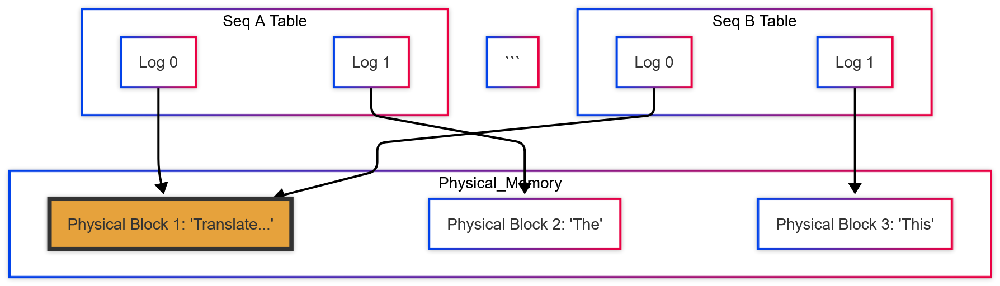

---

- ###### Space Complexity: Near-Zero Waste

<!-- end list -->

  * **Pre-allocation**: $O(\text{Max\_Seq\_Len} \times \text{Batch})$ $\rightarrow$ **Wasteful**.
  * **PagedAttention**: $O(\text{Actual\_Seq\_Len} \times \text{Batch})$.

**Fragmentation Analysis**:

  * No External Fragmentation (All blocks are same size).
  * Internal Fragmentation is limited to the **last block only**.
      * $\text{Waste} < \text{Block Size} / \text{Seq Length}$.
      * With Block Size = 16, waste is **\< 4%**.

---

- ###### Time Complexity & Overhead

Does looking up the Block Table slow us down?

  * **Kernel Overhead**: Small overhead (20-26%) in attention kernel due to memory indirection and extra branches.
  * **End-to-End Gain**:
      * Since we save memory, we can increase **Batch Size** significantly.
      * **Throughput**: 2-4x higher than standard systems (FasterTransformer).

---

<!--
header: Transformer: **CacheBlend Optimization**
_class: title-page
-->

## Optimization:
## **CacheBlend**

###### Handling Multi-Turn & RAG Contexts Efficiently

---

- ###### The Limitation of Prefix Caching

Prefix Caching works great... **IF** the reused text is at the *very beginning*.
But in RAG (Retrieval-Augmented Generation), we retrieve multiple chunks.

**Input Structure**: `[Chunk A] + [Chunk B] + [Chunk C] + [Query]`

  * **Prefix Caching**: Only helps `[Chunk A]`.
  * **Chunks B & C**: Their KV caches cannot be reused because their positions changed, and they see new preceding text.

---

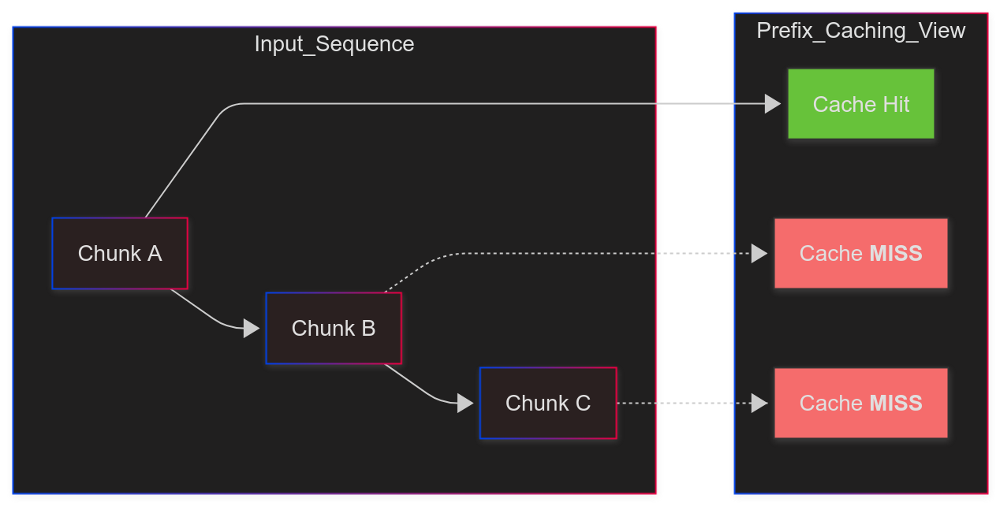

---

- ###### Why not just concatenate pre-computed KVs?

If we pre-compute KV for Chunk A and Chunk B separately, and then stitch them together ("Full KV Reuse"):

**We lose Cross-Attention\!**
Chunk B never "saw" Chunk A during pre-computation.

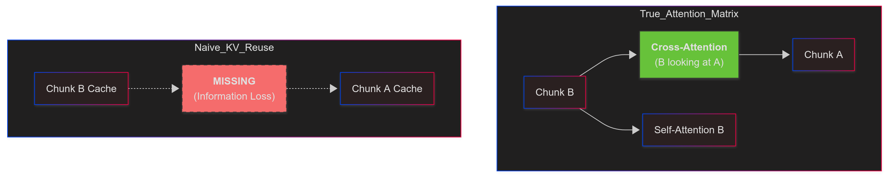

---

- ###### The Core Idea: Selective KV Recompute

We don't need to recompute *everything* ($100\%$).
We don't want to recompute *nothing* ($0\%$, low quality).

**Solution**: Recompute the KV of a **small subset (\~15%)** of tokens that are most affected by the new context.

$$
KV_{new} \approx KV_{precomputed} + \text{Update}(Tokens_{selected})
$$

---

- ###### Which tokens to select?

**Insight**: Attention is **Sparse**.
Only a few tokens in Chunk B strongly attend to Chunk A.

These tokens have **High KV Deviation (HKVD)**.

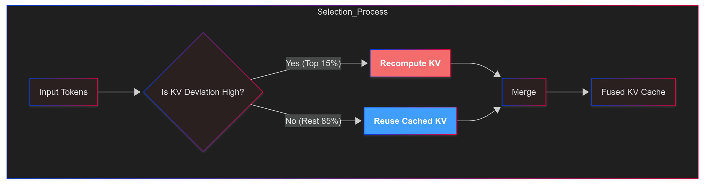

---

- ###### Identifying HKVD Tokens

We cannot know the true deviation without full computation.
**Approximation**: Use a lightweight proxy or gradual filtering.

1.  Compute attention on Layer 1.
2.  Select Top-K tokens with high attention updates.
3.  Propagate these indices to deeper layers (HKVD tokens are highly correlated across layers).

> **Result**: We restore generation quality by updating only the most critical tokens.

---

- ###### The Hidden Cost: IO vs. Compute

We established that we need to recompute ~15% of tokens.
Does this add extra delay?

1.  **Load** Pre-computed KV from Storage (SSD/CPU RAM) to GPU.
2.  **Recompute** the selected HKVD tokens.

$$\text{Total Latency} = \sum_{i=1}^{L} (T_{load}^{(i)} + T_{compute}^{(i)})$$

**Problem**: If we do this sequentially, every bit adds delay.

---

- ###### The Solution: Pipelining

**Insight**: GPU Compute and Memory Loading (IO) can run in parallel.

While the GPU is busy **recomputing** Layer $i$, we can fetch the KV Cache for **Layer $i+1$** from storage.

---

- ###### The Loading Controller

How do we ensure recomputation doesn't exceed loading time?
We introduce a **Loading Controller** to balance the equation:

$$T_{recompute}(r\%) \approx T_{load}(\text{Device})$$

**Two Adaptive Strategies**:

1.  **Adjust Ratio**: If IO is slow, increase recompute ratio (up to the limit) since we have "free" time.
2.  **Select Storage**: If we fix recompute at 15%, pick the **cheapest** storage (e.g., SSD) that is just fast enough to hide the compute.

---

Because we hide computation behind IO, we can store KV Caches on **Slower, Cheaper Media** instead of expensive GPU HBM or CPU RAM.

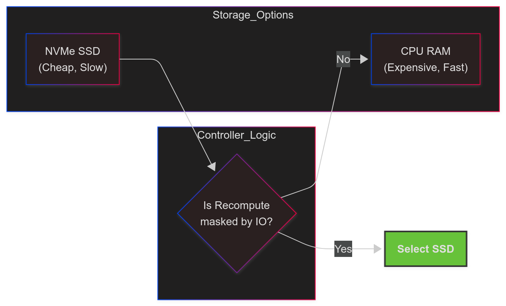

---

- ###### Performance Summary

| Method | TTFT (Speed) | Accuracy | Storage Cost |
| :--- | :--- | :--- | :--- |
| **Full Recompute** | Slow ($1\times$) | High | None |
| **Prefix Caching** | Fast (Start only) | High | High (Duplicates) |
| **Full KV Reuse** | Fast | **Low** (Bad Quality) | Low |
| **CacheBlend** | **Fast (2-3x)** | **High** | Low |
