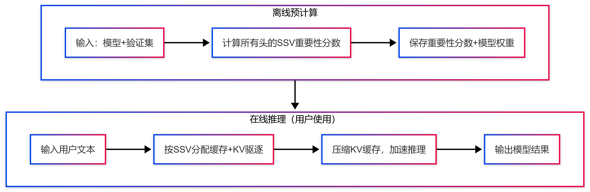
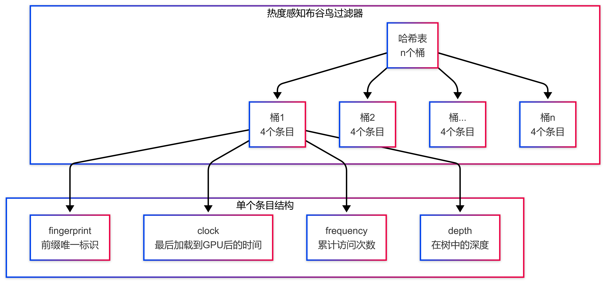

<!-- 
_class: title-page
_header: Papers for building LLM system
-->

## **Papers for building LLM system**

---

<!--
_class: title-page
header: Efficient Cooperation-Aware Key and Value Management for LLM Inference
-->

## **CoKV: Management for LLM Inference**

https://github.com/ZJU-DIVER/CoKV/blob/main/full_paper.pdf

---

### **问题痛点**

* 在长文本场景下，KV 缓存的显存占用甚至可能超过模型本身的显存占用
* 现有的优化方法存在致命问题：
  * 要么用**完全相同的规则**压缩 KV 缓存，忽略注意力头的**重要性差异**
  * 要么**独立评估**注意力头的重要性，忽略注意力头之间的**协同工作**

本文提出 CoKV，旨在用**合作博弈论**的方法，精准衡量每个注意力头在协同工作中的真实贡献，精准衡量每个注意力头在协同工作中的真实贡献

---

### **合作博弈论与 Shapley 值**

Shapley 值能公平地算出每个人在所有可能的组队组合里，带来的**边际贡献平均值**

问题在于，Shapley 值的计算是一个 `P-Hard` 问题

---

### **合作博弈论与 Shapley 值**

传统的 Shapley 值计算方案：

$$
SV_i = \frac{1}{n} \sum_{S \subseteq N \setminus \{p_i\}} \frac{U(S \cup \{p_i\}) - U(S)}{\binom{n-1}{|S|}}
$$

表示**算头i加入任意组合S后的边际贡献，但要算 $2^n$ 次**
$U(S \cup i) - U(S)$ 表示**算头i加入组合S后的边际贡献**

时间复杂度：$\mathbf{O(T\cdot n\cdot C)}$

$\mathbf{C}$：置信度常数 $\frac{\ln(2n/\delta)}{\epsilon^2}$，$T$：单次算$\mathbf{U(S)}$的时间

---

### **优化 1：互补贡献替代边际贡献**

$$
SV_i = \frac{1}{n} \sum_{S \subseteq N \setminus \{p_i\}} \frac{U(S \cup \{p_i\}) - U(N \setminus (S \cup \{p_i\}))}{\binom{n-1}{|S|}}
$$

使用**互补贡献**$U(S) - U(N \setminus S)$，可以一次性更新 $S$ 中所有头的贡献

时间复杂度：$\mathbf{O(T\cdot C)}$

---

### **优化 2：递归计算**

$$
SSV_i^L = \frac{1}{|L|} \sum_{j=1}^n SV_{i,j} \cdot I_L(j)
$$

同一个头，在不同联盟大小下的**互补贡献高度相关**

因此不用遍历所有联盟大小（j=1~n），只挑几个代表性大小（切片 $\mathbf{L}$） 就能近似。

时间复杂度中的所有 $\mathbf{N}$ 替换为 $\mathbf{||L||}$

---

### **优化 3：蒙特卡洛采样近似**

使用随机采样 $\mathbf{M}$ 次联盟代替遍历所有联盟。

时间复杂度不变，但计算量显著减少

### **误差边界**
$$
|SV_i - SSV_i^L| \leq (b-a) \sqrt{\frac{(n-|L|+1)\ln(2/\delta)}{2|L|n}}
$$
- 含义：切片数量$|L|$越多，误差越小，理论保证准确性。

---

### **Shapley 计算（论文算法 1）**

```pseduo
1 初始化：每个头的SSV=0，每个联盟的贡献SV=0，计数m=0
2 循环M次（随机采样）：
3    生成所有头的随机排序πₖ
4    从切片L里随机选一个联盟大小j
5    取前j个头组成联盟S，剩下的头为H\S
6    计算U(S)：只用S里的头，模型效果得分
7    计算U(H\S)：只用H\S里的头，模型效果得分
8    计算互补贡献u = U(S) - U(H\S)
9    对S里的每个头i：
10       SVᵢⱼ += u （累加贡献）
11       mᵢⱼ += 1 （累加计数）
12 最终计算：每个头的SSVᵢᴸ = 平均(SVᵢⱼ/mᵢⱼ) / |L|
```

---

### **KV 缓存驱逐**

按重要性分数分配缓存大小，只保留每个头里最重要的 KV 对

$$
c_i = B \cdot \frac{NSV_i^L}{\sum_{j=1}^n NSV_j^L} + s
$$
- $B$：全局共享缓存预算（总显存）
- $NSV_i^L$：头$i$的归一化重要性分数（0~1）
- $s$：本地窗口大小（论文默认8，每个头必留的最小缓存）
- $c_i$：头$i$最终的KV缓存大小

---

### 论文算法 2

```
1 计算本地窗口的查询Q^win_i
2 计算本地窗口对所有KV的注意力分数A_i
3 聚合注意力分数（池化+均值）
4 用算法1+公式6，算出每个头的缓存大小c_i
5 选注意力分数最高的c_i个KV对
6 拼接：选中的外部KV + 本地窗口KV
7 输出最终保留的KV缓存
```

---

### **扩展方案：KV 缓存量化**

用**不同比特数**存KV，重要头用高精度（多比特），不重要头用低精度（少比特）。
1. 按$SSV_i^L$排序头；
2. 重要头分配**高比特**（如8bit），不重要头分配**低比特**（如4bit）；
3. 按统一量化公式压缩KV，还原时反量化。

---

### **CoKV 整体工作总流程图**



---

<!--
_class: title-page
header: AlayaDB: The Data Foundation for Efficient and Effective Long-context LLM Inference
-->

## **AlayaDB**
### Efficient and Efective Long-context LLM Inference

---

* 大模型（LLM）处理**超长文本**时，有 3 个关键指标很难同时做好：

1. **显存占用**：太长的文本会占满显卡
2. **推理速度**：生成每个字都很慢
3. **回答质量**：压缩了太多信息，并且为了保证速度，导致回答质量下降

* 现有方案：

- **耦合架构**：质量好，但占用显存很多并且很慢
- **KV 缓存分离**：速度中等，但依旧占用显存
- **稀疏注意力**：省显存，但是质量下降严重

---

### DIPR（动态内积范围查询）

- 之前的稀疏注意力都使用 Top-K，只保留前 K 个重要的 token
- **不同层，不同头**所需要的 token 差异实际上很大
- **不同任务**所需要的 token 差异也很大

因此，DIPR：

- 不固定取多少个 token
- 只设定一个 **“重要性门槛”**
- 自动抓所有超过这个门槛的 token
- 不同层、不同任务自动抓不同数量

---

- $q_i \in \mathbb{R}^{1 \times d}$：当前要生成第i+1个token时的查询向量
- $k_j \in \mathbb{R}^{1 \times d}$：第j个历史token的键向量
- $v_j \in \mathbb{R}^{1 \times d}$：第j个历史token的值向量
- $d$：向量维度
- $a_{ij}$：第j个历史token对第i+1个token的注意力分数
- 注意力分数计算公式（论文式1）：
  $$
  z_{ij} = \frac{q_i \cdot k_j^T}{\sqrt{d}}; \quad a_{ij} = softmax(z_{ij}) = \frac{exp(z_{ij})}{\sum_{t=1}^i exp(z_{it})}
  $$

---

**定义 1：基于注意力分数的关键 token**

> 给定所有键向量 $K = [k_1, \cdots, k_n]$，键 $k_j$ 是查询 $q_i$ 的关键token，当且仅当：
> $$
> a_{ij} \geq \alpha \times \max_{s \in [1,n]}(a_{is})
> $$
> 其中 $\alpha \in [0,1]$ 是用户设定的**注意力分数比例阈值**。

**通俗解释**：只要一个token的注意力分数达到"最大注意力分数的α倍"，就认为它是关键的，必须保留。

---

**定义 2：基于内积的关键 token**
> 给定所有键向量 $K = [k_1, \cdots, k_n]$，键 $k_j$ 是查询 $q_i$ 的关键token，当且仅当：
> $$
> q_i \cdot k_j^T \geq \max_{s \in [1,n]}(q_i \cdot k_s^T) - \beta
> $$

**定义3：DIPR查询（Dynamic Inner Product Range Query）**
> 给定键矩阵 $K$、查询向量 $q_i$ 和参数 $\beta \geq 0$，DIPR查询 $DIPR(q_i, \beta)$ 返回所有满足定义2的关键token集合 $cK$。

---
```
Algorithm 1: DIPRS(G, q, k0, l0, β)
Input: Graph G, query q, start key k0, capacity threshold l0, and β
Output: Critical token set cK
1 Initialize a list C with start key vector k0
2 i ← 0
3 while i < C.capacity() do
4   c_i ← the (i+1)-th key vector in C
5   i ← i + 1
6   foreach unvisited neighbor k of c_i in G do
7     tryAppend(q, k, β, C, l0)
8 ĉ ← the closest point to q in C
9 return cK ← {c | c ∈ C, q·c^T ≥ q·ĉ^T − β}

Procedure tryAppend(q, k, β, C, l0):
10 ĉ ← the closest point to q in C
11 Mark k as visited
12 if C.capacity() ≤ l0 or q·k^T ≥ q·ĉ^T − β then
13   C.append(k)
```

---

<!--
_class: title-page
header: HotPrefix: Hotness-Aware KV Cache Scheduling for Efficient Prefix Sharing in LLM Inference Systems
-->

## **HotPrefix**
### Efficient Prefix Sharing in LLM Inference Systems

---

prompt 工程（让 LLM 更好用的提示词技术）会导致 prompt 越来越长，大幅增加推理延迟、降低吞吐量。虽然前缀共享技术能复用相同开头的 KV 缓存，但存在致命问题：

- GPU 显存不够存储 KV 缓存
- 传统方法会使用 **最近最少使用** 策略转移缓存，导致**高热度前缀被淘汰**
- 转移的过程会产生大量的 IO 开销

---

### **HotPrefix**

HotPrefix 提出了三个创新点来解决这三个问题：

- 动态热度追踪
- 选择性 KV 缓存准入
- 热度提升

---

### **动态热度追踪**

论文用**热度感知布谷鸟过滤器**记录每个前缀树节点的热度信息，这是一种轻量级、高效的哈希表结构：
- 整体是连续地址空间的哈希表，包含n个桶，每个桶存4个条目。
- 每个条目存4个元数据：
  - 指纹（fingerprint）：前缀的紧凑唯一标识，用于快速查找。
  - 时钟（clock）：该前缀最后一次被加载到GPU后的时间
  - 频率（frequency）：该前缀被访问的总次数，直接反映热度。
  - 深度（depth）：该前缀在树中的位置（根节点深度为0）。

---

数据结构：增强型布谷鸟过滤器



---
当生成一个新的前缀节点时：
1. 提取从根节点到该节点的所有token作为唯一标识x。
2. 计算x的指纹f，再通过两个哈希函数计算两个候选桶：`b1=hash(f)`、`b2=b1⊕hash(f)`（⊕是异或运算）。
3. 如果两个桶中有空位置，就把f存入，同时初始化：clock=max_age（预定义最大值，论文实验设为255）、frequency=1、depth=节点当前深度。
4. 如果两个桶都满了，随机选一个桶的条目，把它移到它的备用桶；如果备用桶也满了，重复这个过程直到找到空位。
5. 如果迭代到最大次数还没找到空位，就把一些不用的条目移到CPU内存。

---

[步骤流程图](./assets/cuckoo-filter-insert.svg)

### 热度更新机制
分两步实时更新热度：
1. **节点被复用时**：找到该节点在布谷鸟过滤器中的条目，将frequency加1，同时把clock重置为max_age。
2. **周期性老化**：每处理固定数量的用户请求后，遍历整个布谷鸟过滤器，把所有条目的clock减1；如果clock降到0，就保持0不变。这个机制能区分"最近被访问的前缀"和"很久没被访问的前缀"。

---

### 热度感知驱逐策略
- **只驱逐叶子节点**（因为祖先节点被更多后代共享，热度更高）。
- 叶子节点的优先级计算公式：`priority = frequency + clock / length`
  - frequency：该节点的累计访问次数（即使被换出GPU再换入，次数也会累加）。
  - clock：该节点最后一次被加载到GPU后的时间。
  - length：该节点包含的token数量。
- **优先级越低的节点越先被驱逐**

---

### 选择性准入策略
不是所有被GPU驱逐的KV缓存都要移到CPU，论文观察到：很多低热度的KV缓存（比如用户特定的提问内容、LLM生成的独特内容）几乎不会被复用，存到CPU只会浪费I/O和内存。

因此采用**两步过滤**：
1. **频率阈值过滤**：如果被驱逐节点的frequency低于预定义阈值（论文实验设为10），直接丢弃。
2. **热度比较过滤**：通过频率阈值的节点，计算其热度：`hotness = frequency * clock`，然后和CPU内存中热度最低的节点比较。如果比CPU里最低的还低，直接丢弃；否则才移到CPU内存。

---

### 热度提升
如果等用户请求来了再从CPU加载KV缓存，传输开销可能比重新计算还大。因此HotPrefix采用**异步预取策略**，主动把CPU里的高热度KV缓存提前加载到GPU。

1. 把CPU内存中的节点按**热度降序**排序，把GPU内存中的叶子节点按**热度升序**排序。
2. 逐个处理CPU中的节点：
   - 如果该节点的父节点在GPU里，且已经被标记为要驱逐，直接跳过
   - 把该节点和GPU里最冷的节点比较替换
   - 如果一个GPU节点的空间不够，就选多个GPU节点

---

### 流水线提升与解码
1. 执行提升计划时，用**专门的CUDA流**异步传输KV缓存，和GPU的计算流并行。
2. 被替换的GPU节点直接丢弃（因为它们热度极低，复用概率几乎为0）。
3. 提升操作**不会增加GPU内存使用**，因为是等量替换。如果decode阶段需要更多内存，就用之前的热度感知驱逐策略释放空间。

---

<!--
_class: title-page
header: SagaLLM: Context Management, Validation, and Transaction Guarantees for Multi-Agent LLM Planning
-->
## **SagaLLM**
### 多Agent LLM规划的事务保障框架

---
### **现有LLM多Agent系统的四大核心缺陷**
* **不可靠的自验证**：LLM无法可靠检测自身逻辑错误（哥德尔不完备性定理限制）
* **上下文丢失**：长对话中注意力偏向最近token，遗忘早期关键约束
* **缺乏事务保障**：无原子性、一致性、回滚机制，易产生部分执行和不一致状态
* **Agent间协调不足**：无全局监督机制，无法跨Agent验证约束满足
---
### **核心思想：Saga事务模式 + LLM多Agent**
* 经典Saga：将长事务分解为独立子事务，失败时执行补偿操作
* SagaLLM：用LLM自动生成事务逻辑、补偿规则和验证机制
* **核心创新**：让LLM承担传统需要手动编码的事务协调工作
---
### **经典Saga vs SagaLLM 对比**
| 方面 | 经典Saga | SagaLLM |
| --- | --- | --- |
| 领域 | 数据库事务 | 多Agent LLM工作流 |
| 补偿 | 预定义回滚流程 | LLM生成+验证的补偿 |
| 验证 | 模式/约束验证 | 独立LLM输出验证 |
| 上下文 | 无状态事务 | 战略性上下文保留 |
| 协调 | 简单顺序执行 | 复杂多Agent依赖管理 |
| 智能 | 规则驱动 | 自适应LLM推理+事务保障 |
---
### **SagaLLM整体架构**
* 位于应用层与LLM基础设施（如LangGraph）之间
* 由三大核心框架组成：
  1. **上下文管理框架**：解决上下文丢失问题
  2. **验证框架**：解决自验证不可靠问题
  3. **事务框架**：解决缺乏事务保障问题
* **插入位置**：此处插入论文Figure 1（SagaLLM三层架构图）
---
### **1. 上下文管理框架**
* **核心目标**：战略性保留关键上下文，避免长对话中的信息丢失
* **三大核心能力**：
  * **选择性保留**：过滤关键信息（目标、理由、依赖）
  * **结构化存储**：组织规范、推理链和决策依据
  * **依赖跟踪**：维护回滚所需的前置条件
---
### **上下文状态管理三维度**
| 状态类型 | 管理方 | 记录内容 |
| --- | --- | --- |
| 应用状态 \(S_A\) | 任务执行Agent | 领域实体、系统检查点、用户约束 |
| 操作状态 \(S_O\) | Saga协调器Agent | 执行日志、输入输出、推理轨迹、补偿流程 |
| 依赖状态 \(S_D\) | 全局验证Agent | 操作间约束、资源依赖、约束满足证据 |
---
### **2. 验证框架**
* **核心设计**：独立于任务Agent的**全局验证Agent**
* **两层验证架构**：
  * **Agent内输出验证**：语法、语义、事实、约束、推理
  * **Agent间输入验证**：契约、依赖、一致性、时间顺序、共享状态
* **验证响应协议**：
  * 拒绝：丢弃并触发补偿
  * 增强：补充澄清信息
  * 反馈：记录用于未来优化
---
### **全局验证Agent的验证类型**
| 验证类型 | 示例 |
| --- | --- |
| 语法验证 | 验证JSON结构包含必填字段 |
| 语义验证 | 确认住宿覆盖整个行程无间隙 |
| 约束验证 | 确保总费用不超过$5000预算 |
| 依赖验证 | 确保机票预订完成后再订酒店 |
| 时间验证 | 保证预算结算在所有预订之后 |
---
### **3. 事务框架**
* **核心组件**：Saga协调器Agent
* **事务模型**：每个操作 \(o_i\) 对应本地事务 \(T_i\) 和补偿事务 \(C_i\)
* **Saga事务公式**：
  $$Saga\ S=\{T_1, T_2, ..., T_n, C_n, ..., C_2, C_1\}$$
* **失败时执行**：按依赖逆序执行补偿事务，恢复全局一致性
---
### **事务保障三大特性**
* **一致性保留**：所有状态转换遵守全局不变量
* **隔离性**：并发执行结果等价于某种串行顺序
* **持久性**：已提交状态永久保存，支持故障恢复
---
### **核心算法：工作流模板构建与Agent生成**
* **输入**：问题规范O、约束集D、性能指标M
* **输出**：验证通过的工作流模板Wtemplate=(N,E)
* **三大执行阶段**：
  1. 网络构建：提取角色、节点和依赖关系
  2. Agent规范：生成任务Agent、补偿Agent和日志模式
  3. 验证与优化：迭代验证并优化工作流
---
### **算法1 详细步骤（阶段1：网络构建）**
```
1. 从问题规范O中提取所需角色R
2. 将角色映射到工作流节点N
3. 根据约束集D生成节点间的边E
4. 构建初始工作流模板Wtemplate=(N,E)
```

---
### **算法1 详细步骤（阶段2：Agent规范）**
```
5. 对每个节点n_i：
   a. 定义日志模式L_ni
   b. 生成任务Agent α_ni
   c. 生成补偿Agent α_ni^comp
6. 对每个边e_ij：
   a. 定义日志模式L_eij
   b. 生成边Agent α_eij
   c. 生成补偿Agent α_eij^comp
```
---
### **算法1 详细步骤（阶段3：验证与优化）**
```
7. 循环直到工作流验证通过：
   a. 结构验证：检查完整性和无环性
   b. 约束验证：检查所有约束D是否满足
   c. 补偿验证：检查补偿逻辑正确性
   d. 优化工作流模板Wtemplate
8. 返回最终验证通过的Wtemplate
```
---
### **案例：国际旅行规划**
* **问题描述**：旧金山→柏林→科隆→旧金山，总预算$5000
* **要求**：预订机票、酒店、城际火车，4天柏林+2天科隆
* **两阶段工作流**：
  1. **手动规划阶段**：人类生成并验证行程
  2. **SagaLLM自动执行阶段**：全自动化事务管理
---
### **旅行规划事务执行序列**
1. \(T_1\)：旧金山→柏林国际机票预订
2. \(T_2\)：柏林酒店预订（依赖T1完成）
3. \(T_3\)：柏林→科隆火车票预订（依赖T2完成）
4. \(T_4\)：科隆酒店预订（依赖T3完成）
5. \(T_5\)：科隆→旧金山返程机票预订（依赖T4完成）
* **失败时**：按逆序执行补偿C5→C4→C3→C2→C1
---
### **标准事务执行流程**
1. **执行前验证**：全局验证Agent检查输入和依赖
2. **事务执行**：任务Agent执行具体操作
3. **输出验证**：全局验证Agent全面检查结果
4. **状态提交**：验证通过后提交到系统状态
5. **补偿注册**：Saga协调器记录回滚流程
---
### **实验设计**
* **基准测试集**：REALM基准的4个规划问题
  * P6（感恩节晚餐）：顺序规划
  * P9（感恩节晚餐中断）：反应式规划
  * P5（婚礼聚会）：顺序规划
  * P8（婚礼聚会中断）：反应式规划
* **对比模型**：Claude 3.7、DeepSeek R1、GPT-4o、GPT-o1
* **评估指标**：验证准确率、上下文保留率、事务一致性
---
### **实验结果1：感恩节晚餐问题（P9）**
* **问题**：James航班延误3小时，需要重新规划
* **LLM典型错误**：
  * 火灾安全：无人看管烤箱
  * 旅行时间：错误计算机场到家时间
  * 准备时间：配菜准备时间不足
  * 晚餐时间：违反6点晚餐约束
* **原因**：LLM注意力狭窄，专注于最近调整而遗忘早期约束
---
### **SagaLLM的解决方案**
* **分领域验证Agent**：旅行协调Agent和食物准备Agent，每个上下文<1k token
* **外部状态存储**：记录每个人的时空状态和所有约束
* **补偿式重规划**：
  1. 回滚到最后保存的状态
  2. 合并新旧约束
  3. 执行补偿操作取消冲突计划
  4. 重新调度受影响部分
---
### **实验结果2：婚礼聚会问题（P8）**
* **问题**：1点机场附近发生事故，往返机场时间变为3倍
* **LLM典型错误**：
  * Claude：未更新已在途中的车辆行驶时间
  * DeepSeek R1：重写已完成的历史事件
  * GPT-4o：时空上下文混乱
  * GPT-o1：可行但保守，未利用精确位置信息
---
### **SagaLLM的事务保障机制**
* **持久上下文仓库**：完整记录每个检查点的世界状态
* **不可变操作日志**：所有已执行操作永久记录，防止"失忆"
* **精细粒度补偿**：
  * 部分行程补偿：只调整受影响的路段
  * 战略资源重分配：利用可用资源（如Chris的车）
  * 原则性约束放松：必要时适当调整并执行补偿
---
### **LLM vs SagaLLM 能力对比**
| 能力 | 标准LLM | SagaLLM |
| --- | --- | --- |
| 维护历史操作 | 部分/无 | 完整 |
| 部分行程补偿 | 极少 | 总是 |
| 约束一致性检查 | 临时 | 系统 |
| 抗注意力狭窄 | 脆弱 | 强 |
| 物理-时间一致性 | 不一致 | 保证 |
---
### **核心结论**
SagaLLM通过四大创新解决了现有LLM多Agent系统的根本缺陷：
1. **独立验证**：克服LLM自验证不足
2. **战略性上下文保留**：缓解注意力狭窄
3. **事务状态管理**：提供不可变记录和补偿机制
4. **专业化Agent协调**：明确角色分工和依赖跟踪
* 显著提升了复杂规划场景下的一致性、可靠性和适应性
---

<!--
_class: title-page
header: Batch Query Processing and Optimization for Agentic Workflows
-->
## **Halo: Agentic Workflows 批处理优化系统**

---

### **问题背景**
- Agentic工作流：多LLM调用+多工具调用的DAG结构
- 企业级场景：成百上千个相同工作流并发执行
- 现有系统三大核心问题：
  1. 重复提示词与重叠上下文
  2. 碎片化CPU-GPU执行
  3. 硬件利用率极低
---

### **现有解决方案缺陷**
| 方案类型 | 代表系统 | 结构感知 | 异构调度 | 状态优化 |
| --- | --- | --- | --- | --- |
| 请求级服务 | vLLM, SGLang | ❌ | ❌ | ⚠️ |
| 数据平台 | Ray, Spark | ⚠️ | ❌ | ❌ |
| 应用编排器 | LangGraph, AgentScope | ✅ | ❌ | ⚠️ |
| Halo | - | ✅ | ✅ | ✅ |

⚠️：仅优化内部状态，缺乏跨请求全局感知

---

### **三大核心挑战**
**C1: 结构感知缺失**
- 多个Agent执行相同子图，独立执行导致冗余I/O

**C2: 异构流水线气泡**
- CPU工具调用与GPU推理交替，GPU频繁空闲

**C3: 有状态LLM算子**
- 模型切换成本高，KV缓存缺失导致延迟激增
---

### **Halo系统架构**
经典"解析器-优化器-处理器"三层架构
1. **Parser**：YAML工作流 → GraphSpec中间表示
2. **Optimizer**：生成成本最优ExecutionPlan
3. **Processor**：异构CPU-GPU上执行计划

**核心思想**：将Agentic工作流建模为结构化查询计划DAG

---

### **优化器：基于Epoch的调度**
- 将连续时间离散化为决策窗口（Epoch）
- 每个Epoch开始时选择要执行的LLM算子
- 系统状态：已完成节点 + GPU上下文（模型+KV缓存）

**优化目标**：最小化总Epoch成本
$$
min_{\mathcal{A}} \sum_{e=0}^{E-1} C_{epoch}\left(S_{e}, A_{e}\right)
$$

---

### **Epoch成本函数**
$$
C_{epoch}\left(S_{e}, A_{e}\right)=\mu \cdot max _{w \in W} T_{w}+(1-\mu) \cdot \sum_{w \in W} T_{w}+\lambda \cdot g\left(A_{e}\right)
$$
- $max T_w$：最小化瓶颈Worker时间（降低总耗时）
- $\sum T_w$：惩罚系统总负载（提高资源利用率）
- $g(A_e)$：正则化Epoch固定开销（避免过度碎片化）
---

### **状态感知延迟模型**
端到端延迟 = CPU准备时间 + GPU执行时间
$$
T(w, v, S_{e})=T_{prep}(v)+T_{gpu}\left(w, v, h_{w}^{e}\right)
$$
GPU执行时间分解：
$$
T_{gpu}(w, v, h_{w}^{e})=T_{model}\left(v, m_{w}^{e}\right)+T_{infer}\left(v, u_{w}^{e}\right)
$$
- $T_{model}$：模型切换成本（无该模型时）
- $T_{infer}$：推理时间（考虑KV缓存前缀复用）
- 
---

### **动态规划求解器算法**
```
Function Solve(D, H, e)
  if D == V then return (0, ∅)
  if (D, H) in M then return M[(D, H)]
  F = GetFrontier(G, D) // 获取拓扑就绪节点
  foreach batch B⊆F and map φ: B→W do
    c_now = CostModel(B, φ, H)
    H_next = UpdateWorkerState(H, φ)
    (c_fut, Π_rest) = Solve(D∪B, H_next, e+1)
    if c_now + c_fut < c* then
      c* = c_now + c_fut
      Π* = {(B, φ)} ∪ Π_rest
  return (c*, Π*)
```
---

### **处理器核心架构**
- **Coordinator**：非阻塞事件驱动，维护全局DAG状态
- **GPU Executors**：状态ful，每个托管一个vLLM实例
- **CPU Executors**：执行工具算子（SQL/HTTP/本地函数）

**核心能力**：
- 依赖解析与CPU优先级调度
- 跨工作流请求合并
- GPU自适应批处理与流水线
---
<!-- 此处插入论文图4：Halo处理器架构图 -->

### **CPU侧优化**
**优先级调度**
- 按DAG深度排序CPU任务，优先执行解锁GPU的前置任务
- 每个工具后端限制并发数，防止头阻塞

**请求合并（Request Coalescing）**
- 规范化算子签名（类型+参数）
- 合并相同签名的待执行任务为一次物理执行
- 结果扇出给所有依赖节点
---

### **GPU侧优化**
- **连续批处理**：内部使用vLLM连续批处理最大化利用率
- **波前执行**：LLM节点完成后立即启动就绪后继节点
- **机会主义执行**：GPU空闲时执行其他就绪任务
- **KV缓存复用**：保持工作流血统在同一Worker
---

<!--
_class: title-page
header: HuggingGPT: Solving AI Tasks with ChatGPT and its Friends in Hugging Face
-->
## **HuggingGPT**
### Solving AI Tasks with ChatGPT and its Friends in Hugging Face

---

### **问题背景**
* 大语言模型(LLM)在NLP任务上表现出色，但存在三大局限：
  1. **输入输出限制**：只能处理文本，无法处理图像、语音等多模态信息
  2. **复杂任务能力不足**：无法处理需要多个子任务协作的复杂任务
  3. **专业能力不如专家模型**：在特定任务上弱于微调后的专家模型
* 核心问题：如何让LLM与外部专家模型协作，解决复杂AI任务？

---

### **核心思想**
* **语言作为通用接口**：每个AI模型都可以用语言描述其功能
* **LLM作为控制器**：利用LLM的语言理解和推理能力，管理和协调专家模型
* **HuggingGPT架构**：
  - 大脑：LLM(如ChatGPT)负责规划、决策和结果整合
  - 执行者：Hugging Face上的数千个专家模型负责具体任务执行

---

### **整体工作流程**
HuggingGPT的工作流程分为四个核心阶段：
1. **任务规划**：解析用户请求，分解为结构化任务
2. **模型选择**：为每个任务选择最合适的专家模型
3. **任务执行**：调用模型执行任务，处理资源依赖
4. **响应生成**：整合所有结果，生成自然语言回答

**插入位置**：此处插入HuggingGPT整体工作流程图(对应论文Figure 2)

---

### **阶段一：任务规划**
* **目标**：将用户的自然语言请求解析为结构化的任务列表
* **任务格式**：
  ```json
  {
    "task": "任务类型",
    "id": "任务唯一ID",
    "dep": ["依赖的任务ID"],
    "args": {"输入参数"}
  }
  ```

---

* **实现方法**：
  1. **规范指令**：定义任务模板，要求LLM按JSON格式输出
  2. **示例解析**：在prompt中提供多个示例，帮助LLM理解任务分解规则
  3. **上下文管理**：支持多轮对话，跟踪历史资源

---

### **任务规划示例**
* 用户请求："First generate a HED image of e3.jpg, then based on the HED image and a text 'a girl reading a book', create a new image as a response."
* LLM输出：
  ```json
  [
    {"task": "pose-detection", "id": 0, "dep": [-1], "args": {"image": "e3.jpg"}},
    {"task": "pose-text-to-image", "id": 1, "dep": [0], "args": {"text": "a girl reading a book", "image": "<resource>-0"}}
  ]
  ```
---
### **阶段二：模型选择**
* **目标**：为每个任务从Hugging Face中选择最合适的专家模型
* **核心机制**：**上下文内任务-模型分配**
  1. 先按任务类型过滤模型，缩小候选范围
  2. 按下载量排序，选择Top-K个模型作为候选
  3. LLM根据模型描述，选择最适合的模型
* **输出格式**：
  ```json
  {
    "id": "模型ID",
    "reason": "选择理由"
  }
  ```
---
### **阶段三：任务执行**
* **目标**：调用选中的模型执行任务，返回结果给LLM
* **关键挑战**：处理任务间的**资源依赖**
* **解决方案**：使用特殊符号`<resource>-task_id`表示依赖资源
  - 任务规划阶段：在参数中使用`<resource>-task_id`引用前置任务的输出
  - 任务执行阶段：动态替换为实际生成的资源
* **执行优化**：无依赖的任务可以**并行执行**，提高效率
* **混合端点**：优先使用本地端点，本地没有的使用Hugging Face云端端点
---
### **阶段四：响应生成**
* **目标**：整合所有阶段的信息，生成用户友好的自然语言回答
* **整合内容**：
  1. 任务规划列表
  2. 每个任务选择的模型
  3. 所有模型的推理结果
* **输出要求**：
  - 首先直接回答用户的问题
  - 然后用第一人称描述任务执行过程
  - 如果有生成的文件，提供完整路径
