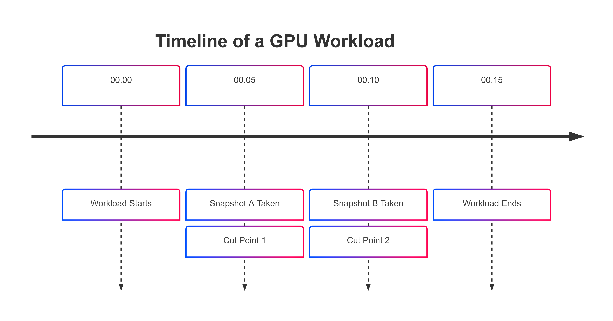
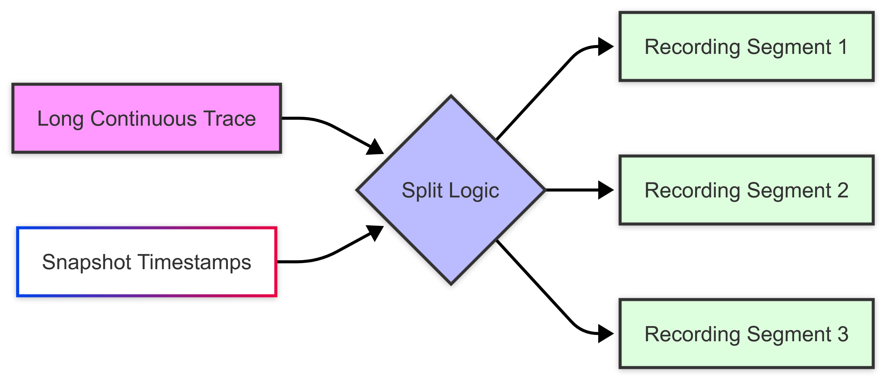
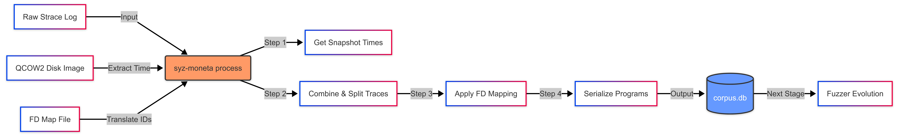

<!--
header: Moneta: Ex-Vivo GPU Driver Fuzzing by Recalling In-Vivo Execution State
_class: title-page
-->

# Moneta: code reading report
### `syz-moneta` inside `syzkaller`

---

### The "Translator" and "Cutter"

The file `syz-moneta.go` is a crucial utility tool in the Moneta architecture.

* **Role**: It bridges the gap between the **Observation Phase** (recording what happened) and the **Fuzzing Phase** (trying to break things).
* **Core Task**: It converts raw system logs (`strace`) into a format that the fuzzer (`syzkaller`) can understand and execute.
* **Key Feature**: It chops continuous recordings into small, replayable chunks synchronized with Virtual Machine snapshots.

---

### The Raw Materials (Inputs)

1.  **The "Diary" (Trace File)** `[-file/-dir]`:
    * A raw log of every System Call made by the GPU driver (e.g., `ioctl`, `open`).
    * Generated by `strace`.
2.  **The "Save File" (Disk Image)** `[-image]`:
    * The QCOW2 virtual disk image containing VM snapshots.
    * Tells us *exactly when* a snapshot was taken.
3.  **The "Address Book" (FD Map)** `[-fd]`:
    * A mapping file that translates **File Descriptors** (FDs).

---

### Step 1: Timing the Snapshots

The function `getSnapshotPoint()` creates a timeline.

* **Action**: It executes `qemu-img snapshot -l` on the disk image.
* **Purpose**: Extracts the precise timestamps of every snapshot taken during the observation phase.
* **Result**: A list of "Cut Points". We know exactly where to slice the long recording.

---

---

### Step 2: The Translation Problem (FD Maps)

The function `parseFdmap()` handles the "Identity Crisis" of resources.

* **The Problem**:
    * In the **Recording**, the GPU might be accessed via ID `3`.
    * In the **Snapshot** (when restored), the GPU might be at ID `5`.
* **The Solution**:
    * The code reads a mapping file to understand which ID corresponds to which resource (Nvidia, Mali, or AMD).
    * It creates an `Fdmap` struct: `old_fd -> new_fd`.

---

### Step 3: Slicing the Data (`splitWithSnapshotPoint`)

This is the core logic of the code. It takes the continuous trace and splits it based on the timestamps found in Step 1.

* **Logic**:
    1.  Iterate through every system call in the trace.
    2.  If the call happened **after** Snapshot A but **before** Snapshot B, it belongs to **Segment A**.
    3.  Only keep the first `200` calls (defined by `maxCallNum`) to keep fuzzing efficient.

---

---

### Step 4: Memory Management (`mmap`)

* **The Challenge**: GPU drivers use `mmap` to map device memory to user space. If the fuzzer tries to write to an address that isn't mapped, it crashes uselessly.
    * The code tracks `mmap$gpu` (memory allocation) and `munmap` (memory freeing) calls.
    * It carries over valid memory mappings into the new program segments.
    * **Result**: The fuzzer knows exactly which memory addresses are valid to play with.

---

### The Final Output: `corpus.db`

Finally, the `pack()` function wraps everything up.

* **Format**: A generic Syzkaller database (`corpus.db`).
* **Content**: A collection of small, serialized programs.
* **Usage**:
    * Moneta loads this database.
    * It restores a Snapshot.
    * It immediately executes the corresponding "Program" from this database.
    * *Then* it starts mutating (fuzzing) from that valid state.

**Value**: This ensures the fuzzer starts from a **valid, deep state** (Stateful Fuzzing) rather than starting from scratch every time.

---

### Summary: The `syz-moneta` Pipeline

