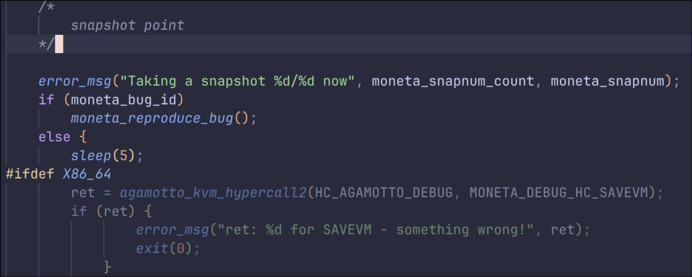
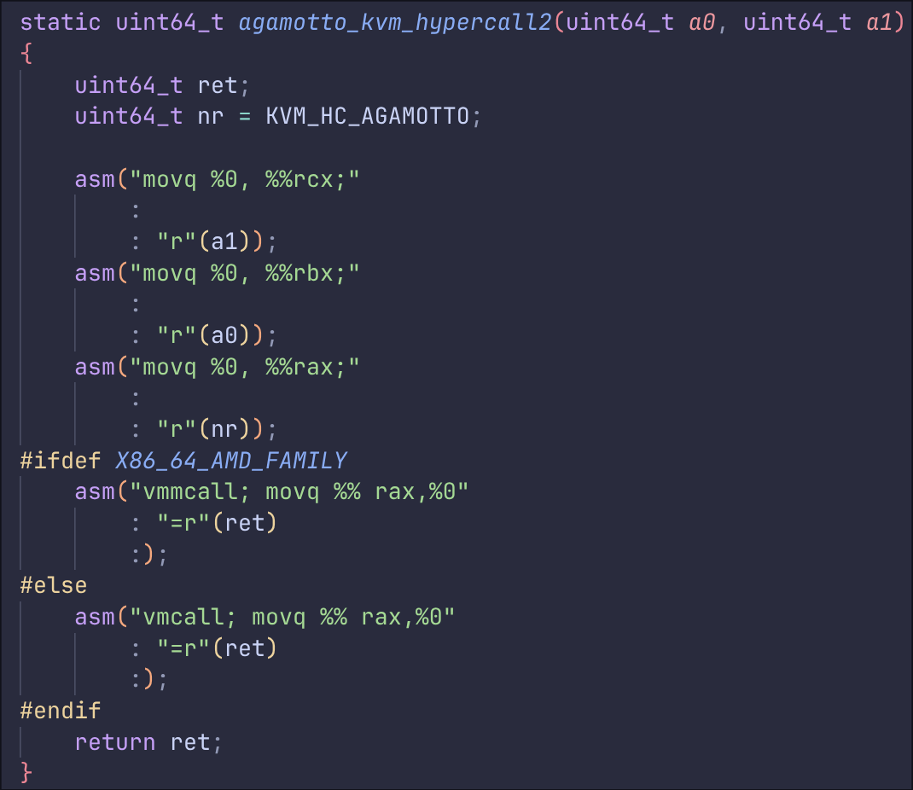
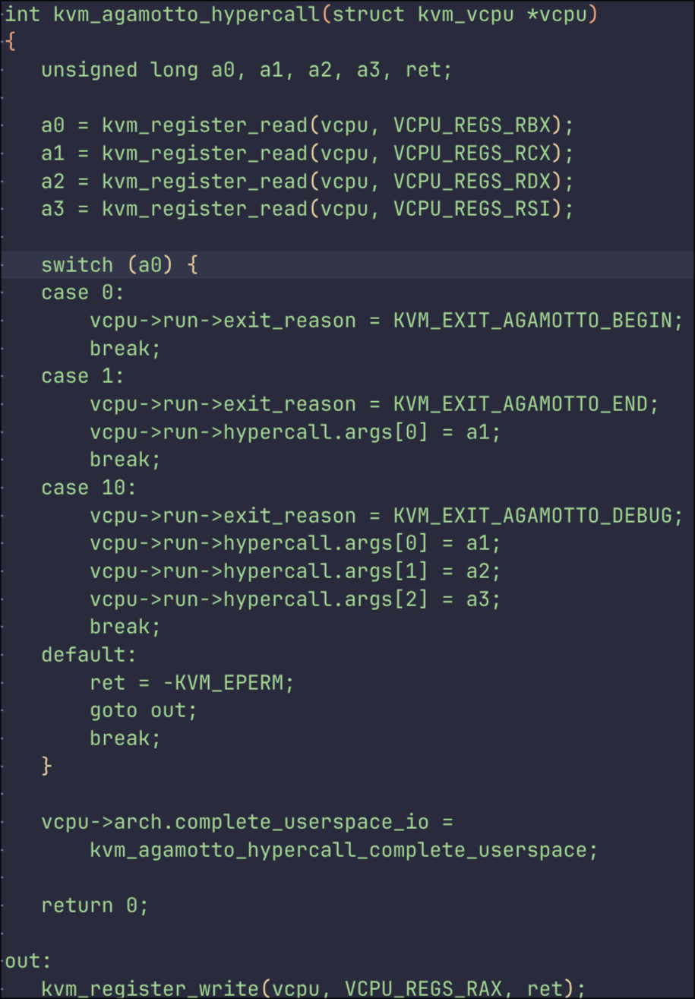
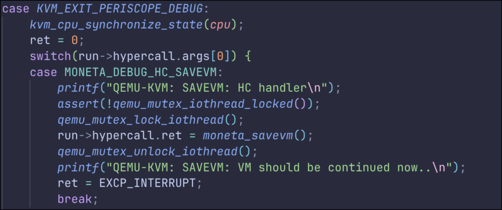
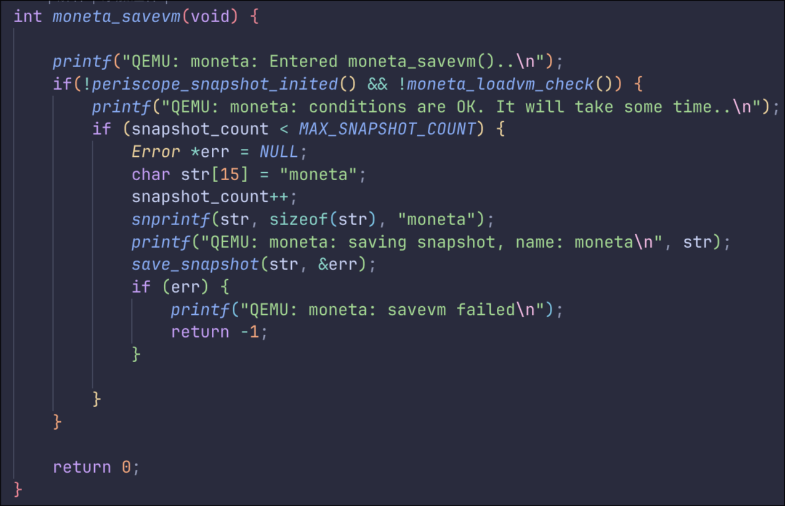

<!--
header: Moneta: Ex-Vivo GPU Driver Fuzzing by Recalling In-Vivo Execution State
_class: title-page
-->

# Moneta: The Whole Process
**Fuzzing the GPU driver with trace and snapshots**

---

### The prerequesites of moneta

#### Utility tools

- ##### A patched version of **Syzkaller**
  - The state-of-the-art fuzzing tool for linux kernel specially patched for driver fuzzing.
- ##### A patched version of **QEMU**
  - The virtual machine emulator specially patched to support taking execution state snapshots.

---

### The prerequesites of moneta

#### Linux kernels

- ##### A patched version of **Linux kernel for host machine**
  - As the hypervisor, the host kernel is patched to support special hypercalls for taking execution state snapshots.
- ##### A patched version of **Linux kernel for guest machine**
  - As the guest kernel, the kernel is patched to be up with the GPU driver support.

---

### The prerequesites of moneta
#### Software
- ##### A patched version of **strace**
  - The **strace** software will be run in the guest machine to trace ioctl calls for the GPU driver and generate snapshots and recordings.
- ##### Some GPU workload
  - The GPU workload will be run in the guest machine for **strace** to generate the snapshots.

---

### Recording and capturing the snapshots

Inside guest machine, we use **the patched strace** to run some specific GPU workload and record the ioctl calls:

```bash
strace -o moneta.trace --moneta-n <ioctl count for snapshot> ... <workload>
```
**Strace** will run the workload and count the ioctl calls. Every time the count reaches the specified number, **strace** will require **the patched qemu** to take a snapshot of the whole virtual machine.

> The generated `snapshot_point` is somehow empty, we are currently trying to fix it.

---

### Generating corpus using **syz-moneta**

The **syz-moneta** tool is added to syzkaller to generate corpus using the recorded traces and snapshots.

```bash
syz-moneta -dir <trace_dir> -fd <fd_dir> -image <image>
```

The tool will generate file `corpus.db` for syzkaller to use.

---

### Fuzzing with syzkaller

The **syzkaller** will be run with the generated corpus and the patched kernel.

```bash
./bin/syz-manager -config /path/to/configs/syzkaller/generated/<CFG_FILE>.cfg
```

The syzkaller will fuzz the driver with the generated corpus and report the bugs.

---

### Taking the snapshot: The process

During strace, when it's time to take a snapshot, **strace** will call the **special hypercall** to take the snapshot:



---

### Taking the snapshot: The process

The `agamotto_kvm_hypercall2` function is just calling `vmcall`



---

### Taking the snapshot: The process

The `vmcall` will be captured by the host kernel and was turned into a **kvm exit event**:



---

### Taking the snapshot: The process

`Qemu` will know this **kvm exit event** and handle the event:



---

### Taking the snapshot: The process

`moneta_savevm` should be called to save the snapshot:


