<!-- _class: title-page -->

## NV45 GPU Simulation

Analysis of Nouveau Driver & Hardware Emulation Strategy

---

<!-- 
_class: title-page 
_header: Hardware Architecture
-->

## Part 1:
## **NV45 Hardware Architecture**

###### Understanding the Target Device

---

<!-- _header: NV45 (Curie) Internal Structure -->

The NV45 GPU consists of multiple sub-devices ("Engines") coordinated by the Master Control.

---

<!-- _header: Memory Interface (BARs) -->

The CPU communicates with the GPU via three **Base Address Registers (BARs)**.

| BAR | Type | Size | Description | Method |
| :--- | :--- | :--- | :--- | :--- |
| **BAR 0** | **MMIO** | 16 MB |  Registers for all engines. | `readl` / `writel` (Intercepted by QEMU) |
| **BAR 1** | **VRAM** | 512 MB | Textures, Framebuffer, PushBuffers. | Direct Memory Access / TTM Mapping |
| **BAR 2** | **PRAMIN** | 1 MB | Channel status, Hash Tables. | Direct Access (Stored as Structs) |

---

<!-- _header: Sub-Devices -->

1.  **bios** - **BIOS** (Basic Input/Output System)
    * Responsible for handling the graphics card's BIOS information, including initialization parameters and hardware configuration.
2.  **bus** - **Bus Interface**
    * Responsible for managing the communication interface between the **GPU** and the system bus.
3.  **clk** - **Clock Controller**
    * Responsible for clock generation, distribution, and frequency adjustment for various components within the **GPU**.

---

4.  **devinit** - **Device Initialization**
    * Responsible for the initial setup and configuration of the **GPU** hardware.
5.  **fb** - **Framebuffer**
    * Responsible for managing video memory (VRAM) and the framebuffer, handling the storage of graphics data.
6.  **gpio** - **General Purpose Input/Output**
    * Responsible for controlling the general-purpose pins on the **GPU**, used for various hardware control functions.

---

7.  **i2c** - **I2C Bus Controller**
    * Responsible for the **I2C** communication protocol, used to communicate with displays and other peripherals.
8.  **imem** - **Instruction Memory**
    * Responsible for managing the **GPU**'s instruction storage area, storing the microcode to be executed.
9.  **mc** - **Memory Controller**
    * Responsible for managing **GPU** memory access and memory mapping.

---

10. **mmu** - **Memory Management Unit**
    * Responsible for virtual-to-physical address translation, managing the **GPU**'s address space.
11. **pci** - **PCI Interface Controller**
    * Responsible for managing the interface and communication between the **GPU** and the **PCI** bus.
12. **therm** - **Thermal Management**
    * Responsible for monitoring **GPU** temperature and managing the cooling system.

---

13. **timer** - **Timer**
    * Responsible for providing timing functions and a time base.
14. **volt** - **Voltage Regulator**
    * Responsible for the regulation and management of the **GPU** core voltage.
15. **disp** - **Display Controller**
    * Responsible for managing display output, including signal generation and display mode control.

---

16. **dma** - **Direct Memory Access**
    * Responsible for managing direct memory transfers between various **GPU** components.
17. **fifo** - **Command FIFO** (First In, First Out)
    * Responsible for managing and scheduling the **GPU** command queue, ensuring commands are executed in order.
18. **gr** - **Graphics Rendering Engine**
    * Responsible for processing **3D** graphics rendering and **2D** graphics acceleration.

---

19. **mpeg** - **MPEG Decoder**
    * Responsible for hardware **MPEG** video decoding acceleration.
20. **sw** - **Software Objects**
    * Responsible for managing objects and operations at the software level.

---

<!-- _header: The Fuzzing Loop (IOCTL Flow) -->

How a fuzzing payload reaches the simulated GPU.

---

<!--
header: The Whole Process: Analysis
_class: title-page
-->

## The Whole Process: Analysis
**The overall process of simulating a GPU driver**

---

### Lifecycle: From Boot to Shutdown

The interaction between **Nouveau** and **NV45** follows a strict state machine.

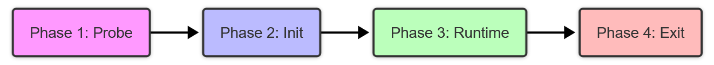

1. **Probe**: Identification & PCI Enable.
2. **Init**: Hardware Reset & Engine Wake-up.
3. **Runtime**: IOCTLs, Command Submission, Interrupts.
4. **Exit**: Resource Cleanup & Shutdown.

---

### Detecting the Hardware

The driver validates the device identity via **BAR0** reads.

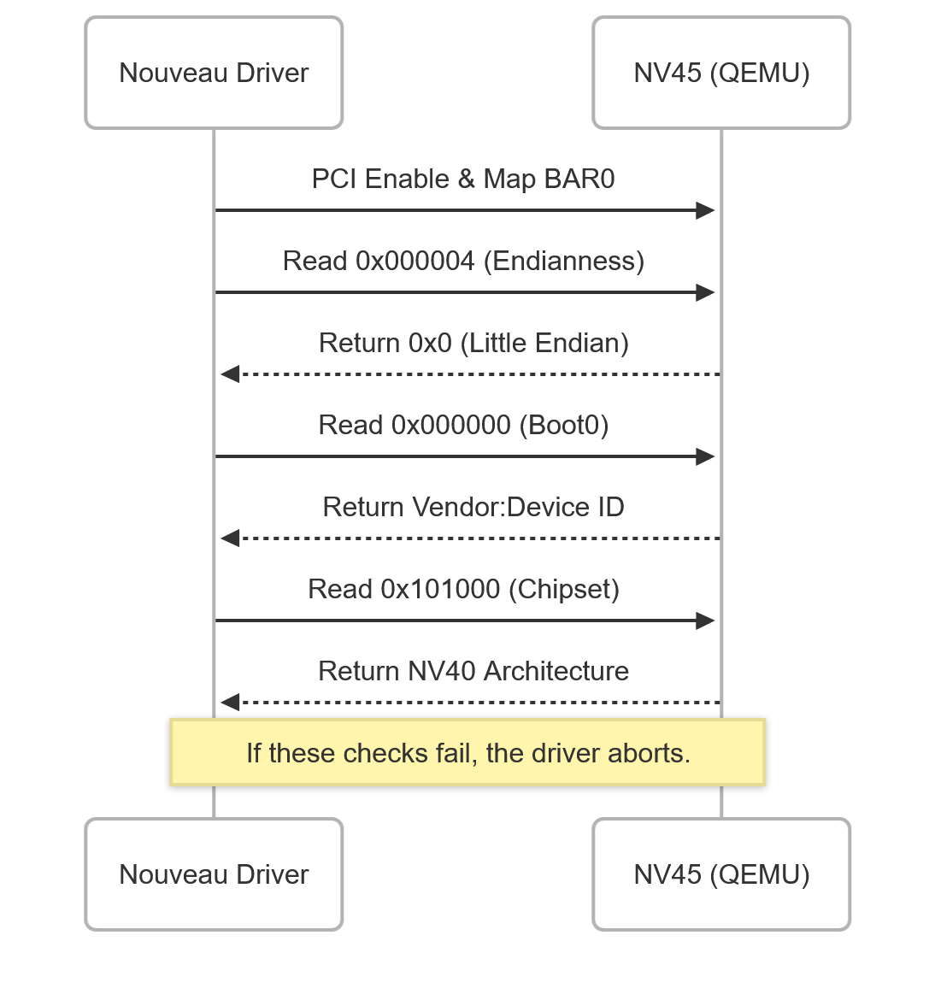

---

### Initializing Engines

`nvkm_device_init` wakes up sub-devices sequentially.

| Step | Engine | Action | Key Register |
| :--- | :--- | :--- | :--- |
| **1** | **MC** | Disable Interrupts & Enable Engines | `0x000140` (Intr), `0x000200` (Master) |
| **2** | **TIMER** | Calibrate Timing & Divider | `0x009220`, `0x009400` |
| **3** | **FB** | Detect VRAM Size & Partitions | `0x10020c` (Size), `0x100200` (Count) |
| **4** | **FIFO** | Setup RAMFC/RAMHT & Enable | `0x003200` (Push), `0x003250` (Pull) |
| **5** | **GR** | Clear Context & Enable Pipe | `0x40032c`, `0x40013c` |

---

### The Timer Handshake

QEMU **must** respond to timer reads, or the driver will hang (deadlock).

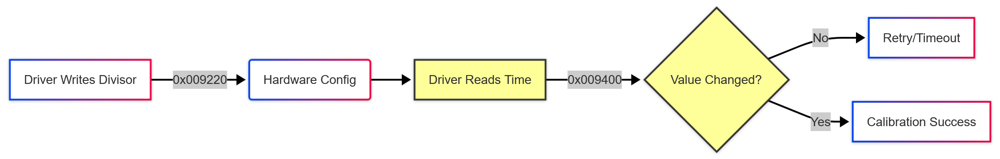

* **Logic**: The driver writes frequency dividers ($m, n, d$) and expects the timer counter at `0x009400` to increment immediately.

---

### Handling User Commands

When `Mesa` or user-space sends a draw command:

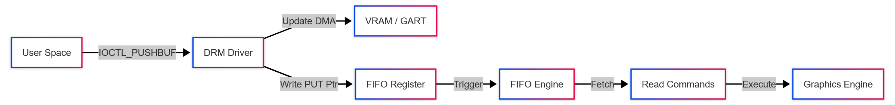

1.  **Push**: Commands written to shared memory.
2.  **Kick**: Driver updates the `PUT` pointer (Doorbell).
3.  **Pull**: GPU fetches commands between `GET` and `PUT`.

---

### The Interrupt Cycle

How the GPU signals completion or errors.

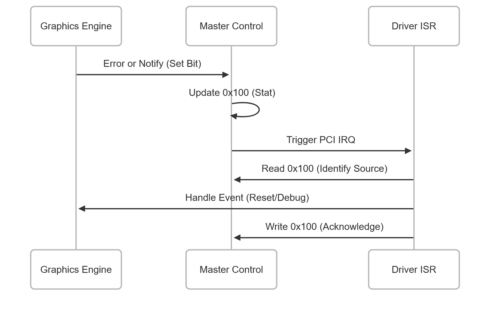

---

### Safe Shutdown

When `nouveau_drm_exit` is called, the hardware must be quieted safely.

1.  **Block Interrupts**: Write `0` to `0x000140` (MC).
2.  **Stop FIFO**: Disable Push/Pull caches at `0x003250`.
3.  **Unmap**: Release BAR mappings.

> **Note**: Failure to stop the FIFO before unloading can cause the GPU to write to freed memory.

---

<!-- _class: title-page -->

## **Sub-Device Specifics**

###### Detailed Register Interactions & Responsibilities

---

### MC (Master Control): The Interrupt Router

**Address Space:** BAR0 `0x000000 - 0x001FFF`
**Role:** The central hub that enables other engines and routes their interrupts to the CPU.

1.  **Boot:** The driver writes `0xFFFFFFFF` to `0x000200` to enable all sub-devices (FIFO, GR, etc.). QEMU must mark these engines as "Active".
2.  **Runtime:** When a sub-device (e.g., Timer) triggers an event, MC sets a bit in the **Stat Register** (`0x000100`).
3.  **Interaction:** The driver reads `0x000100` to find the source, handles it, and writes `0x000140` to re-arm the interrupt line.
 
---

### MC (Master Control): The Interrupt Router

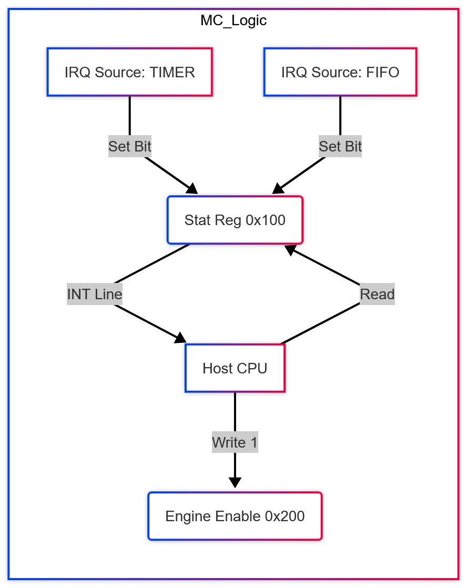

---

### TIMER: The Heartbeat

**Address Space:** BAR0 `0x009000 - 0x009FFF`
**Role:** Provides a monotonic 64-bit nanosecond timestamp and handles alarm interrupts.
1.  **Calibration:** The driver writes dividers ($m, n, d$) to `0x009220`/`0x009200`. QEMU must calculate the tick rate based on this.
2.  **Operation:** QEMU must increment the 64-bit value at `0x009400` (Low) + `0x009410` (High) continuously.
3.  **Handshake:** If `0x009400` does not change between two reads, the driver assumes the GPU is frozen and panics.
4.  **Interrupt:** The driver writes `0x009420` to trigger timer, timer would count down and trigger the interrupt at `0x009100`.

---

### FB (PFB): VRAM Manager

**Address Space:** BAR0 `0x100000` + BAR1 (Actual Memory)
**Role:** Controls VRAM layout, size detection, and memory tiling (compression).

1.  **Discovery:** The driver reads `0x10020c` to detect VRAM size (e.g., 512MB) and `0x001218` for memory type.
2.  **Tiling:** The driver defines "Tiles" (rectangular memory regions) by writing to `0x100240`. QEMU must map these BAR0 registers to internal logic that translates addresses.
3.  **Interaction:** When the CPU accesses BAR1 (VRAM aperture), PFB translates linear addresses into physical video memory addresses.

---

### FB (PFB): VRAM Manager

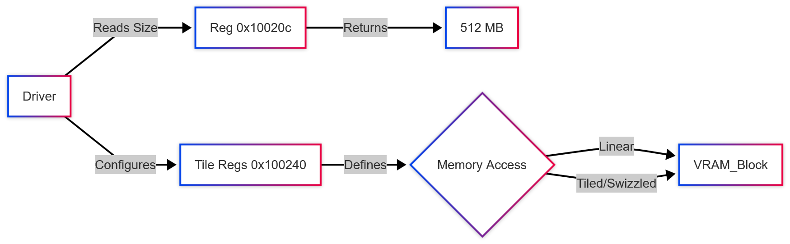

---

### FIFO: Command Scheduler

**Address Space:** BAR0 `0x002000` (Control) + BAR0 `0x800000` (User/Doorbell)
**Role:** The engine that pulls commands from memory and feeds them to the execution unit.

1.  **Setup:** The driver allocates **RAMHT** (Hash Table) and **RAMFC** (Context) in VRAM and tells FIFO where they are (`0x002210`).
2.  **The Loop:**
    * **Push:** Driver writes commands to a PushBuffer (DMA).
    * **Kick:** Driver writes the channel ID to a **Doorbell** register.
    * **Pull:** FIFO wakes up, reads the `PUT` pointer, fetches data via DMA, and sends it to PGRAPH.

---

### FIFO: Command Scheduler

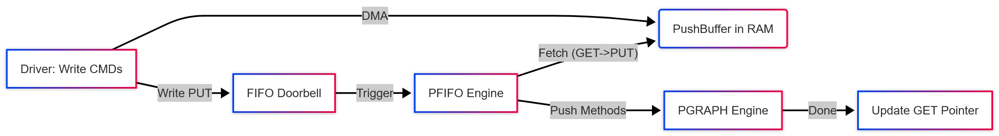

---

### GR (PGRAPH): The Graphics Engine

**Address Space:** BAR0 `0x400000 - 0x40FFFF`
**Role:** Executes the actual drawing commands (3D/2D) received from FIFO.

1.  **Context:** Before drawing, PGRAPH loads a "Context" (State) from memory. The driver initializes this by clearing `0x40032c`.
2.  **Pipeline:** It processes "Methods" (Commands).
    * *Method*: `SetShader` -> QEMU loads internal shader state.
    * *Method*: `DrawTriangle` -> QEMU executes software rasterization.
3.  **Exceptions:** If an invalid method is sent, GR triggers an interrupt at `0x400100`. The driver reads `0x40013c` to debug it.

---

### GR (PGRAPH): The Graphics Engine

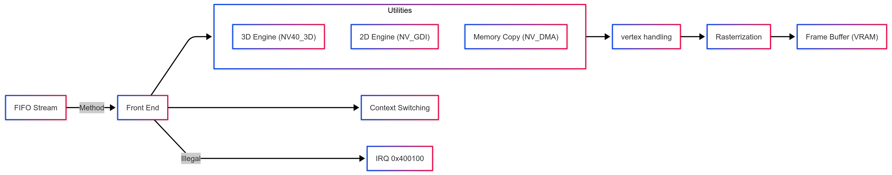

---

### PCI & BUS Interface

**Address Space:** PCI Config Space + BAR0 `0x001000`
**Role:** Handles initial hardware detection, endianness, and bus errors.

1.  **Endianness:** At boot, the driver reads `0x000004`. QEMU must return `0x0` (Little Endian) or the driver will attempt to flip the bytes.
2.  **Identification:** Returns the Device ID (NV45) and Vendor ID at `0x000000`.
3.  **Safety:** The `BUS` unit monitors for invalid memory accesses. If the driver accesses an unmapped address, `nv32_bus_intr` fires. QEMU must report the faulting address at `0x009084`.

---

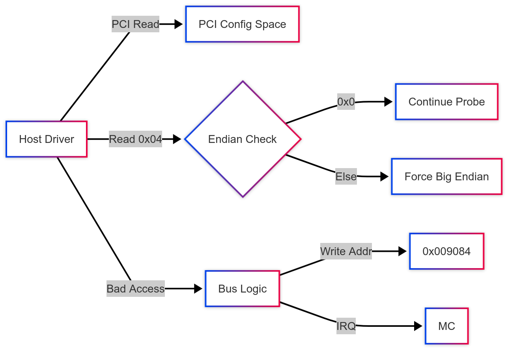

---

### DEVINIT: Legacy VGA & PLL Setup

**Address Space:** VGA Ports (`0x03x4`) + PLL Regs
**Role:** Handles the transition from VGA text mode to High-Res graphics and configures clocks.

1.  **VGA Ownership:** The driver reads **`0x44`** to check if it owns the bus. It writes `0` to **`0x03d5`** (via `nvkm_wrport`) to disable the legacy CRTC slave mode.
2.  **PLL Config:** The driver calculates $N/M/P$ coefficients and writes them to **`0x004000`** (NPLL) and **`0x004008`** (SPLL).
3.  **Interaction:** QEMU must intercept port `0x03d4`/`0x03d5` IO writes to satisfy the legacy VGA handshake.

---

### DEVINIT: Legacy VGA & PLL Setup

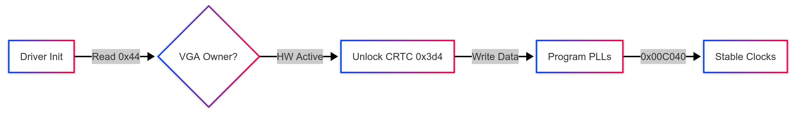

---

### GPIO (`nv10_gpio`): Pin Control

**Address Space:** BAR0 `0x001104` (Intr) + `0x6008xx` (Lines)
**Role:** Controls external pins (Fan PWM, Panel Power) and monitors inputs (Hotplug Detect).

1.  **Pin Mapping:** Driver writes to different registers based on line number:
    * **Lines 0-1**: `0x600818` (16 bits/line).
    * **Lines 2-9**: `0x60081c` (4 bits/line).
2.  **Interrupts:** Driver masks interrupts via **`0x001144`**. When a pin changes state, QEMU must set the bit in **`0x001104`** and trigger the MC IRQ.

---

### GPIO (`nv10_gpio`): Pin Control

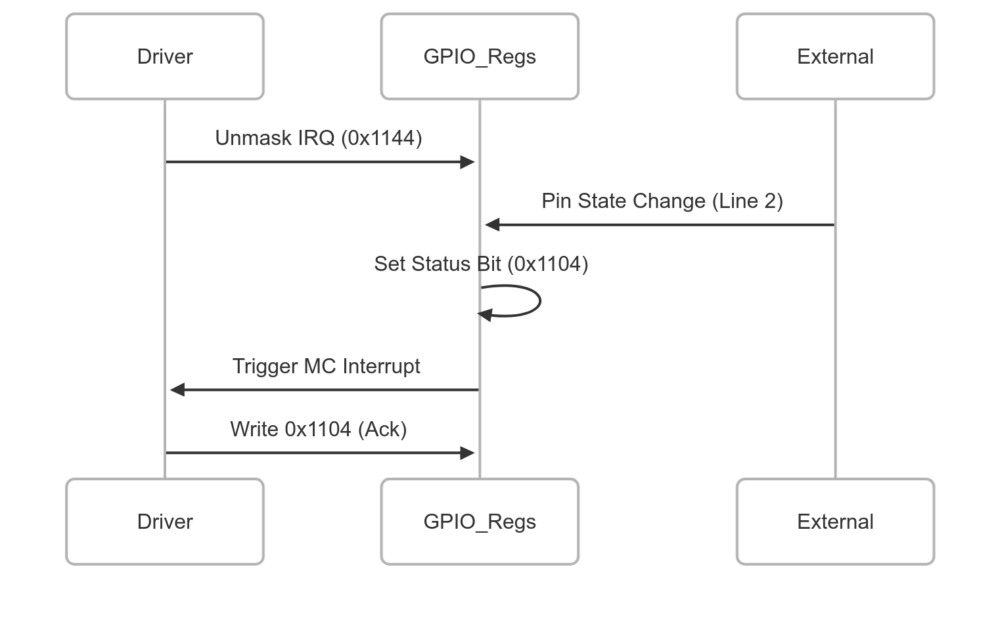

---

### DISP (`nv04_disp`): CRTC & VBlank

**Address Space:** BAR0 `0x600000` (CRTC0) / `0x602000` (CRTC1)
**Role:** Generates video timing signals. Crucial for `vsync` logic.

1.  **VBlank Interrupts:** The driver waits for vertical blanking intervals to swap buffers.
2.  **Mechanism:** QEMU should run a timer (60Hz). When fired:
    * Write `1` to **`0x600100`** (CRTC0 VBlank Pending).
    * Trigger MC Interrupt.
3.  **Handling:** The driver's ISR reads `0x600100`, acknowledges it by writing `1`, and wakes up any threads waiting on `drm_vblank_wait`.

---

### IMEM (`nv40_instmem`): GPU Object Storage

**Address Space:** BAR2 (PRAMIN) / VRAM Aperture
**Role:** Manages the "Instance Memory" heap—where Page Tables, Channel Contexts (RAMFC), and Object descriptors live.

1.  **Initialization:** The driver reserves a block of VRAM for "Instance Memory" and aligns it to 4KB.
2.  **Object Creation:** When creating a channel, the driver writes the **RAMFC** structure into this space via BAR2 or BAR1.
3.  **Role in QEMU:** This is purely memory management. However, QEMU's **FIFO** and **MMU** engines must know *where* this region starts to fetch context data correctly.

---

### MPEG (`nv44_mpeg`) & SW (`nv10_sw`)

**Role:** Specialized engines for Video Decoding and Software Methods.

* **MPEG Engine:**
    * **Function:** Hardware acceleration for MPEG2 decoding.
    * **Simulation:** Can be stubbed initially. It works like GR: receives methods via FIFO. If simulated, it processes bitstream data from VRAM.
* **SW (Software) Class:**
    * **Function:** Handles synchronization barriers (Semaphores) and VBlank waits within the command stream.
    * **Simulation:** QEMU must handle the `0x00000104` (DMA_NOTIFY) method to signal completion to the host driver.

---

### I2C (`nv04_i2c`) & THERM (`nv40_therm`)

**Role:** Monitor health and query external devices.

* **I2C (Bus):**
    * **Logic:** The driver toggles bits in `0x000200` or specific GPIO ports to bit-bang I2C traffic.
    * **Task:** QEMU should respond to EDID reads (monitor detection) if simulating a connected display.
* **THERM (Thermal):**
    * **Logic:** Monitors temperature.
    * **Clock Gating:** The driver calls `nvkm_therm_clkgate_enable` to save power. QEMU can ignore the power saving aspect but must accept the register writes to prevent errors.

---

### MMU (`nv04_mmu`): Virtual Memory & GART

**Role:** Translates GPU virtual addresses to Physical System RAM (GART) or VRAM.
**Crucial for:** `User-Space` isolation and large texture mapping.

1.  **GART Setup:** The driver allocates a "GART Table" (Page Table) in system RAM and tells the GPU its base address via **MC** or **FIFO** registers.
2.  **Translation:**
    * When PGRAPH accesses a virtual address (e.g., a texture), MMU walks the page table.
    * **QEMU Task:** You must intercept memory accesses that fall into the **GART Aperture** (usually in BAR1 or BAR2) and redirect them to the correct Guest RAM offset.
3.  **Invalid Access:** If a translation fails, MMU raises a `Page Fault` interrupt.

---

### MMU (`nv04_mmu`): Virtual Memory & GART

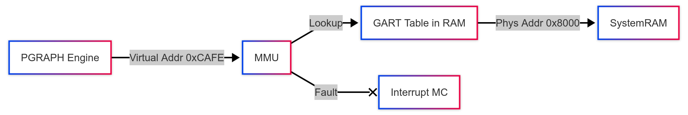

---

### DMA (`nv04_dma`): Moving Data

**Role:** Offloads memory copy tasks from the CPU. Used for transferring textures from System RAM to VRAM.

1.  **DMA Classes:** The driver initializes DMA objects (`NV_DMA_FROM_MEMORY`, `NV_DMA_TO_MEMORY`).
2.  **Operation:**
    * Driver pushes a `COPY` method into the FIFO.
    * Specifies `Source Address`, `Destination Address`, and `Length`.
3.  **QEMU Implementation:**
    * When the DMA engine receives the launch command, perform a `cpu_physical_memory_rw` in QEMU to copy the buffer instantly.
    * Trigger an interrupt upon completion to notify the driver.

---

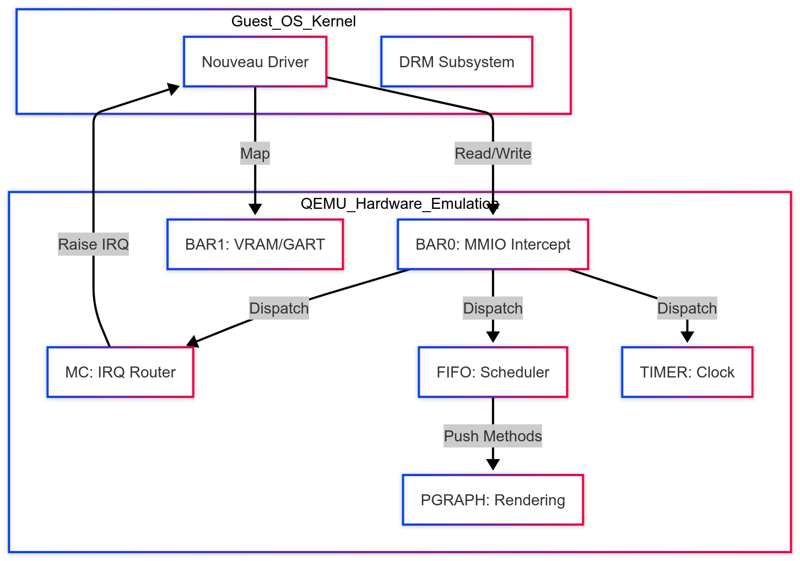
