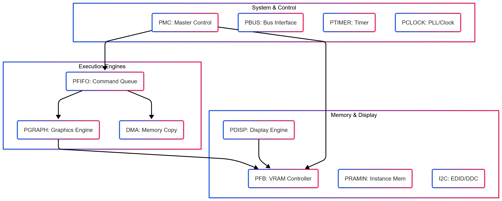
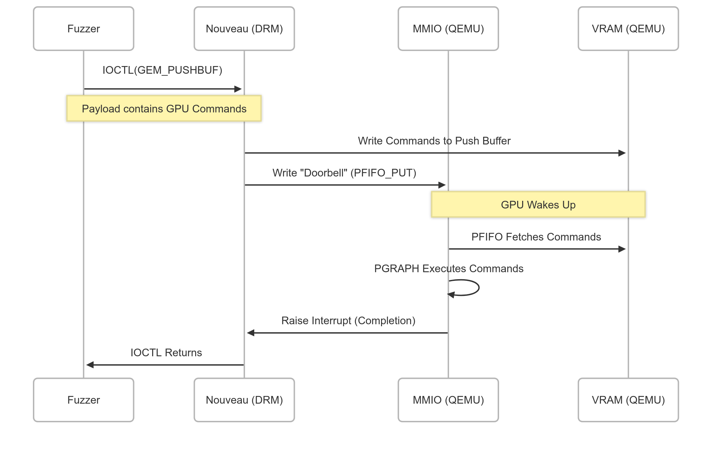

<!-- _class: title-page -->

## NV45 GPU Simulation

Analysis of Nouveau Driver & Hardware Emulation Strategy

---

<!-- 
_class: title-page 
_header: Hardware Architecture
-->

## Part 1:
## **NV45 Hardware Architecture**

###### Understanding the Target Device

---

<!-- _header: NV45 (Curie) Internal Structure -->

The NV45 GPU consists of multiple sub-devices ("Engines") coordinated by the Master Control.

---

<!-- _header: Memory Interface (BARs) -->

The CPU communicates with the GPU via three **Base Address Registers (BARs)**.

| BAR | Type | Size | Description | Method |
| :--- | :--- | :--- | :--- | :--- |
| **BAR 0** | **MMIO** | 16 MB |  Registers for all engines. | `readl` / `writel` (Intercepted by QEMU) |
| **BAR 1** | **VRAM** | 512 MB | Textures, Framebuffer, PushBuffers. | Direct Memory Access / TTM Mapping |
| **BAR 2** | **PRAMIN** | 1 MB | Channel status, Hash Tables. | Direct Access (Stored as Structs) |

---

<!-- 
_class: title-page 
_header: Driver Initialization
-->

## Part 2:
## **Driver Initialization (NVKM)**

###### From Probe to "Ready"

---

<!-- _header: Phase 1: Device Probe & Identification -->

**Key MMIO Interactions (BAR 0):**

1.  **Endianness Check**:
    - Read `0x000004` (PMC.BOOT_1). Expects `0x0` (Little Endian).
2.  **Chip Identification**:
    - Read `0x000000` (PMC.BOOT_0).
    - Response: Must return `0x045000A2` to identify as **NV45**.
3.  **Strapping Information**:
    - Read `0x101000` (PSTRAP).
    - Response: Configures Crystal Freq (e.g., 27MHz) and Bus Type. Crucial for clock calculations.

---

<!-- _header: Phase 2: Core Engine Init (Clock & Timer) -->

Before execution, the heartbeat of the GPU must be configured.

- **PTIMER (Timer)**:
  - Driver reads `0x009400` (TIME_LOW).
  - **QEMU Action**: Must return a strictly increasing value (nanoseconds). Failure causes driver timeouts/hangs.

- **PCLOCK (PLL)**:
  - Driver reads `0x004000` region (Core/Mem PLLs).
  - Logic: $Freq = \frac{Ref \times N}{M \times 2^P}$.
  - **QEMU Action**: Store coefficients written by driver, return calculated frequency when read to satisfy `nv40_clk_read`.

---

<!-- _header: Phase 3: Memory & Display Init -->

Initializing VRAM management and Kernel Mode Setting.

- **PFB (Framebuffer)**:
  - Read `0x10020C`. **Response**: VRAM Size (e.g., 128MB).
  - Enables `nouveau_ttm_init`.

- **PDISP (Display)**:
  - **I2C/GPIO**: Driver toggles `0x600818`+ to bit-bang I2C.
  - **QEMU Action**: Emulate I2C bus to return a valid **EDID** block.
  - **Modesetting**: Driver writes `HTOTAL`/`VTOTAL` to `0x6xxxxx`.
  - **Scanout**: Driver writes `0x600808` (`FB_START`).
  -  **QEMU Action**: Start reading pixels from VRAM at this offset.

---

<!-- _header: Phase 4: PFIFO & PGRAPH Init -->

Preparing the command execution pipeline.

- **PFIFO (Command Queue)**:
  - `0x002210` (RAMHT): Hash Table location in VRAM.
  - `0x002220` (RAMFC): Context Save Area in PRAMIN.
  - `0x003204` (CACHE1_PUSH1): Channel ID mask.
  - `0x002504` (CACHES): Rebalance/Enable.

- **PGRAPH (Graphics)**:
  - Context switching and status registers.
  - Interrupt enablement (`INTR_EN`).

---

<!-- 
_class: title-page 
_header: Runtime Interaction
-->

## Part 3:
## **Runtime Interaction Logic**

###### From User Space IOCTL to Hardware Execution

---

<!-- _header: The Fuzzing Loop (IOCTL Flow) -->

How a fuzzing payload reaches the simulated GPU.

---

<!-- _header: Key Mechanism: The Doorbell -->

The **Doorbell** mechanism is the primary trigger for GPU.

1.  **Setup**: Driver fills a command buffer in **BAR 1 (VRAM)**.
2.  **Trigger**: Driver writes to `NV03_PFIFO_CACHE1_PUT` (Offset `0x0032xx` in BAR0).
3.  **QEMU Response**:
    *   Intercept Write to `PUT` register.
    *   Read `GET` (current pointer) and `PUT` (new pointer).
    *   Fetch data from VRAM [`GET` : `PUT`].
    *   Pass data to PGRAPH emulator.
    *   Update `GET` pointer.

---

<!-- _header: Key Mechanism: Interrupts -->

Asynchronous notification is vital for driver stability.

- **Sources**:
  - `PGRAPH_NOTIFY`: Command finished.
  - `CRTC_VBLANK`: Vertical Blanking interval (Display refresh).
  - `PFIFO_ERROR`: DMA faults or illegal commands.

- **QEMU Logic**:
  1.  Set bit in `PMC_INTR` (`0x000100`).
  2.  Assert physical PCI IRQ line (`pci_set_irq`).
  3.  Driver ISR reads `PMC_INTR`, handles event, writes to clear bit.
  4.  QEMU de-asserts IRQ.

---

<!-- 
_class: title-page 
_header: QEMU Implementation
-->

## Part 4:
## **QEMU Implementation Strategy**

###### Building the Virtual Device

---

<!-- _header: MemoryRegion Strategy -->

| Region | Implementation | Rationale |
| :--- | :--- | :--- |
| **MMIO** | `memory_region_init_io` | Needs active logic to intercept `read`/`write` for registers. |
| **VRAM** | `memory_region_init_ram` | Performance. Driver writes directly to host RAM. QEMU reads ptr for display/execution. |
| **PRAMIN** | `memory_region_init_ram` | Storage for Context/RAMFC. Accessible via pointer for logic checks. |

---

<!-- _header: Logic Implementation Plan -->

1.  **The "Big Switch"**: A central MMIO Read/Write handler dispatching based on address ranges.
    *   `0x000xxx` $\to$ PMC
    *   `0x002xxx` $\to$ PFIFO
    *   `0x10xxxx` $\to$ PFB
    *   `0x60xxxx` $\to$ PDISP
2.  **State Machine**: Maintain global state (`NV45State` struct) containing register values and memory pointers.
3.  **Timers**: Use `QEMUTimer` for VBlank emulation (~60Hz).
4.  **Stubbing**: For complex but non-critical engines (MPEG), return 0 or dummy success values to keep the driver happy.

---

<!-- _header: Summary -->

- **Target**: We are emulating the **Interface** of the NV45, not the transistor logic.
- **Success Criteria**:
  1.  Driver loads without error (dmesg: `Nouveau: Found chip NV45`).
  2.  Display initializes (VBlank interrupts active).
  3.  `PUSHBUF` IOCTL triggers MMIO doorbell and data fetch.
- **Current Status**: Mapping out all critical MMIO addresses and initialization sequences from Kernel Source (`nv40.c`, `base.c`).
