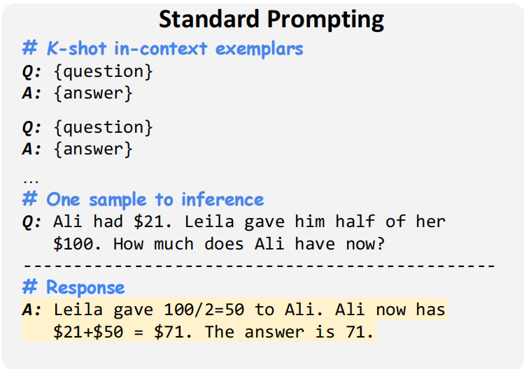
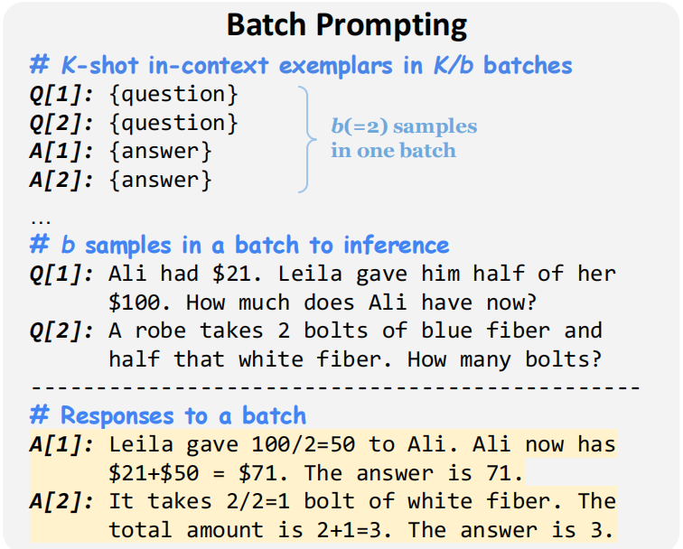
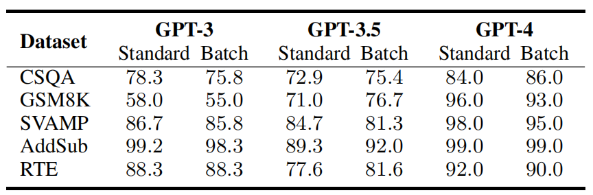
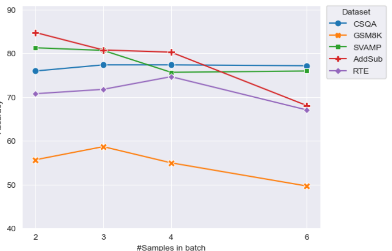
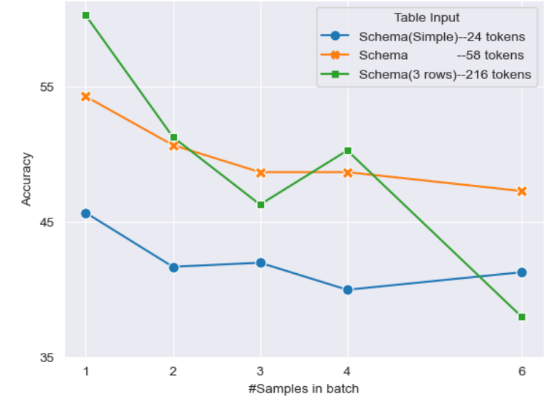

<!-- 
_class: title-page
_header: Optimations for Orchestrating
-->

## **Optimations for Orchestrating**
Recent Papers

---

<!--
_class: title-page
header: Batch Prompting: Efficient Inference with Large Language Model APIs
-->

## **Batch Prompting**
### Efficient Inference with LLM APIs
EMNLP 2023 Industry Track

---

- **How do we use large models in our daily life?**

For one API call, we send a prompt to the model and get a response.

This can only solve one question **at once**.

For a more precise answer, we can use techniques like **Few-shot Prompting** to guide the model how to answer.

But we need to send those examples for each API call, which is very inefficient.

---

- **How many costs?**

the widely-adopted OpenAI API service1 of LLMs requires about $40 and 8 hours to perform inference on 10K samples using gpt-3.5-turbo

And the expense significantly escalates when using gpt-4, exceeding a substantial $600.

If the rate limits of maximum API requests per minute are also considered, the cost will be even higher, preventing users from building massive LLM applications.

---

- **Using Batch Prompting**

  
  

Using batch prompting, we can reduce api calls from **$N$** to **$N/b$**

---

- **We have shortened the time, but at what cost?**

According to the experiments in the paper, the batch prompting method can achieve at most $5\times$ token and time efficiency (with six examples in batches) improvement with similar or even better performance.

---

- **We have shortened the time, but at what cost?**

However, the accuracy slowly decreases with the increasing number of **$b$**:

  
  

---

<!--
_class: title-page
header: Chain-of-Verification Reduces Hallucination in Large Language Models
-->

## **Chain-of-Verification**

### Reduces Hallucination in LLMs

ACL 2024

---

- **How do we use large models in our daily life?**

For one API call, we send a prompt to the model and get a response.

This can only solve one question **at once**.
