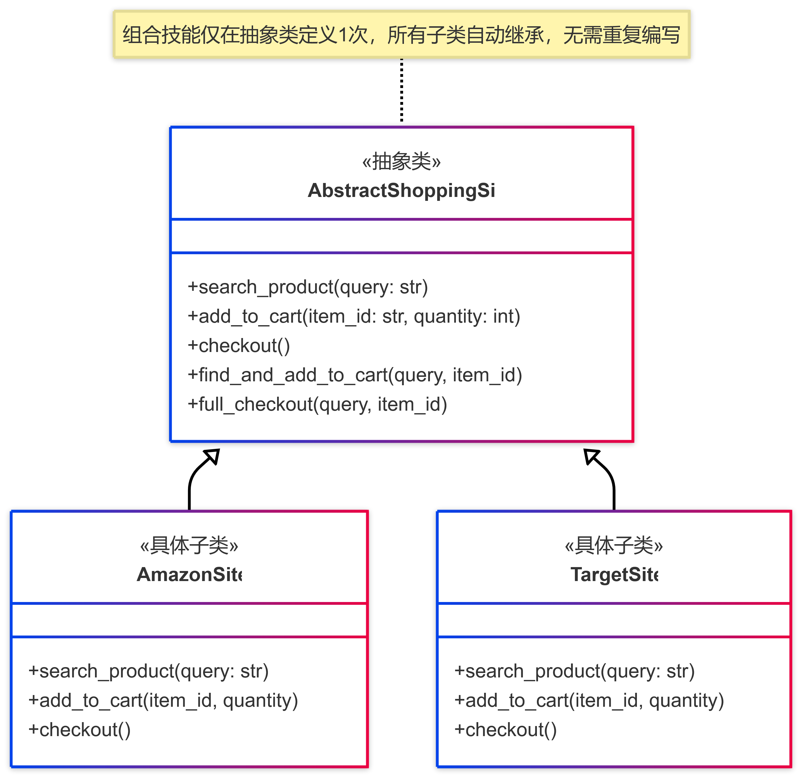
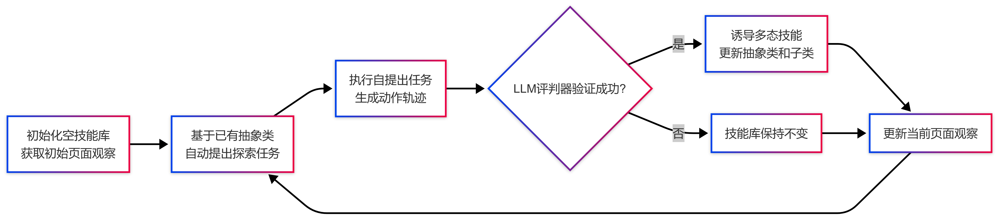
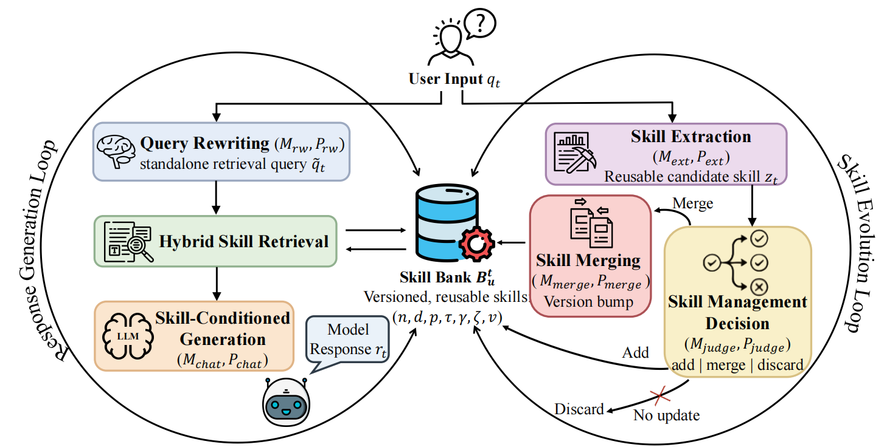
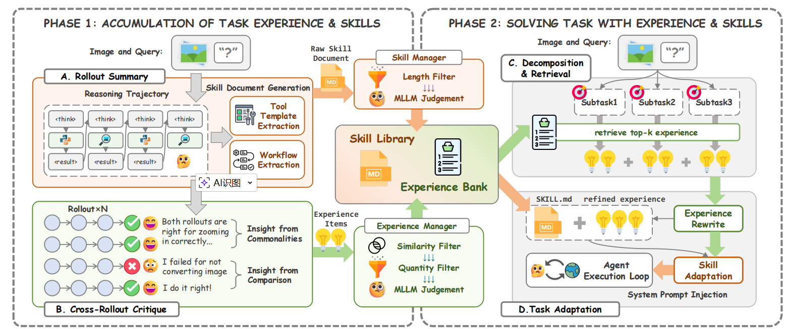

<!-- 
_class: title-page
_header: Skills for agents
-->

## **Skills for agents**
Recent Papers

---

### **Skill?!**

*一个没有技能的 Agent 该怎么完成任务？*
- 从头开始思考每一步并顺序执行，例如要安装思题目学习平台：
  - 打开浏览器
  - 输入网址
  - 点击下载按钮
  - 运行安装程序
  - 完成安装

如果要安装别的东西，还是要重复思考一遍相同的内容

---

### **Skill?!**

🤓👆我们可以把这个步骤打包成一个“技能”
- 把上面的步骤打包成“安装软件()”技能
- 下次需要安装软件，只需要调用这个技能就行，不需要重新想步骤

**好处？**

- 不用一步一步思考，更加快，更节省 token
- 来自成功经验总结，不容易出错，并且可以保存
- 来自强力模型总结的技能可以给小型模型用

---

<!--
_class: title-page
header: PolySkill: Learning Generalizable Skills Through Polymorphic Abstraction for Continual Learning
-->

## **PolySkill**
### Skills through polymorphic abstraction
ICLR 2026

---

### **什么是网页智能体？**

- 大模型驱动的 AI 程序
- 能像人一样操作网页
- 能够完成用户指定的任务

### **现有网页智能体的核心问题**

- 在一个网站上学会的技能，没有办法应用到另一个网站上
- 学会新网站技能后，原有网站性能显著下降

---

### **使用软件工程的“多态”**

- 先制定一个抽象技能，定义“做什么”
- 再为每个不同的情况制定特定的方法，定义“怎么做”

**例如：**
- 每个购物网站都需要“搜索商品”
- 为每个网站实现单独的搜索方法

---

---

### **遇到需要新学习的知识？**

- 直接可以根据抽象模板学习
- 学习速度可以大幅加快
- 任务成功后，在模板中记录新的实现
- 技能库中记录了所有学习到的技能，越用越厉害

---

<!-- 
_class: title-page
header: AutoSkill: Experience-driven Lifelong Learning Via Skill Self-evolution
-->

## **AutoSkill**
### Experience-driven Self-evolution

---

**在实际应用中，用户会反复表达稳定的偏好和要求：**

- 减少幻觉
- 遵循指定写作规范
- 避免过于技术化的措辞
- 遵守固定的工作流程

但这些交互经验**很少被转化为可复用的知识**，导致用户每次开启新会话都需要重新说明自己的要求。

已有的解决方案要么成本过高，要么无法长期维护

---

### **AutoSkill**

AutoSkill 是一个**无需训练基础模型**的经验驱动终身学习框架：

> 不把交互经验仅仅当作记忆，而是当作技能形成的来源。从用户交互中抽象出可复用的行为，将其固化为**显式、可编辑、带版本控制的 SKILL.md 技能工件**，并在未来的请求中动态注入相关技能，实现能力的持续积累。

它是一个模型无关的插件层，可以兼容所有现有 LLM，并且支持技能在不同代理、用户和任务之间共享和迁移。

---

### 解决方案：

#### **左循环：用技能回答问题**

    收到用户请求 → 找到相关技能 → 用技能生成更好的回答

#### **右循环：从对话中学技能**

    对话结束后 → 提取新的技能 → 更新技能库

#### 所有操作**都不修改 AI 模型的参数**

---

---

<!--
_class: title-page
header: XSkill: Continual Learning from Experience and Skills in Multimodal Agents
-->

## **XSkill**
### Continual Learning from Experience and Skills

---

## **多模态智能体**

- 能看图片，能用工具的 AI 智能体

**致命短板**

- 简单的问题会绕弯路，复杂问题不会深入探索，经常浪费步骤在错误恢复上
- 只会按固定流程走，不会根据不同任务灵活搭配工具
- 过去的经验学习方法，**全都是纯文本的**，忽略了多模态 AI 最核心的能力

---

### **XSkill**

人类解决问题靠两样东西：
- 技能：标准化的操作手册，告诉你这类问题整体该按什么步骤做
- 经验：踩过坑总结的小技巧，告诉你遇到某个具体情况该怎么处理

XSKILL 就是第一个把这两种知识结合起来，并且**所有知识都基于图片信息提取**的 AI 框架。它不用修改 AI 本身的参数，只靠积累外部知识就能让 AI 越用越聪明。

---

### **XSkill**

XSkill 使用两个独立的大模型，把“工作”和“学习”过程分开：

- `MLLM_exec`：专门负责解决实际问题、调用工具
- `MLLM_kb`：专门负责从过去的解题过程中提取、整理、检索知识
- 可以用更强的模型管知识，而且一个模型学的知识，能直接给其他模型用（跨模型转移）

XSkill 的算法分为两个循环阶段：

---

### **XSkill：知识积累阶段**

- 对每个训练任务，让 AI 独立做 4 遍
- `MLLM_kb` 同时看图片和解题文本，总结每条轨迹的关键点：用了什么工具、为什么用这个工具、哪里成功了、哪里失败了
- 同时从成功的轨迹里，提取出通用的 "技能碎片"：比如工具调用的代码模板、常见的步骤顺序
- 对比轨迹，从对比中提炼出**可复用的经验**
- 每个经验都写成 "条件→动作" 的形式，保证简洁通用

---

### **XSkill：用知识解决新问题**

- 先把大任务拆成 2-3 个小任务，对每个小任务，从经验库找最相关的 3 条经验
- 同时从技能库找对应的整体操作流程
- 把通用经验改成适合当前任务的说法（比如把 "旋转倒着的图片" 改成 "把这张上下颠倒的吉祥物图片旋转 180 度"）
- 删掉技能里和当前任务无关的部分，把改写后的经验插到对应的步骤里
- AI 解题时，记录哪些知识被用到了，这些使用记录会反馈回上一阶段，用来优化知识库

---

